# 01 - KIẾN TRÚC HỆ THỐNG

## TỔNG QUAN

Hệ thống ERP mỹ phẩm được thiết kế theo kiến trúc Microservices nhằm đáp ứng các yêu cầu:
- **Scalability**: Mở rộng độc lập từng service
- **Maintainability**: Dễ bảo trì và phát triển song song
- **Deployment**: On-premise, offline-capable
- **Performance**: Xử lý 100,000-500,000 transactions/tháng
- **Security**: Bảo mật thông tin công thức sản phẩm

## SYSTEM ARCHITECTURE DIAGRAM

```mermaid
graph TB
    subgraph "External Clients"
        Web["Web Browser<br/>(PrimeVue)"]
        Mobile["Mobile App<br/>(Future)"]
    end

    subgraph "Load Balancer / Reverse Proxy"
        Nginx["Nginx<br/>SSL Termination<br/>Load Balancing"]
    end

    subgraph "API Layer"
        Gateway["API Gateway<br/>:8080<br/>Authentication<br/>Rate Limiting<br/>Routing"]
    end

    subgraph "Core Services"
        Auth["Auth Service<br/>:8081<br/>JWT & RBAC"]
        User["User Service<br/>:8082<br/>User Mgmt"]
        Master["Master Data<br/>:8083<br/>Materials/Products"]
    end

    subgraph "Supply Chain Services"
        Supplier["Supplier Service<br/>:8084<br/>Supplier Mgmt"]
        Procurement["Procurement<br/>:8085<br/>PR/PO"]
        WMS["WMS Service<br/>:8086<br/>Warehouse/Stock"]
    end

    subgraph "Production Services"
        Manufacturing["Manufacturing<br/>:8087<br/>BOM/Work Order"]
        Sales["Sales Service<br/>:8088<br/>Orders/Customers"]
        Marketing["Marketing<br/>:8089<br/>KOL/Campaigns"]
    end

    subgraph "Support Services"
        Notification["Notification<br/>:8090<br/>Email/Alerts"]
        File["File Service<br/>:8091<br/>MinIO"]
        Reporting["Reporting<br/>:8092<br/>Dashboards"]
        AI["AI Service<br/>:8093<br/>Ollama"]
    end

    subgraph "Message Queue"
        NATS["NATS/RabbitMQ<br/>Event Bus<br/>:4222"]
    end

    subgraph "Data Layer"
        Redis["Redis<br/>Cache/Session<br/>:6379"]
        
        subgraph "PostgreSQL Databases"
            AuthDB[(Auth DB)]
            UserDB[(User DB)]
            MasterDB[(Master DB)]
            SupplierDB[(Supplier DB)]
            ProcurementDB[(Procurement DB)]
            WMSDB[(WMS DB)]
            MfgDB[(Manufacturing DB)]
            SalesDB[(Sales DB)]
            MarketingDB[(Marketing DB)]
            NotifDB[(Notification DB)]
        end
        
        MinIO["MinIO<br/>Object Storage<br/>:9000"]
        Ollama["Ollama<br/>LLM Engine<br/>:11434"]
    end

    subgraph "Monitoring Stack"
        Prometheus["Prometheus<br/>:9090"]
        Grafana["Grafana<br/>:3001"]
        Loki["Loki<br/>Logs<br/>:3100"]
        Jaeger["Jaeger<br/>Tracing<br/>:16686"]
    end

    Web --> Nginx
    Mobile --> Nginx
    Nginx --> Gateway
    
    Gateway --> Auth
    Gateway --> User
    Gateway --> Master
    Gateway --> Supplier
    Gateway --> Procurement
    Gateway --> WMS
    Gateway --> Manufacturing
    Gateway --> Sales
    Gateway --> Marketing
    Gateway --> Notification
    Gateway --> File
    Gateway --> Reporting
    Gateway --> AI

    Auth --> AuthDB
    Auth --> Redis
    User --> UserDB
    Master --> MasterDB
    Supplier --> SupplierDB
    Procurement --> ProcurementDB
    WMS --> WMSDB
    Manufacturing --> MfgDB
    Sales --> SalesDB
    Marketing --> MarketingDB
    Notification --> NotifDB

    File --> MinIO
    AI --> Ollama

    Auth -.gRPC.-> NATS
    User -.gRPC.-> NATS
    Master -.gRPC.-> NATS
    Supplier -.gRPC.-> NATS
    Procurement -.gRPC.-> NATS
    WMS -.gRPC.-> NATS
    Manufacturing -.gRPC.-> NATS
    Sales -.gRPC.-> NATS
    Marketing -.gRPC.-> NATS
    Notification -.gRPC.-> NATS

    Auth --> Prometheus
    User --> Prometheus
    Master --> Prometheus
    Supplier --> Prometheus
    Procurement --> Prometheus
    WMS --> Prometheus
    Manufacturing --> Prometheus
    Sales --> Prometheus
    Marketing --> Prometheus
    
    Prometheus --> Grafana
    
    Auth --> Loki
    User --> Loki
    Master --> Loki
    Supplier --> Loki
    Procurement --> Loki
    WMS --> Loki
    Manufacturing --> Loki
    Sales --> Loki
    Marketing --> Loki
```



## MICROSERVICES OVERVIEW

### Service Ports Allocation

| Service | Port | Protocol | Database Port |
|---------|------|----------|---------------|
| API Gateway | 8080 | HTTP/REST | - |
| Auth Service | 8081 | HTTP + gRPC | 5432 (auth_db) |
| User Service | 8082 | HTTP + gRPC | 5433 (user_db) |
| Master Data | 8083 | HTTP + gRPC | 5434 (master_db) |
| Supplier | 8084 | HTTP + gRPC | 5435 (supplier_db) |
| Procurement | 8085 | HTTP + gRPC | 5436 (procurement_db) |
| WMS | 8086 | HTTP + gRPC | 5437 (wms_db) |
| Manufacturing | 8087 | HTTP + gRPC | 5438 (manufacturing_db) |
| Sales | 8088 | HTTP + gRPC | 5439 (sales_db) |
| Marketing | 8089 | HTTP + gRPC | 5440 (marketing_db) |
| Notification | 8090 | HTTP + gRPC | 5441 (notification_db) |
| File Service | 8091 | HTTP + gRPC | - (MinIO) |
| Reporting | 8092 | HTTP + gRPC | 5442 (reporting_db) |
| AI Service | 8093 | HTTP + gRPC | - (Ollama) |

### Infrastructure Services

| Service | Port | Purpose |
|---------|------|---------|
| Redis | 6379 | Cache & Session |
| NATS | 4222 | Message Queue |
| MinIO | 9000 (API), 9001 (Console) | Object Storage |
| Ollama | 11434 | LLM Engine |
| Prometheus | 9090 | Metrics |
| Grafana | 3001 | Visualization |
| Loki | 3100 | Log Aggregation |
| Jaeger | 16686 (UI), 14268 (Collector) | Distributed Tracing |

## SERVICE COMMUNICATION PATTERNS

### 1. Client → API Gateway (REST)

```
┌──────────┐         HTTP/REST          ┌─────────────┐
│  Client  │ ───────────────────────► │ API Gateway │
│ (VueJS)  │ ◄─────JSON Response────── │             │
└──────────┘                            └─────────────┘
```

**Characteristics:**
- RESTful API với JSON payload
- JWT token trong header: `Authorization: Bearer <token>`
- API versioning: `/api/v1/...`
- Request/Response logging
- Rate limiting theo user/IP

### 2. API Gateway → Services (HTTP)

```
┌─────────────┐      HTTP/REST       ┌──────────────┐
│ API Gateway │ ──────────────────► │  Service A   │
│             │ ◄────JSON/Error───── │ (HTTP:8081)  │
└─────────────┘                      └──────────────┘
```

**Characteristics:**
- Internal REST API calls
- Service discovery via DNS (Docker network)
- Circuit breaker pattern (khi service down)
- Timeout: 30s default
- Retry: 3 attempts với exponential backoff

### 3. Service ↔ Service (gRPC)

```
┌────────────┐      gRPC/Protobuf    ┌────────────┐
│ Service A  │ ──────────────────► │ Service B  │
│ (gRPC Client) ◄────Response─────── │ (gRPC Server)│
└────────────┘                       └────────────┘
```

**Characteristics:**
- Binary protocol (Protobuf) - nhanh hơn JSON
- Bi-directional streaming support
- Load balancing với round-robin
- Timeout: 10s default
- Health check endpoint

**Example Use Cases:**
- Auth Service → User Service: Validate user permissions
- Procurement Service → Supplier Service: Get supplier details
- WMS Service → Manufacturing Service: Reserve materials

### 4. Event-Driven (Message Queue)

```
┌────────────┐     Publish Event      ┌──────┐
│ Service A  │ ─────────────────────► │ NATS │
└────────────┘                         └───┬──┘
                                           │
                                           │ Subscribe
                     ┌─────────────────────┼─────────────┐
                     │                     │             │
                     ▼                     ▼             ▼
              ┌────────────┐       ┌────────────┐  ┌────────────┐
              │ Service B  │       │ Service C  │  │ Service D  │
              │(Subscriber)│       │(Subscriber)│  │(Subscriber)│
              └────────────┘       └────────────┘  └────────────┘
```

**Characteristics:**
- Async communication
- Pub/Sub pattern
- Event replay capability
- At-least-once delivery
- Event persistence (30 days)

**Example Events:**
- `procurement.po.created` → WMS prepares for receiving
- `wms.grn.completed` → Procurement updates PO status
- `manufacturing.workorder.started` → WMS reserves materials
- `sales.order.confirmed` → WMS reserves stock

## DATABASE STRATEGY

### Database per Service Pattern

Mỗi service có database riêng để đảm bảo:
- **Loose coupling**: Services không share tables
- **Independent scaling**: Scale DB theo nhu cầu service
- **Technology flexibility**: Có thể dùng DB khác nhau (nếu cần)
- **Failure isolation**: DB crash không ảnh hưởng toàn hệ thống

```
┌─────────────┐         ┌──────────────┐
│ Service A   │────────►│  Postgres A  │
└─────────────┘         └──────────────┘

┌─────────────┐         ┌──────────────┐
│ Service B   │────────►│  Postgres B  │
└─────────────┘         └──────────────┘
```

### Cross-Service Data Access

**KHÔNG BAO GIỜ** query database của service khác!

✅ **Correct**: Service A gọi API/gRPC của Service B  
❌ **Wrong**: Service A query trực tiếp database của Service B

### Data Consistency Strategies

#### 1. Eventual Consistency (via Events)

```
Service A                    NATS                     Service B
   │                          │                          │
   │──1. Update local DB────►│                          │
   │                          │                          │
   │──2. Publish event───────►│──3. Forward event──────►│
   │                          │                          │
   │                          │◄────4. Update local DB──│
```

**Use Cases:**
- Denormalization để tránh join giữa services
- Analytics/Reporting data
- Notification triggers

#### 2. Saga Pattern (Distributed Transactions)

Cho business processes cần coordination:

**Example: Sales Order Process**

```
1. Sales Service: Create order (status=PENDING)
2. → Event: sales.order.created
3. WMS Service: Reserve stock
   - Success → Event: wms.stock.reserved
   - Fail → Event: wms.stock.reservation_failed
4. If success:
   - Sales Service: Update order (status=CONFIRMED)
5. If fail:
   - Sales Service: Update order (status=CANCELLED)
   - Notification Service: Alert user
```

## API GATEWAY DESIGN

### Responsibilities

1. **Authentication**: Validate JWT token
2. **Authorization**: Check permissions
3. **Routing**: Forward requests to services
4. **Rate Limiting**: Prevent abuse
5. **Request/Response Transformation**: Format conversion
6. **Logging**: Centralized request logging
7. **Circuit Breaking**: Handle service failures
8. **CORS**: Cross-origin handling

### Request Flow

```
┌─────────┐
│ Client  │
└────┬────┘
     │ 1. HTTP Request + JWT
     ▼
┌─────────────────────────────────────┐
│          API Gateway                │
│                                     │
│  ┌──────────────────────────────┐  │
│  │ 1. CORS Middleware           │  │
│  └──────────────┬───────────────┘  │
│                 │                   │
│  ┌──────────────▼───────────────┐  │
│  │ 2. Authentication Middleware │  │
│  │    - Validate JWT            │  │
│  │    - Extract user_id         │  │
│  └──────────────┬───────────────┘  │
│                 │                   │
│  ┌──────────────▼───────────────┐  │
│  │ 3. Authorization Middleware  │  │
│  │    - Check permissions       │  │
│  │    - Call Auth Service       │  │
│  └──────────────┬───────────────┘  │
│                 │                   │
│  ┌──────────────▼───────────────┐  │
│  │ 4. Rate Limiting Middleware  │  │
│  │    - Check Redis counter     │  │
│  └──────────────┬───────────────┘  │
│                 │                   │
│  ┌──────────────▼───────────────┐  │
│  │ 5. Logging Middleware        │  │
│  └──────────────┬───────────────┘  │
│                 │                   │
│  ┌──────────────▼───────────────┐  │
│  │ 6. Router                    │  │
│  │    - Match route             │  │
│  │    - Forward to service      │  │
│  └──────────────┬───────────────┘  │
└─────────────────┼───────────────────┘
                  │
                  ▼
         ┌──────────────────┐
         │ Backend Service  │
         └──────────────────┘
```

### Routing Configuration

```yaml
routes:
  # Auth routes (no auth required)
  - path: /api/v1/auth/login
    method: POST
    service: auth-service:8081
    timeout: 5s
    auth_required: false
    
  # User management
  - path: /api/v1/users/*
    methods: [GET, POST, PUT, DELETE]
    service: user-service:8082
    timeout: 10s
    auth_required: true
    permissions:
      GET: user:read
      POST: user:create
      PUT: user:update
      DELETE: user:delete
    
  # Procurement
  - path: /api/v1/procurement/purchase-orders/*
    methods: [GET, POST, PUT]
    service: procurement-service:8085
    timeout: 15s
    auth_required: true
    permissions:
      GET: procurement:po:read
      POST: procurement:po:create
      PUT: procurement:po:update
```

## SECURITY ARCHITECTURE

### 1. Authentication (JWT)

```
┌────────────┐                           ┌──────────────┐
│   Client   │                           │ Auth Service │
└──────┬─────┘                           └──────┬───────┘
       │                                        │
       │ 1. POST /api/v1/auth/login            │
       │    {email, password}                  │
       ├───────────────────────────────────────►│
       │                                        │
       │                                        │ 2. Verify credentials
       │                                        │    (check password hash)
       │                                        │
       │ 3. Return tokens                      │
       │◄───────────────────────────────────────┤
       │   {                                    │
       │     access_token: "eyJ...",            │
       │     refresh_token: "eyJ...",           │
       │     expires_in: 900                    │
       │   }                                    │
       │                                        │
       │ 4. Subsequent requests                │
       │    Header: Authorization: Bearer eyJ...│
       ├───────────────────────────────────────►│
       │                                        │
       │                                        │ 5. Validate token
       │                                        │    - Check signature
       │                                        │    - Check expiry
       │                                        │    - Extract claims
       │                                        │
       │ 6. Response with data                 │
       │◄───────────────────────────────────────┤
       │                                        │
```

**JWT Payload Structure:**

```json
{
  "sub": "user-uuid",
  "email": "user@company.com",
  "role_ids": ["role-uuid-1", "role-uuid-2"],
  "iat": 1700000000,
  "exp": 1700000900,
  "type": "access"
}
```

**Token Lifetimes:**
- Access Token: 15 minutes
- Refresh Token: 7 days
- Remember Me: 30 days

### 2. Authorization (RBAC)

**Permission Format**: `service:resource:action`

**Examples:**
- `procurement:po:create` - Tạo Purchase Order
- `wms:stock:read` - Xem tồn kho
- `manufacturing:bom:update` - Sửa BOM (sensitive!)
- `*:*:*` - Super admin (full access)

**Role Hierarchy:**

```
Super Admin
    ├── Admin
    │   ├── Procurement Manager
    │   │   ├── Procurement Officer
    │   │   └── Procurement Clerk
    │   ├── Production Manager
    │   │   ├── Production Planner
    │   │   ├── QC Inspector
    │   │   └── Production Operator
    │   ├── Warehouse Manager
    │   │   ├── Warehouse Supervisor
    │   │   └── Warehouse Staff
    │   ├── Sales Manager
    │   │   └── Sales Representative
    │   └── Marketing Manager
    │       └── Marketing Coordinator
    └── Viewer (read-only across all modules)
```

### 3. Data Encryption

| Type | Method | Key Management |
|------|--------|----------------|
| Data in Transit | TLS 1.3 | Auto-renewing Let's Encrypt certs |
| Data at Rest | PostgreSQL encryption | Master key in Docker secrets |
| Sensitive Fields | AES-256 | Per-service encryption keys |
| Passwords | Bcrypt (cost=12) | N/A |
| BOM Formulas | AES-256-GCM | Manufacturing service key |

**Encrypted Fields:**
- `users.password_hash`
- `manufacturing_bom.formula_details` (JSON encrypted)
- `suppliers.bank_account`
- `customers.payment_info`

### 4. Audit Logging

Tất cả các thao tác quan trọng đều được audit:

**Audit Log Schema:**

```sql
CREATE TABLE audit_logs (
    id UUID PRIMARY KEY,
    user_id UUID NOT NULL,
    action VARCHAR(100) NOT NULL,      -- CREATE, UPDATE, DELETE, VIEW
    resource_type VARCHAR(50) NOT NULL, -- PO, BOM, StockMovement
    resource_id UUID,
    old_values JSONB,
    new_values JSONB,
    ip_address INET,
    user_agent TEXT,
    created_at TIMESTAMP NOT NULL
);
```

**Audited Actions:**
- Login/Logout
- BOM view/edit (công thức nhạy cảm)
- Price changes
- Stock adjustments
- Approval actions
- User permission changes

## DEPLOYMENT ARCHITECTURE (Docker Compose)

### Network Topology

```
┌────────────────────────────────────────────────────────────┐
│                        Host Machine                        │
│                                                            │
│  ┌──────────────────────────────────────────────────────┐ │
│  │              Docker Bridge Network                    │ │
│  │                  (erp-network)                        │ │
│  │                                                       │ │
│  │  ┌─────────────┐  ┌─────────────┐  ┌─────────────┐  │ │
│  │  │   Nginx     │  │ API Gateway │  │Auth Service │  │ │
│  │  │   :80,:443  │  │    :8080    │  │   :8081     │  │ │
│  │  └──────┬──────┘  └─────────────┘  └─────────────┘  │ │
│  │         │                                            │ │
│  │  ┌──────▼──────────────────────────────────────┐    │ │
│  │  │        Internal Service Network              │    │ │
│  │  │  (All microservices communicate here)        │    │ │
│  │  └──────────────────────────────────────────────┘    │ │
│  │                                                       │ │
│  │  ┌─────────────┐  ┌─────────────┐  ┌─────────────┐  │ │
│  │  │ PostgreSQL  │  │   Redis     │  │    NATS     │  │ │
│  │  │  Cluster    │  │   :6379     │  │   :4222     │  │ │
│  │  └─────────────┘  └─────────────┘  └─────────────┘  │ │
│  │                                                       │ │
│  └───────────────────────────────────────────────────────┘ │
│                                                            │
│  Volumes (Persistent Data):                               │
│   - postgres-data/                                        │
│   - redis-data/                                           │
│   - minio-data/                                           │
│   - ollama-data/                                          │
│   - prometheus-data/                                      │
│   - grafana-data/                                         │
└────────────────────────────────────────────────────────────┘
```

### Container Dependencies

```
┌────────────────────┐
│  Infrastructure    │
│  - PostgreSQL      │
│  - Redis           │
│  - NATS            │
│  - MinIO           │
└─────────┬──────────┘
          │ depends_on
          ▼
┌────────────────────┐
│  Core Services     │
│  - Auth            │
│  - User            │
│  - Master Data     │
└─────────┬──────────┘
          │ depends_on
          ▼
┌────────────────────┐
│  Business Services │
│  - Procurement     │
│  - WMS             │
│  - Manufacturing   │
│  - Sales           │
└─────────┬──────────┘
          │ depends_on
          ▼
┌────────────────────┐
│  API Gateway       │
└─────────┬──────────┘
          │ depends_on
          ▼
┌────────────────────┐
│  Nginx             │
└────────────────────┘
```

### Resource Allocation

| Service | CPU Limit | Memory Limit | Replicas |
|---------|-----------|--------------|----------|
| API Gateway | 1 | 512MB | 2 |
| Auth Service | 0.5 | 256MB | 2 |
| User Service | 0.5 | 256MB | 1 |
| Master Data Service | 1 | 512MB | 1 |
| Procurement Service | 1 | 512MB | 1 |
| WMS Service | 2 | 1GB | 2 |
| Manufacturing Service | 1 | 512MB | 1 |
| Sales Service | 1 | 512MB | 1 |
| PostgreSQL (combined) | 4 | 4GB | 1 |
| Redis | 1 | 512MB | 1 |
| NATS | 0.5 | 256MB | 1 |
| MinIO | 1 | 1GB | 1 |
| Ollama | 4 | 8GB | 1 |
| Prometheus | 1 | 1GB | 1 |
| Grafana | 0.5 | 512MB | 1 |

**Total Resources Required:**
- CPU: ~22 cores
- RAM: ~20GB
- Disk: 500GB (recommend 1TB for growth)

### High Availability Strategy

Cho production on-premise:

1. **Database Replication**:
   - PostgreSQL: Master-Slave replication
   - Automated failover với pg_auto_failover
   - Backup schedule: Full daily, incremental hourly

2. **Service Scaling**:
   - Critical services (Gateway, Auth, WMS) chạy 2 replicas
   - Load balancing via Nginx
   
3. **Data Backup**:
   - Database: Daily full backup + transaction logs
   - MinIO: Replication to secondary storage
   - Config files: Git repository

4. **Disaster Recovery**:
   - RTO (Recovery Time Objective): 1 hour
   - RPO (Recovery Point Objective): 15 minutes
   - Backup retention: 30 days

## MONITORING & OBSERVABILITY

### 1. Metrics (Prometheus)

**Application Metrics:**
```
# Request metrics
http_requests_total{service="auth", method="POST", endpoint="/login", status="200"}
http_request_duration_seconds{service="auth", endpoint="/login"}

# Business metrics
procurement_po_created_total
wms_stock_movements_total{type="IN|OUT|ADJUSTMENT"}
manufacturing_work_orders_completed_total

# System metrics
go_goroutines{service="auth"}
go_memstats_alloc_bytes{service="auth"}
```

**Infrastructure Metrics:**
- CPU, Memory, Disk usage per container
- Network I/O
- Database connections, query performance
- Redis hit/miss ratio

### 2. Logging (Loki)

**Structured Logging Format:**

```json
{
  "timestamp": "2026-01-23T14:27:00Z",
  "level": "INFO",
  "service": "procurement-service",
  "trace_id": "abc123",
  "user_id": "user-uuid",
  "action": "create_po",
  "message": "Purchase order created successfully",
  "metadata": {
    "po_id": "PO-2024-001",
    "supplier_id": "sup-uuid",
    "total_amount": 1500000
  }
}
```

**Log Levels:**
- **DEBUG**: Development only
- **INFO**: Normal operations
- **WARN**: Abnormal but handled (e.g., retry)
- **ERROR**: Errors requiring investigation
- **FATAL**: Service crash

### 3. Distributed Tracing (Jaeger)

Trace request flow across services:

```
TraceID: abc123def456
│
├─ Span: API Gateway (10ms)
│   └─ Span: Auth Service - Validate Token (5ms)
│
├─ Span: Procurement Service - Create PO (50ms)
│   ├─ Span: Supplier Service - Get Supplier (gRPC, 10ms)
│   ├─ Span: Master Data - Get Materials (gRPC, 15ms)
│   └─ Span: Database Insert (20ms)
│
└─ Span: Event Publish to NATS (5ms)
```

### 4. Health Checks

Mỗi service expose `/health` endpoint:

```json
{
  "status": "healthy",
  "version": "1.0.0",
  "uptime": 86400,
  "checks": {
    "database": "healthy",
    "redis": "healthy",
    "nats": "healthy",
    "disk_space": "healthy"
  }
}
```

**Status Values:**
- `healthy`: All systems operational
- `degraded`: Service hoạt động nhưng có vấn đề
- `unhealthy`: Service không thể xử lý requests

## OFFLINE CAPABILITY

### Design Principles

1. **Local-First**: Tất cả data ở local on-premise
2. **No Cloud Dependencies**: Không cần internet để vận hành
3. **Sync-When-Available**: Nếu có internet, sync với cloud backup (optional)

### Internet-Required Features (Optional)

- Email notifications (fallback: lưu queue)
- SMS alerts (fallback: trong app notification)
- External API integrations (fallback: manual input)
- Software updates (manual download & install)

### Data Residency

```
┌──────────────────────────────────────┐
│     On-Premise Data Center           │
│                                      │
│  ┌────────────────────────────────┐  │
│  │  Production Environment        │  │
│  │  - All microservices           │  │
│  │  - All databases               │  │
│  │  - All file storage            │  │
│  └────────────────────────────────┘  │
│                                      │
│  ┌────────────────────────────────┐  │
│  │  Backup Environment            │  │
│  │  - Database backups (local)    │  │
│  │  - Config backups              │  │
│  └────────────────────────────────┘  │
│                                      │
│           No data leaves             │
│           this perimeter             │
└──────────────────────────────────────┘
```

## SCALABILITY STRATEGY

### Vertical Scaling (Phase 1-2)

Tăng resources cho containers:

```yaml
# docker-compose.override.yml
services:
  wms-service:
    deploy:
      resources:
        limits:
          cpus: '4'
          memory: 2GB
```

### Horizontal Scaling (Phase 3+)

Tăng số lượng replicas:

```yaml
services:
  wms-service:
    deploy:
      replicas: 3
```

Nginx load balance giữa các replicas.

### Database Scaling

1. **Read Replicas**: Cho reporting queries
2. **Partitioning**: Partition tables theo thời gian (stock_movements, audit_logs)
3. **Archiving**: Move old data sang archive database

### Performance Targets

| Metric | Target | Current |
|--------|--------|---------|
| API Response Time (p95) | < 200ms | TBD |
| API Response Time (p99) | < 500ms | TBD |
| Database Query Time (p95) | < 50ms | TBD |
| Concurrent Users | 100 | TBD |
| Requests per Second | 1000 | TBD |
| Uptime | 99.5% | TBD |

## DISASTER RECOVERY PLAN

### Backup Strategy

**Automated Backups:**

```bash
# Database backup (daily at 2 AM)
0 2 * * * /scripts/backup-databases.sh

# File storage backup (daily at 3 AM)
0 3 * * * /scripts/backup-minio.sh

# Config backup (daily at 1 AM)
0 1 * * * /scripts/backup-configs.sh
```

**Backup Retention:**
- Daily: Keep 7 days
- Weekly: Keep 4 weeks
- Monthly: Keep 12 months

**Backup Storage:**
- Primary: Local NAS
- Secondary: External HDD (offsite)

### Recovery Procedures

**Database Recovery:**

```bash
# Stop services
docker compose down

# Restore database
./scripts/restore-database.sh <backup-file>

# Verify data integrity
./scripts/verify-database.sh

# Start services
docker compose up -d
```

**Full System Recovery:**

```bash
# From fresh Ubuntu machine
1. Install Docker & Docker Compose
2. Clone repository
3. Restore configs: ./scripts/restore-configs.sh
4. Restore databases: ./scripts/restore-databases.sh
5. Restore files: ./scripts/restore-minio.sh
6. docker compose up -d
7. Verify all services: ./scripts/health-check.sh
```

**Recovery Time:**
- Database only: 15-30 minutes
- Full system: 1-2 hours

## TECHNOLOGY DECISIONS

### Why Go for Backend?

✅ Fast compilation & execution  
✅ Built-in concurrency (goroutines)  
✅ Strong typing với good IDE support  
✅ Small binary size  
✅ Great for microservices (lightweight)  
✅ Excellent HTTP & gRPC libraries

### Why PrimeVue for Frontend?

✅ Rich component library (100+ components)  
✅ Enterprise-grade UI/UX  
✅ Vue 3 Composition API support  
✅ Good documentation  
✅ Built-in themes (incl. dark mode)  
✅ Accessible (WCAG compliant)  
✅ Free & open-source

### Why PostgreSQL?

✅ ACID compliance (critical cho ERP)  
✅ Advanced features (JSON, full-text search, partitioning)  
✅ Excellent performance  
✅ Strong ecosystem  
✅ Good replication support  
✅ Free & open-source

### Why Docker Compose (not Kubernetes)?

✅ Simpler operations (100 users, on-premise)  
✅ Lower resource overhead  
✅ Easier for small IT team  
✅ Sufficient for current scale  
✅ Easier disaster recovery  

**Migration path**: Nếu scale > 500 users, có thể migrate sang Kubernetes.

### Why NATS (vs RabbitMQ)?

✅ Lightweight & fast  
✅ Simple operations  
✅ Built-in persistence (JetStream)  
✅ Good Go client library  
✅ Lower resource usage  

**Alternative**: RabbitMQ nếu cần advanced routing.

## NEXT STEPS

Sau khi đọc tài liệu này, tiếp tục:

1. [02-SERVICE-SPECIFICATIONS.md](./02-SERVICE-SPECIFICATIONS.md) - Chi tiết từng service
2. [03-AUTH-SERVICE.md](./03-AUTH-SERVICE.md) - Authentication & Authorization
3. [16-DEPLOYMENT.md](./16-DEPLOYMENT.md) - Hướng dẫn deployment chi tiết

---

**Document Version**: 1.0  
**Last Updated**: 2026-01-23  
**Author**: ERP Development Team
