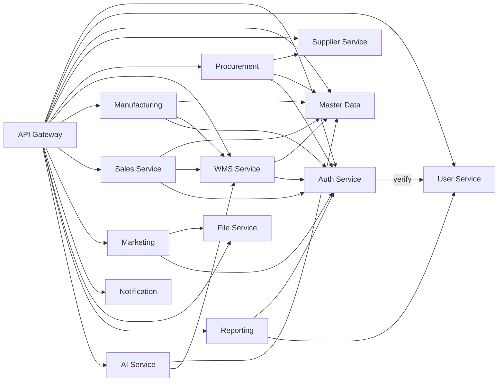

# 02 - CHI TIẾT CÁC SERVICES

## TỔNG QUAN

Tài liệu này mô tả chi tiết 15 microservices trong hệ thống ERP mỹ phẩm, bao gồm:
- Trách nhiệm (Responsibilities)
- Database schema chính
- API endpoints (REST)
- Events publish/subscribe
- Dependencies với services khác
- Permissions yêu cầu

## SERVICE DEPENDENCY MAP



---

## 1. API GATEWAY SERVICE

### Responsibilities

- Route requests tới đúng backend service
- Validate JWT tokens
- Check permissions (RBAC)
- Rate limiting theo user/IP
- Request/Response logging
- Circuit breaker pattern
- CORS handling
- API versioning

### Tech Stack

- **Framework**: Gin (Go)
- **Rate Limiting**: Redis
- **Config**: YAML file

### Configuration Example

```yaml
server:
  port: 8080
  read_timeout: 30s
  write_timeout: 30s

cors:
  allowed_origins: ["http://localhost:3000"]
  allowed_methods: ["GET", "POST", "PUT", "DELETE", "PATCH"]
  allowed_headers: ["Authorization", "Content-Type"]

rate_limit:
  requests_per_minute: 100
  burst: 20

services:
  auth:
    url: "http://auth-service:8081"
    timeout: 5s
  user:
    url: "http://user-service:8082"
    timeout: 10s
  # ... other services
```

### Routes

| Path Pattern | Target Service | Auth Required |
|-------------|---------------|---------------|
| `/api/v1/auth/*` | auth-service:8081 | No |
| `/api/v1/users/*` | user-service:8082 | Yes |
| `/api/v1/master-data/*` | master-data-service:8083 | Yes |
| `/api/v1/suppliers/*` | supplier-service:8084 | Yes |
| `/api/v1/procurement/*` | procurement-service:8085 | Yes |
| `/api/v1/warehouse/*` | wms-service:8086 | Yes |
| `/api/v1/manufacturing/*` | manufacturing-service:8087 | Yes |
| `/api/v1/sales/*` | sales-service:8088 | Yes |
| `/api/v1/marketing/*` | marketing-service:8089 | Yes |
| `/api/v1/notifications/*` | notification-service:8090 | Yes |
| `/api/v1/files/*` | file-service:8091 | Yes |
| `/api/v1/reports/*` | reporting-service:8092 | Yes |
| `/api/v1/ai/*` | ai-service:8093 | Yes |

### Middleware Chain

```go
// Execution order
1. CORS Middleware
2. Request Logger
3. Recovery (panic handler)
4. Rate Limiter
5. JWT Validator (if auth required)
6. Permission Checker (if auth required)
7. Request Proxy to Backend Service
8. Response Logger
```

### No Database

API Gateway không có database riêng, chỉ sử dụng Redis cho rate limiting cache.

---

## 2. AUTH SERVICE

### Responsibilities

- User authentication (login/logout)
- JWT token generation & validation
- Refresh token rotation
- Password reset workflow
- Role-Based Access Control (RBAC)
- Permission management
- Session tracking

### Database Schema

```sql
-- Roles table
CREATE TABLE roles (
    id UUID PRIMARY KEY DEFAULT gen_random_uuid(),
    name VARCHAR(100) NOT NULL UNIQUE,
    description TEXT,
    is_system BOOLEAN DEFAULT false, -- system roles không xóa được
    created_at TIMESTAMP NOT NULL DEFAULT CURRENT_TIMESTAMP,
    updated_at TIMESTAMP NOT NULL DEFAULT CURRENT_TIMESTAMP,
    deleted_at TIMESTAMP
);

-- Permissions table
CREATE TABLE permissions (
    id UUID PRIMARY KEY DEFAULT gen_random_uuid(),
    code VARCHAR(100) NOT NULL UNIQUE, -- format: service:resource:action
    name VARCHAR(200) NOT NULL,
    description TEXT,
    service VARCHAR(50) NOT NULL, -- auth, user, procurement, etc.
    resource VARCHAR(50) NOT NULL, -- user, role, po, stock, etc.
    action VARCHAR(50) NOT NULL, -- read, create, update, delete, approve
    created_at TIMESTAMP NOT NULL DEFAULT CURRENT_TIMESTAMP
);

-- Role-Permission mapping
CREATE TABLE role_permissions (
    id UUID PRIMARY KEY DEFAULT gen_random_uuid(),
    role_id UUID NOT NULL REFERENCES roles(id) ON DELETE CASCADE,
    permission_id UUID NOT NULL REFERENCES permissions(id) ON DELETE CASCADE,
    created_at TIMESTAMP NOT NULL DEFAULT CURRENT_TIMESTAMP,
    UNIQUE(role_id, permission_id)
);

CREATE INDEX idx_role_permissions_role ON role_permissions(role_id);
CREATE INDEX idx_role_permissions_permission ON role_permissions(permission_id);

-- User credentials (password hash stored here)
CREATE TABLE user_credentials (
    id UUID PRIMARY KEY DEFAULT gen_random_uuid(),
    user_id UUID NOT NULL UNIQUE, -- references User in user-service
    email VARCHAR(255) NOT NULL UNIQUE,
    password_hash VARCHAR(255) NOT NULL, -- bcrypt
    is_active BOOLEAN DEFAULT true,
    email_verified BOOLEAN DEFAULT false,
    failed_login_attempts INT DEFAULT 0,
    locked_until TIMESTAMP,
    last_login_at TIMESTAMP,
    created_at TIMESTAMP NOT NULL DEFAULT CURRENT_TIMESTAMP,
    updated_at TIMESTAMP NOT NULL DEFAULT CURRENT_TIMESTAMP,
    deleted_at TIMESTAMP
);

CREATE INDEX idx_user_credentials_email ON user_credentials(email);
CREATE INDEX idx_user_credentials_user_id ON user_credentials(user_id);

-- User-Role mapping
CREATE TABLE user_roles (
    id UUID PRIMARY KEY DEFAULT gen_random_uuid(),
    user_id UUID NOT NULL,
    role_id UUID NOT NULL REFERENCES roles(id) ON DELETE CASCADE,
    assigned_by UUID, -- user_id who assigned this role
    assigned_at TIMESTAMP NOT NULL DEFAULT CURRENT_TIMESTAMP,
    UNIQUE(user_id, role_id)
);

CREATE INDEX idx_user_roles_user ON user_roles(user_id);
CREATE INDEX idx_user_roles_role ON user_roles(role_id);

-- Refresh tokens
CREATE TABLE refresh_tokens (
    id UUID PRIMARY KEY DEFAULT gen_random_uuid(),
    user_id UUID NOT NULL,
    token_hash VARCHAR(255) NOT NULL UNIQUE,
    expires_at TIMESTAMP NOT NULL,
    created_at TIMESTAMP NOT NULL DEFAULT CURRENT_TIMESTAMP,
    revoked_at TIMESTAMP,
    revoked_by UUID,
    ip_address INET,
    user_agent TEXT
);

CREATE INDEX idx_refresh_tokens_user ON refresh_tokens(user_id);
CREATE INDEX idx_refresh_tokens_hash ON refresh_tokens(token_hash);
CREATE INDEX idx_refresh_tokens_expires ON refresh_tokens(expires_at);

-- Password reset tokens
CREATE TABLE password_reset_tokens (
    id UUID PRIMARY KEY DEFAULT gen_random_uuid(),
    user_id UUID NOT NULL,
    token_hash VARCHAR(255) NOT NULL UNIQUE,
    expires_at TIMESTAMP NOT NULL,
    used_at TIMESTAMP,
    created_at TIMESTAMP NOT NULL DEFAULT CURRENT_TIMESTAMP
);

CREATE INDEX idx_password_reset_user ON password_reset_tokens(user_id);
CREATE INDEX idx_password_reset_token ON password_reset_tokens(token_hash);

-- Active sessions
CREATE TABLE sessions (
    id UUID PRIMARY KEY DEFAULT gen_random_uuid(),
    user_id UUID NOT NULL,
    access_token_jti VARCHAR(100) NOT NULL UNIQUE, -- JWT ID
    refresh_token_id UUID REFERENCES refresh_tokens(id),
    ip_address INET,
    user_agent TEXT,
    expires_at TIMESTAMP NOT NULL,
    created_at TIMESTAMP NOT NULL DEFAULT CURRENT_TIMESTAMP,
    last_activity TIMESTAMP NOT NULL DEFAULT CURRENT_TIMESTAMP
);

CREATE INDEX idx_sessions_user ON sessions(user_id);
CREATE INDEX idx_sessions_jti ON sessions(access_token_jti);
```

### API Endpoints

#### Authentication

```
POST   /api/v1/auth/login
POST   /api/v1/auth/logout
POST   /api/v1/auth/refresh
POST   /api/v1/auth/forgot-password
POST   /api/v1/auth/reset-password
POST   /api/v1/auth/verify-email
GET    /api/v1/auth/me
POST   /api/v1/auth/change-password
```

#### Roles (Admin only)

```
GET    /api/v1/auth/roles              # List roles
POST   /api/v1/auth/roles              # Create role
GET    /api/v1/auth/roles/:id          # Get role details
PUT    /api/v1/auth/roles/:id          # Update role
DELETE /api/v1/auth/roles/:id          # Delete role
```

#### Permissions (Admin only)

```
GET    /api/v1/auth/permissions        # List all permissions
POST   /api/v1/auth/permissions        # Create permission
GET    /api/v1/auth/permissions/:id    # Get permission details
```

#### Role-Permission Management

```
POST   /api/v1/auth/roles/:id/permissions         # Assign permissions to role
DELETE /api/v1/auth/roles/:id/permissions/:perm_id # Remove permission from role
GET    /api/v1/auth/roles/:id/permissions         # Get role permissions
```

#### User-Role Management

```
POST   /api/v1/auth/users/:user_id/roles          # Assign role to user
DELETE /api/v1/auth/users/:user_id/roles/:role_id # Remove role from user
GET    /api/v1/auth/users/:user_id/roles          # Get user roles
GET    /api/v1/auth/users/:user_id/permissions    # Get user effective permissions
```

#### Validation (Internal gRPC)

```
ValidateToken(token) -> (user_id, claims, error)
CheckPermission(user_id, permission) -> (allowed, error)
GetUserPermissions(user_id) -> (permissions[], error)
```

### Events Published

```
auth.user.logged_in
auth.user.logged_out
auth.user.password_changed
auth.role.created
auth.role.updated
auth.role.deleted
auth.permission.assigned
auth.permission.revoked
```

### Events Subscribed

```
user.created -> Create user_credentials entry
user.deleted -> Soft delete user_credentials, revoke all tokens
```

### Permissions Required

```
auth:role:read
auth:role:create
auth:role:update
auth:role:delete
auth:permission:manage
auth:user:assign_role
```

### Dependencies

- **User Service** (gRPC): Verify user exists
- **Redis**: Token blacklist, session cache
- **NATS**: Event publishing

---

## 3. USER SERVICE

### Responsibilities

- User profile management
- Department/Team management
- Employee information
- User avatar/photo
- User preferences
- Organization structure

### Database Schema

```sql
-- Departments
CREATE TABLE departments (
    id UUID PRIMARY KEY DEFAULT gen_random_uuid(),
    code VARCHAR(50) NOT NULL UNIQUE,
    name VARCHAR(200) NOT NULL,
    parent_id UUID REFERENCES departments(id),
    manager_id UUID, -- references users.id
    description TEXT,
    is_active BOOLEAN DEFAULT true,
    created_at TIMESTAMP NOT NULL DEFAULT CURRENT_TIMESTAMP,
    updated_at TIMESTAMP NOT NULL DEFAULT CURRENT_TIMESTAMP,
    deleted_at TIMESTAMP
);

CREATE INDEX idx_departments_parent ON departments(parent_id);
CREATE INDEX idx_departments_manager ON departments(manager_id);

-- Users
CREATE TABLE users (
    id UUID PRIMARY KEY DEFAULT gen_random_uuid(),
    employee_code VARCHAR(50) UNIQUE,
    email VARCHAR(255) NOT NULL UNIQUE,
    first_name VARCHAR(100) NOT NULL,
    last_name VARCHAR(100) NOT NULL,
    phone VARCHAR(20),
    mobile VARCHAR(20),
    avatar_url TEXT,
    
    department_id UUID REFERENCES departments(id),
    manager_id UUID REFERENCES users(id),
    position VARCHAR(100),
    job_title VARCHAR(100),
    
    date_of_birth DATE,
    gender VARCHAR(10),
    address TEXT,
    city VARCHAR(100),
    country VARCHAR(100),
    
    hire_date DATE,
    resignation_date DATE,
    employment_status VARCHAR(50) DEFAULT 'ACTIVE', -- ACTIVE, PROBATION, RESIGNED, TERMINATED
    
    preferences JSONB, -- UI preferences, language, theme, etc.
    
    created_at TIMESTAMP NOT NULL DEFAULT CURRENT_TIMESTAMP,
    updated_at TIMESTAMP NOT NULL DEFAULT CURRENT_TIMESTAMP,
    deleted_at TIMESTAMP
);

CREATE INDEX idx_users_email ON users(email);
CREATE INDEX idx_users_department ON users(department_id);
CREATE INDEX idx_users_manager ON users(manager_id);
CREATE INDEX idx_users_employee_code ON users(employee_code);

-- User contact details
CREATE TABLE user_contacts (
    id UUID PRIMARY KEY DEFAULT gen_random_uuid(),
    user_id UUID NOT NULL REFERENCES users(id) ON DELETE CASCADE,
    contact_type VARCHAR(50) NOT NULL, -- EMERGENCY, PERSONAL, WORK
    contact_name VARCHAR(200),
    relationship VARCHAR(100),
    phone VARCHAR(20),
    email VARCHAR(255),
    address TEXT,
    is_primary BOOLEAN DEFAULT false,
    created_at TIMESTAMP NOT NULL DEFAULT CURRENT_TIMESTAMP,
    updated_at TIMESTAMP NOT NULL DEFAULT CURRENT_TIMESTAMP
);

CREATE INDEX idx_user_contacts_user ON user_contacts(user_id);
```

### API Endpoints

```
GET    /api/v1/users                   # List users (with filters, pagination)
POST   /api/v1/users                   # Create user
GET    /api/v1/users/:id               # Get user details
PUT    /api/v1/users/:id               # Update user
DELETE /api/v1/users/:id               # Soft delete user
PATCH  /api/v1/users/:id/status        # Change employment status
POST   /api/v1/users/:id/avatar        # Upload avatar

GET    /api/v1/departments             # List departments
POST   /api/v1/departments             # Create department
GET    /api/v1/departments/:id         # Get department
PUT    /api/v1/departments/:id         # Update department
DELETE /api/v1/departments/:id         # Delete department
GET    /api/v1/departments/:id/users   # Get users in department
```

### gRPC Methods (Internal)

```
GetUser(user_id) -> User
GetUserByEmail(email) -> User
GetUsersByIds(user_ids[]) -> User[]
ValidateUserExists(user_id) -> bool
GetDepartment(dept_id) -> Department
```

### Events Published

```
user.created
user.updated
user.deleted
user.status_changed
department.created
department.updated
department.deleted
```

### Events Subscribed

```
auth.user.logged_in -> Update last_login_at
```

### Permissions Required

```
user:user:read
user:user:create
user:user:update
user:user:delete
user:department:read
user:department:create
user:department:update
user:department:delete
```

### Dependencies

- **Auth Service** (gRPC): Validate permissions
- **File Service** (HTTP): Upload avatar
- **NATS**: Event publishing

---

## 4. MASTER DATA SERVICE

### Responsibilities

- Material master data (raw materials, packaging)
- Product master data
- Categories & subcategories
- Units of measure (UoM)
- Material specifications (INCI, CAS, allergens)
- Material-Supplier mapping
- Price lists

### Database Schema

```sql
-- Categories (hierarchical)
CREATE TABLE categories (
    id UUID PRIMARY KEY DEFAULT gen_random_uuid(),
    code VARCHAR(50) NOT NULL UNIQUE,
    name VARCHAR(200) NOT NULL,
    parent_id UUID REFERENCES categories(id),
    category_type VARCHAR(50) NOT NULL, -- MATERIAL, PRODUCT
    description TEXT,
    is_active BOOLEAN DEFAULT true,
    created_at TIMESTAMP NOT NULL DEFAULT CURRENT_TIMESTAMP,
    updated_at TIMESTAMP NOT NULL DEFAULT CURRENT_TIMESTAMP,
    deleted_at TIMESTAMP
);

CREATE INDEX idx_categories_parent ON categories(parent_id);
CREATE INDEX idx_categories_type ON categories(category_type);

-- Units of measure
CREATE TABLE units_of_measure (
    id UUID PRIMARY KEY DEFAULT gen_random_uuid(),
    code VARCHAR(20) NOT NULL UNIQUE,
    name VARCHAR(100) NOT NULL,
    symbol VARCHAR(10),
    uom_type VARCHAR(50), -- WEIGHT, VOLUME, LENGTH, QUANTITY, TIME
    base_unit_id UUID REFERENCES units_of_measure(id),
    conversion_factor DECIMAL(18,6), -- how many base units in 1 of this unit
    is_active BOOLEAN DEFAULT true,
    created_at TIMESTAMP NOT NULL DEFAULT CURRENT_TIMESTAMP,
    updated_at TIMESTAMP NOT NULL DEFAULT CURRENT_TIMESTAMP
);

-- Materials (raw materials + packaging)
CREATE TABLE materials (
    id UUID PRIMARY KEY DEFAULT gen_random_uuid(),
    material_code VARCHAR(100) NOT NULL UNIQUE,
    name VARCHAR(300) NOT NULL,
    description TEXT,
    
    material_type VARCHAR(50) NOT NULL, -- RAW_MATERIAL, PACKAGING, SEMI_FINISHED
    category_id UUID REFERENCES categories(id),
    
    -- Specifications
    inci_name VARCHAR(500), -- International Nomenclature of Cosmetic Ingredients
    cas_number VARCHAR(50), -- Chemical Abstracts Service number
    origin_country VARCHAR(100),
    is_organic BOOLEAN DEFAULT false,
    is_natural BOOLEAN DEFAULT false,
    
    -- Storage requirements
    storage_conditions TEXT, -- e.g., "Store at 2-8°C"
    requires_cold_storage BOOLEAN DEFAULT false,
    shelf_life_days INT,
    
    -- Safety & Compliance
    is_hazardous BOOLEAN DEFAULT false,
    allergen_info TEXT,
    safety_data_sheet_url TEXT, -- link to SDS file
    
    -- Cost & Pricing
    standard_cost DECIMAL(18,2),
    currency VARCHAR(10) DEFAULT 'VND',
    
    -- Inventory
    base_uom_id UUID NOT NULL REFERENCES units_of_measure(id),
    purchase_uom_id UUID REFERENCES units_of_measure(id),
    stock_uom_id UUID REFERENCES units_of_measure(id),
    
    min_stock_quantity DECIMAL(18,3),
    max_stock_quantity DECIMAL(18,3),
    reorder_point DECIMAL(18,3),
    
    -- Status
    is_active BOOLEAN DEFAULT true,
    discontinued_date DATE,
    
    -- Audit
    created_by UUID NOT NULL,
    updated_by UUID,
    created_at TIMESTAMP NOT NULL DEFAULT CURRENT_TIMESTAMP,
    updated_at TIMESTAMP NOT NULL DEFAULT CURRENT_TIMESTAMP,
    deleted_at TIMESTAMP
);

CREATE INDEX idx_materials_code ON materials(material_code);
CREATE INDEX idx_materials_type ON materials(material_type);
CREATE INDEX idx_materials_category ON materials(category_id);
CREATE INDEX idx_materials_inci ON materials(inci_name);

-- Products (finished goods)
CREATE TABLE products (
    id UUID PRIMARY KEY DEFAULT gen_random_uuid(),
    product_code VARCHAR(100) NOT NULL UNIQUE,
    name VARCHAR(300) NOT NULL,
    description TEXT,
    
    category_id UUID REFERENCES categories(id),
    product_line VARCHAR(100), -- e.g., "Skincare", "Haircare"
    
    -- Product details
    volume DECIMAL(10,2),
    volume_unit VARCHAR(20), -- ml, g
    target_skin_type VARCHAR(100),
    ingredients_summary TEXT, -- for label
    usage_instructions TEXT,
    
    -- Pricing
    standard_price DECIMAL(18,2),
    recommended_retail_price DECIMAL(18,2),
    currency VARCHAR(10) DEFAULT 'VND',
    
    -- Packaging
    packaging_type VARCHAR(100), -- bottle, jar, tube
    barcode VARCHAR(100) UNIQUE,
    sku VARCHAR(100) UNIQUE,
    
    -- Compliance
    cosmetic_license_number VARCHAR(100),
    license_expiry_date DATE,
    
    -- Inventory
    base_uom_id UUID NOT NULL REFERENCES units_of_measure(id),
    sales_uom_id UUID REFERENCES units_of_measure(id),
    
    shelf_life_months INT,
    
    -- Images
    image_urls JSONB, -- array of image URLs
    
    -- Status
    is_active BOOLEAN DEFAULT true,
    launch_date DATE,
    discontinued_date DATE,
    
    -- Audit
    created_by UUID NOT NULL,
    updated_by UUID,
    created_at TIMESTAMP NOT NULL DEFAULT CURRENT_TIMESTAMP,
    updated_at TIMESTAMP NOT NULL DEFAULT CURRENT_TIMESTAMP,
    deleted_at TIMESTAMP
);

CREATE INDEX idx_products_code ON products(product_code);
CREATE INDEX idx_products_category ON products(category_id);
CREATE INDEX idx_products_barcode ON products(barcode);
CREATE INDEX idx_products_sku ON products(sku);

-- Material-Supplier approved list
CREATE TABLE material_suppliers (
    id UUID PRIMARY KEY DEFAULT gen_random_uuid(),
    material_id UUID NOT NULL REFERENCES materials(id),
    supplier_id UUID NOT NULL, -- references supplier-service
    
    is_preferred BOOLEAN DEFAULT false,
    is_approved BOOLEAN DEFAULT true,
    
    supplier_material_code VARCHAR(100), -- code nhà cung cấp dùng
    lead_time_days INT,
    moq DECIMAL(18,3), -- minimum order quantity
    moq_uom_id UUID REFERENCES units_of_measure(id),
    
    unit_price DECIMAL(18,4),
    currency VARCHAR(10) DEFAULT 'VND',
    price_valid_from DATE,
    price_valid_to DATE,
    
    last_purchase_date DATE,
    
    created_at TIMESTAMP NOT NULL DEFAULT CURRENT_TIMESTAMP,
    updated_at TIMESTAMP NOT NULL DEFAULT CURRENT_TIMESTAMP,
    UNIQUE(material_id, supplier_id)
);

CREATE INDEX idx_material_suppliers_material ON material_suppliers(material_id);
CREATE INDEX idx_material_suppliers_supplier ON material_suppliers(supplier_id);
```

### API Endpoints

#### Materials

```
GET    /api/v1/master-data/materials           # List materials
POST   /api/v1/master-data/materials           # Create material
GET    /api/v1/master-data/materials/:id       # Get material
PUT    /api/v1/master-data/materials/:id       # Update material
DELETE /api/v1/master-data/materials/:id       # Delete material
GET    /api/v1/master-data/materials/:id/suppliers # Get approved suppliers
POST   /api/v1/master-data/materials/:id/suppliers # Add approved supplier
```

#### Products

```
GET    /api/v1/master-data/products            # List products
POST   /api/v1/master-data/products            # Create product
GET    /api/v1/master-data/products/:id        # Get product
PUT    /api/v1/master-data/products/:id        # Update product
DELETE /api/v1/master-data/products/:id        # Delete product
```

#### Categories

```
GET    /api/v1/master-data/categories          # List categories (tree)
POST   /api/v1/master-data/categories          # Create category
GET    /api/v1/master-data/categories/:id      # Get category
PUT    /api/v1/master-data/categories/:id      # Update category
DELETE /api/v1/master-data/categories/:id      # Delete category
```

#### Units of Measure

```
GET    /api/v1/master-data/uom                 # List UoM
POST   /api/v1/master-data/uom                 # Create UoM
GET    /api/v1/master-data/uom/:id             # Get UoM
PUT    /api/v1/master-data/uom/:id             # Update UoM
DELETE /api/v1/master-data/uom/:id             # Delete UoM
POST   /api/v1/master-data/uom/convert         # Convert between units
```

### gRPC Methods (Internal)

```
GetMaterial(material_id) -> Material
GetMaterialsByIds(material_ids[]) -> Material[]
GetProduct(product_id) -> Product
GetProductsByIds(product_ids[]) -> Product[]
GetUoM(uom_id) -> UoM
ConvertUoM(value, from_uom, to_uom) -> converted_value
GetMaterialSuppliers(material_id) -> MaterialSupplier[]
```

### Events Published

```
master_data.material.created
master_data.material.updated
master_data.material.deactivated
master_data.product.created
master_data.product.updated
master_data.product.deactivated
master_data.category.created
master_data.category.updated
```

### Events Subscribed

```
supplier.created -> Available for material_suppliers mapping
supplier.deactivated -> Mark material_suppliers.is_approved = false
```

### Permissions Required

```
master_data:material:read
master_data:material:create
master_data:material:update
master_data:material:delete
master_data:product:read
master_data:product:create
master_data:product:update
master_data:product:delete
master_data:category:manage
master_data:uom:manage
```

### Dependencies

- **Supplier Service** (gRPC): Validate supplier_id
- **File Service** (HTTP): Upload SDS files, product images
- **NATS**: Event publishing

---

## 5. SUPPLIER SERVICE

### Responsibilities

- Supplier master data
- Supplier contacts
- Supplier addresses
- Certifications tracking (GMP, ISO, Organic, Ecocert)
- Supplier evaluation/rating
- Approved Supplier List (ASL)

### Database Schema

```sql
-- Suppliers
CREATE TABLE suppliers (
    id UUID PRIMARY KEY DEFAULT gen_random_uuid(),
    supplier_code VARCHAR(50) NOT NULL UNIQUE,
    name VARCHAR(300) NOT NULL,
    legal_name VARCHAR(300),
    tax_code VARCHAR(50) UNIQUE,
    
    supplier_type VARCHAR(50), -- MANUFACTURER, TRADER, IMPORTER
    business_type VARCHAR(50), -- DOMESTIC, INTERNATIONAL
    
    website VARCHAR(255),
    email VARCHAR(255),
    phone VARCHAR(50),
    fax VARCHAR(50),
    
    payment_terms VARCHAR(100), -- e.g., "Net 30", "COD"
    currency VARCHAR(10) DEFAULT 'VND',
    
    bank_name VARCHAR(200),
    bank_account VARCHAR(100),
    bank_branch VARCHAR(200),
    
    credit_limit DECIMAL(18,2),
    
    -- Ratings
    quality_rating INT CHECK (quality_rating BETWEEN 1 AND 5),
    delivery_rating INT CHECK (delivery_rating BETWEEN 1 AND 5),
    service_rating INT CHECK (service_rating BETWEEN 1 AND 5),
    overall_rating DECIMAL(3,2),
    
    -- Status
    status VARCHAR(50) DEFAULT 'PENDING', -- PENDING, APPROVED, BLOCKED, INACTIVE
    is_approved BOOLEAN DEFAULT false,
    approved_by UUID,
    approved_at TIMESTAMP,
    
    notes TEXT,
    
    created_by UUID NOT NULL,
    updated_by UUID,
    created_at TIMESTAMP NOT NULL DEFAULT CURRENT_TIMESTAMP,
    updated_at TIMESTAMP NOT NULL DEFAULT CURRENT_TIMESTAMP,
    deleted_at TIMESTAMP
);

CREATE INDEX idx_suppliers_code ON suppliers(supplier_code);
CREATE INDEX idx_suppliers_status ON suppliers(status);
CREATE INDEX idx_suppliers_tax_code ON suppliers(tax_code);

-- Supplier addresses
CREATE TABLE supplier_addresses (
    id UUID PRIMARY KEY DEFAULT gen_random_uuid(),
    supplier_id UUID NOT NULL REFERENCES suppliers(id) ON DELETE CASCADE,
    address_type VARCHAR(50) NOT NULL, -- BILLING, SHIPPING, OFFICE, FACTORY
    address_line1 VARCHAR(300) NOT NULL,
    address_line2 VARCHAR(300),
    ward VARCHAR(100),
    district VARCHAR(100),
    city VARCHAR(100) NOT NULL,
    province VARCHAR(100),
    country VARCHAR(100) NOT NULL DEFAULT 'Vietnam',
    postal_code VARCHAR(20),
    is_primary BOOLEAN DEFAULT false,
    created_at TIMESTAMP NOT NULL DEFAULT CURRENT_TIMESTAMP,
    updated_at TIMESTAMP NOT NULL DEFAULT CURRENT_TIMESTAMP
);

CREATE INDEX idx_supplier_addresses_supplier ON supplier_addresses(supplier_id);

-- Supplier contacts
CREATE TABLE supplier_contacts (
    id UUID PRIMARY KEY DEFAULT gen_random_uuid(),
    supplier_id UUID NOT NULL REFERENCES suppliers(id) ON DELETE CASCADE,
    contact_type VARCHAR(50), -- PRIMARY, SALES, TECHNICAL, QUALITY, ACCOUNTING
    full_name VARCHAR(200) NOT NULL,
    position VARCHAR(100),
    department VARCHAR(100),
    email VARCHAR(255),
    phone VARCHAR(50),
    mobile VARCHAR(50),
    is_primary BOOLEAN DEFAULT false,
    notes TEXT,
    created_at TIMESTAMP NOT NULL DEFAULT CURRENT_TIMESTAMP,
    updated_at TIMESTAMP NOT NULL DEFAULT CURRENT_TIMESTAMP
);

CREATE INDEX idx_supplier_contacts_supplier ON supplier_contacts(supplier_id);

-- Supplier certifications
CREATE TABLE supplier_certifications (
    id UUID PRIMARY KEY DEFAULT gen_random_uuid(),
    supplier_id UUID NOT NULL REFERENCES suppliers(id) ON DELETE CASCADE,
    certification_type VARCHAR(100) NOT NULL, -- GMP, ISO9001, ISO22716, ORGANIC, ECOCERT, HALAL, etc.
    certificate_number VARCHAR(100),
    issuing_body VARCHAR(200),
    issue_date DATE,
    expiry_date DATE NOT NULL,
    status VARCHAR(50) DEFAULT 'VALID', -- VALID, EXPIRING_SOON, EXPIRED
    
    certificate_file_url TEXT, -- link to file storage
    
    verification_date DATE,
    verified_by UUID,
    notes TEXT,
    
    created_at TIMESTAMP NOT NULL DEFAULT CURRENT_TIMESTAMP,
    updated_at TIMESTAMP NOT NULL DEFAULT CURRENT_TIMESTAMP
);

CREATE INDEX idx_supplier_certifications_supplier ON supplier_certifications(supplier_id);
CREATE INDEX idx_supplier_certifications_expiry ON supplier_certifications(expiry_date);
CREATE INDEX idx_supplier_certifications_status ON supplier_certifications(status);

-- Supplier evaluations (periodic reviews)
CREATE TABLE supplier_evaluations (
    id UUID PRIMARY KEY DEFAULT gen_random_uuid(),
    supplier_id UUID NOT NULL REFERENCES suppliers(id),
    evaluation_date DATE NOT NULL,
    evaluation_period VARCHAR(50), -- Q1-2024, 2024-H1, etc.
    
    -- Criteria scores (1-5)
    quality_score INT CHECK (quality_score BETWEEN 1 AND 5),
    delivery_score INT CHECK (delivery_score BETWEEN 1 AND 5),
    price_score INT CHECK (price_score BETWEEN 1 AND 5),
    service_score INT CHECK (service_score BETWEEN 1 AND 5),
    documentation_score INT CHECK (documentation_score BETWEEN 1 AND 5),
    
    overall_score DECIMAL(3,2),
    
    -- Metrics
    on_time_delivery_rate DECIMAL(5,2), -- percentage
    quality_acceptance_rate DECIMAL(5,2), -- percentage
    lead_time_adherence DECIMAL(5,2),
    
    strengths TEXT,
    weaknesses TEXT,
    action_items TEXT,
    
    evaluated_by UUID NOT NULL,
    reviewed_by UUID,
    status VARCHAR(50) DEFAULT 'DRAFT', -- DRAFT, SUBMITTED, APPROVED
    
    created_at TIMESTAMP NOT NULL DEFAULT CURRENT_TIMESTAMP,
    updated_at TIMESTAMP NOT NULL DEFAULT CURRENT_TIMESTAMP
);

CREATE INDEX idx_supplier_evaluations_supplier ON supplier_evaluations(supplier_id);
CREATE INDEX idx_supplier_evaluations_date ON supplier_evaluations(evaluation_date);
```

### API Endpoints

```
GET    /api/v1/suppliers                       # List suppliers
POST   /api/v1/suppliers                       # Create supplier
GET    /api/v1/suppliers/:id                   # Get supplier details
PUT    /api/v1/suppliers/:id                   # Update supplier
DELETE /api/v1/suppliers/:id                   # Delete supplier
PATCH  /api/v1/suppliers/:id/approve           # Approve supplier
PATCH  /api/v1/suppliers/:id/block             # Block supplier

GET    /api/v1/suppliers/:id/addresses         # Get addresses
POST   /api/v1/suppliers/:id/addresses         # Add address
PUT    /api/v1/suppliers/:id/addresses/:addr_id # Update address
DELETE /api/v1/suppliers/:id/addresses/:addr_id # Delete address

GET    /api/v1/suppliers/:id/contacts          # Get contacts
POST   /api/v1/suppliers/:id/contacts          # Add contact
PUT    /api/v1/suppliers/:id/contacts/:contact_id # Update contact
DELETE /api/v1/suppliers/:id/contacts/:contact_id # Delete contact

GET    /api/v1/suppliers/:id/certifications    # Get certifications
POST   /api/v1/suppliers/:id/certifications    # Add certification
PUT    /api/v1/suppliers/:id/certifications/:cert_id # Update certification
DELETE /api/v1/suppliers/:id/certifications/:cert_id # Delete certification
GET    /api/v1/suppliers/certifications/expiring # Get expiring certifications

GET    /api/v1/suppliers/:id/evaluations       # Get evaluations
POST   /api/v1/suppliers/:id/evaluations       # Create evaluation
GET    /api/v1/suppliers/:id/evaluations/:eval_id # Get evaluation detail
PUT    /api/v1/suppliers/:id/evaluations/:eval_id # Update evaluation
PATCH  /api/v1/suppliers/:id/evaluations/:eval_id/submit # Submit evaluation
```

### gRPC Methods (Internal)

```
GetSupplier(supplier_id) -> Supplier
GetSuppliersByIds(supplier_ids[]) -> Supplier[]
GetSupplierByCode(supplier_code) -> Supplier
ValidateSupplierActive(supplier_id) -> bool
GetSupplierContacts(supplier_id) -> Contact[]
GetSupplierCertifications(supplier_id) -> Certification[]
```

### Events Published

```
supplier.created
supplier.updated
supplier.approved
supplier.blocked
supplier.deactivated
supplier.certification.added
supplier.certification.expiring (30 days before)
supplier.certification.expired
supplier.evaluation.completed
```

### Events Subscribed

None

### Permissions Required

```
supplier:supplier:read
supplier:supplier:create
supplier:supplier:update
supplier:supplier:delete
supplier:supplier:approve
supplier:certification:manage
supplier:evaluation:create
supplier:evaluation:approve
```

### Dependencies

- **File Service** (HTTP): Upload certification documents
- **Notification Service** (Event): Send expiry alerts
- **NATS**: Event publishing

---

## 6. PROCUREMENT SERVICE

### Responsibilities

- Purchase Requisition (PR) workflow
- Purchase Order (PO) creation & management
- RFQ (Request for Quotation) process
- Approval workflows
- PO tracking
- Vendor comparison

### Database Schema

```sql
-- Purchase Requisitions
CREATE TABLE purchase_requisitions (
    id UUID PRIMARY KEY DEFAULT gen_random_uuid(),
    pr_number VARCHAR(50) NOT NULL UNIQUE,
    pr_date DATE NOT NULL,
    
    requested_by UUID NOT NULL,
    department_id UUID,
    
    required_date DATE NOT NULL, -- ngày cần hàng
    priority VARCHAR(20) DEFAULT 'NORMAL', -- URGENT, HIGH, NORMAL, LOW
    
    justification TEXT,
    
    status VARCHAR(50) DEFAULT 'DRAFT', -- DRAFT, SUBMITTED, APPROVED, REJECTED, CANCELLED, COMPLETED
    
    -- Approval workflow
    submitted_at TIMESTAMP,
    approved_by UUID,
    approved_at TIMESTAMP,
    rejected_by UUID,
    rejected_at TIMESTAMP,
    rejection_reason TEXT,
    
    total_amount DECIMAL(18,2),
    currency VARCHAR(10) DEFAULT 'VND',
    
    notes TEXT,
    
    created_by UUID NOT NULL,
    updated_by UUID,
    created_at TIMESTAMP NOT NULL DEFAULT CURRENT_TIMESTAMP,
    updated_at TIMESTAMP NOT NULL DEFAULT CURRENT_TIMESTAMP,
    deleted_at TIMESTAMP
);

CREATE INDEX idx_pr_number ON purchase_requisitions(pr_number);
CREATE INDEX idx_pr_status ON purchase_requisitions(status);
CREATE INDEX idx_pr_requested_by ON purchase_requisitions(requested_by);

-- PR Line Items
CREATE TABLE pr_line_items (
    id UUID PRIMARY KEY DEFAULT gen_random_uuid(),
    pr_id UUID NOT NULL REFERENCES purchase_requisitions(id) ON DELETE CASCADE,
    line_number INT NOT NULL,
    
    material_id UUID NOT NULL, -- references master-data-service
    material_code VARCHAR(100) NOT NULL, -- denormalized
    material_name VARCHAR(300) NOT NULL, -- denormalized
    
    quantity DECIMAL(18,3) NOT NULL,
    uom_id UUID NOT NULL,
    uom_code VARCHAR(20) NOT NULL, -- denormalized
    
    required_date DATE NOT NULL,
    
    estimated_unit_price DECIMAL(18,4),
    estimated_total DECIMAL(18,2),
    
    specifications TEXT,
    notes TEXT,
    
    status VARCHAR(50) DEFAULT 'PENDING', -- PENDING, PARTIALLY_ORDERED, FULLY_ORDERED, CANCELLED
    
    created_at TIMESTAMP NOT NULL DEFAULT CURRENT_TIMESTAMP,
    updated_at TIMESTAMP NOT NULL DEFAULT CURRENT_TIMESTAMP,
    UNIQUE(pr_id, line_number)
);

CREATE INDEX idx_pr_items_pr ON pr_line_items(pr_id);
CREATE INDEX idx_pr_items_material ON pr_line_items(material_id);

-- Purchase Orders
CREATE TABLE purchase_orders (
    id UUID PRIMARY KEY DEFAULT gen_random_uuid(),
    po_number VARCHAR(50) NOT NULL UNIQUE,
    po_date DATE NOT NULL,
    
    supplier_id UUID NOT NULL, -- references supplier-service
    supplier_code VARCHAR(50) NOT NULL, -- denormalized
    supplier_name VARCHAR(300) NOT NULL, -- denormalized
    
    delivery_address_id UUID, -- supplier address
    billing_address_id UUID,
    
    payment_terms VARCHAR(100),
    delivery_terms VARCHAR(100), -- Incoterms: EXW, FOB, CIF, etc.
    
    expected_delivery_date DATE,
    
    status VARCHAR(50) DEFAULT 'DRAFT', -- DRAFT, SUBMITTED, CONFIRMED, PARTIALLY_RECEIVED, FULLY_RECEIVED, CANCELLED, CLOSED
    
    -- Approval
    approved_by UUID,
    approved_at TIMESTAMP,
    
    -- Supplier confirmation
    supplier_confirmed_at TIMESTAMP,
    supplier_confirmed_delivery_date DATE,
    
    subtotal DECIMAL(18,2),
    tax_amount DECIMAL(18,2),
    discount_amount DECIMAL(18,2),
    freight_amount DECIMAL(18,2),
    total_amount DECIMAL(18,2),
    currency VARCHAR(10) DEFAULT 'VND',
    
    notes TEXT,
    terms_and_conditions TEXT,
    
    created_by UUID NOT NULL,
    updated_by UUID,
    created_at TIMESTAMP NOT NULL DEFAULT CURRENT_TIMESTAMP,
    updated_at TIMESTAMP NOT NULL DEFAULT CURRENT_TIMESTAMP,
    deleted_at TIMESTAMP
);

CREATE INDEX idx_po_number ON purchase_orders(po_number);
CREATE INDEX idx_po_supplier ON purchase_orders(supplier_id);
CREATE INDEX idx_po_status ON purchase_orders(status);
CREATE INDEX idx_po_date ON purchase_orders(po_date);

-- PO Line Items
CREATE TABLE po_line_items (
    id UUID PRIMARY KEY DEFAULT gen_random_uuid(),
    po_id UUID NOT NULL REFERENCES purchase_orders(id) ON DELETE CASCADE,
    line_number INT NOT NULL,
    
    pr_line_item_id UUID, -- optional reference to PR line
    
    material_id UUID NOT NULL,
    material_code VARCHAR(100) NOT NULL, -- denormalized
    material_name VARCHAR(300) NOT NULL, -- denormalized
    
    quantity DECIMAL(18,3) NOT NULL,
    uom_id UUID NOT NULL,
    uom_code VARCHAR(20) NOT NULL,
    
    unit_price DECIMAL(18,4) NOT NULL,
    discount_percent DECIMAL(5,2),
    discount_amount DECIMAL(18,2),
    tax_percent DECIMAL(5,2),
    tax_amount DECIMAL(18,2),
    line_total DECIMAL(18,2) NOT NULL,
    
    received_quantity DECIMAL(18,3) DEFAULT 0,
    remaining_quantity DECIMAL(18,3),
    
    specifications TEXT,
    notes TEXT,
    
    status VARCHAR(50) DEFAULT 'PENDING', -- PENDING, PARTIALLY_RECEIVED, FULLY_RECEIVED, CANCELLED
    
    created_at TIMESTAMP NOT NULL DEFAULT CURRENT_TIMESTAMP,
    updated_at TIMESTAMP NOT NULL DEFAULT CURRENT_TIMESTAMP,
    UNIQUE(po_id, line_number)
);

CREATE INDEX idx_po_items_po ON po_line_items(po_id);
CREATE INDEX idx_po_items_material ON po_line_items(material_id);
CREATE INDEX idx_po_items_pr_line ON po_line_items(pr_line_item_id);

-- RFQ (Request for Quotation) - Optional
CREATE TABLE rfqs (
    id UUID PRIMARY KEY DEFAULT gen_random_uuid(),
    rfq_number VARCHAR(50) NOT NULL UNIQUE,
    rfq_date DATE NOT NULL,
    
    pr_id UUID REFERENCES purchase_requisitions(id),
    
    subject VARCHAR(300) NOT NULL,
    description TEXT,
    
    submission_deadline TIMESTAMP NOT NULL,
    
    status VARCHAR(50) DEFAULT 'DRAFT', -- DRAFT, SENT, RESPONSES_RECEIVED, EVALUATED, CLOSED
    
    created_by UUID NOT NULL,
    created_at TIMESTAMP NOT NULL DEFAULT CURRENT_TIMESTAMP,
    updated_at TIMESTAMP NOT NULL DEFAULT CURRENT_TIMESTAMP
);

-- RFQ sent to suppliers
CREATE TABLE rfq_suppliers (
    id UUID PRIMARY KEY DEFAULT gen_random_uuid(),
    rfq_id UUID NOT NULL REFERENCES rfqs(id) ON DELETE CASCADE,
    supplier_id UUID NOT NULL,
    
    sent_at TIMESTAMP,
    responded_at TIMESTAMP,
    
    status VARCHAR(50) DEFAULT 'PENDING', -- PENDING, RESPONDED, DECLINED, SELECTED
    
    created_at TIMESTAMP NOT NULL DEFAULT CURRENT_TIMESTAMP,
    UNIQUE(rfq_id, supplier_id)
);

-- Supplier quotations
CREATE TABLE supplier_quotations (
    id UUID PRIMARY KEY DEFAULT gen_random_uuid(),
    rfq_supplier_id UUID NOT NULL REFERENCES rfq_suppliers(id),
    
    quotation_number VARCHAR(100),
    quotation_date DATE NOT NULL,
    valid_until DATE,
    
    payment_terms VARCHAR(100),
    delivery_terms VARCHAR(100),
    lead_time_days INT,
    
    total_amount DECIMAL(18,2),
    currency VARCHAR(10) DEFAULT 'VND',
    
    attachments JSONB, -- file URLs
    notes TEXT,
    
    is_selected BOOLEAN DEFAULT false,
    
    created_at TIMESTAMP NOT NULL DEFAULT CURRENT_TIMESTAMP,
    updated_at TIMESTAMP NOT NULL DEFAULT CURRENT_TIMESTAMP
);
```

### API Endpoints

#### Purchase Requisitions

```
GET    /api/v1/procurement/requisitions        # List PRs
POST   /api/v1/procurement/requisitions        # Create PR
GET    /api/v1/procurement/requisitions/:id    # Get PR details
PUT    /api/v1/procurement/requisitions/:id    # Update PR
DELETE /api/v1/procurement/requisitions/:id    # Delete PR (draft only)
PATCH  /api/v1/procurement/requisitions/:id/submit # Submit PR for approval
PATCH  /api/v1/procurement/requisitions/:id/approve # Approve PR
PATCH  /api/v1/procurement/requisitions/:id/reject # Reject PR
```

#### Purchase Orders

```
GET    /api/v1/procurement/purchase-orders     # List POs
POST   /api/v1/procurement/purchase-orders     # Create PO
POST   /api/v1/procurement/purchase-orders/from-pr/:pr_id # Create PO from PR
GET    /api/v1/procurement/purchase-orders/:id # Get PO details
PUT    /api/v1/procurement/purchase-orders/:id # Update PO
DELETE /api/v1/procurement/purchase-orders/:id # Delete PO (draft only)
PATCH  /api/v1/procurement/purchase-orders/:id/submit # Submit to supplier
PATCH  /api/v1/procurement/purchase-orders/:id/cancel # Cancel PO
GET    /api/v1/procurement/purchase-orders/:id/pdf # Generate PO PDF
```

#### RFQ

```
GET    /api/v1/procurement/rfqs                # List RFQs
POST   /api/v1/procurement/rfqs                # Create RFQ
GET    /api/v1/procurement/rfqs/:id            # Get RFQ details
PUT    /api/v1/procurement/rfqs/:id            # Update RFQ
PATCH  /api/v1/procurement/rfqs/:id/send       # Send to suppliers
POST   /api/v1/procurement/rfqs/:id/quotations # Submit quotation (supplier)
GET    /api/v1/procurement/rfqs/:id/compare    # Compare quotations
```

### gRPC Methods (Internal)

```
GetPO(po_id) -> PurchaseOrder
GetPOByNumber(po_number) -> PurchaseOrder
UpdatePOReceivedQuantity(po_line_item_id, quantity) -> bool
GetPendingPOsForSupplier(supplier_id) -> PurchaseOrder[]
```

### Events Published

```
procurement.pr.created
procurement.pr.submitted
procurement.pr.approved
procurement.pr.rejected
procurement.po.created
procurement.po.submitted
procurement.po.confirmed
procurement.po.cancelled
procurement.rfq.sent
procurement.quotation.received
```

### Events Subscribed

```
wms.grn.completed -> Update PO received quantities
supplier.blocked -> Alert for active POs
```

### Permissions Required

```
procurement:pr:read
procurement:pr:create
procurement:pr:update
procurement:pr:submit
procurement:pr:approve
procurement:po:read
procurement:po:create
procurement:po:update
procurement:po:approve
procurement:po:cancel
procurement:rfq:manage
```

### Dependencies

- **Supplier Service** (gRPC): Get supplier details, validate supplier
- **Master Data Service** (gRPC): Get material details, validate materials
- **User Service** (gRPC): Get requester/approver details
- **WMS Service** (Event): Receive GRN completion events
- **File Service** (HTTP): Upload attachments, generate PO PDF
- **NATS**: Event publishing

---

**Note**: Tài liệu này còn 9 services nữa. Tôi sẽ tiếp tục trong phần tiếp theo để tránh file quá dài.

Các services còn lại:
7. WMS Service
8. Manufacturing Service
9. Sales Service
10. Marketing Service
11. Finance Service
12. Reporting Service
13. Notification Service
14. AI Service
15. File Service

---

**Document Version**: 1.0 (Part 1/2)  
**Last Updated**: 2026-01-23  
**Author**: ERP Development Team

## 7. WMS SERVICE (Warehouse Management)

### Responsibilities

- Warehouse, zone, location hierarchy
- Lot/Batch management với expiry tracking
- Stock on hand, reservations
- Goods Receipt Note (GRN) từ PO
- Goods Issue (FEFO logic)
- Stock transfers, adjustments
- Inventory counting/cycle count
- Cold storage monitoring

### Database Schema (Key Tables)

```sql
-- Warehouses
CREATE TABLE warehouses (
    id UUID PRIMARY KEY DEFAULT gen_random_uuid(),
    code VARCHAR(50) NOT NULL UNIQUE,
    name VARCHAR(200) NOT NULL,
    warehouse_type VARCHAR(50), -- MAIN, COLD_STORAGE, QUARANTINE, FG
    address TEXT,
    is_active BOOLEAN DEFAULT true,
    created_at TIMESTAMP NOT NULL DEFAULT CURRENT_TIMESTAMP,
    updated_at TIMESTAMP NOT NULL DEFAULT CURRENT_TIMESTAMP
);

-- Zones within warehouse
CREATE TABLE zones (
    id UUID PRIMARY KEY DEFAULT gen_random_uuid(),
    warehouse_id UUID NOT NULL REFERENCES warehouses(id),
    code VARCHAR(50) NOT NULL,
    name VARCHAR(200) NOT NULL,
    zone_type VARCHAR(50), -- RECEIVING, STORAGE, PICKING, SHIPPING, COLD
    temperature_min DECIMAL(5,2),
    temperature_max DECIMAL(5,2),
    is_active BOOLEAN DEFAULT true,
    created_at TIMESTAMP NOT NULL DEFAULT CURRENT_TIMESTAMP,
    UNIQUE(warehouse_id, code)
);

-- Storage locations
CREATE TABLE locations (
    id UUID PRIMARY KEY DEFAULT gen_random_uuid(),
    zone_id UUID NOT NULL REFERENCES zones(id),
    code VARCHAR(50) NOT NULL,
    aisle VARCHAR(20),
    rack VARCHAR(20),
    shelf VARCHAR(20),
    bin VARCHAR(20),
    capacity_weight DECIMAL(10,2),
    capacity_volume DECIMAL(10,2),
    is_active BOOLEAN DEFAULT true,
    created_at TIMESTAMP NOT NULL DEFAULT CURRENT_TIMESTAMP,
    UNIQUE(zone_id, code)
);

-- Lots/Batches
CREATE TABLE lots (
    id UUID PRIMARY KEY DEFAULT gen_random_uuid(),
    lot_number VARCHAR(100) NOT NULL UNIQUE,
    material_id UUID NOT NULL,
    supplier_id UUID,
    supplier_lot_number VARCHAR(100),
    
    manufactured_date DATE,
    expiry_date DATE,
    
    grn_id UUID, -- references GRN
    po_id UUID,
    
    status VARCHAR(50) DEFAULT 'ACTIVE', -- ACTIVE, QUARANTINE, APPROVED, EXPIRED, CONSUMED
    
    created_at TIMESTAMP NOT NULL DEFAULT CURRENT_TIMESTAMP,
    updated_at TIMESTAMP NOT NULL DEFAULT CURRENT_TIMESTAMP
);

CREATE INDEX idx_lots_material ON lots(material_id);
CREATE INDEX idx_lots_expiry ON lots(expiry_date);

-- Stock on hand
CREATE TABLE stock (
    id UUID PRIMARY KEY DEFAULT gen_random_uuid(),
    location_id UUID NOT NULL REFERENCES locations(id),
    material_id UUID NOT NULL,
    lot_id UUID REFERENCES lots(id),
    
    quantity DECIMAL(18,3) NOT NULL DEFAULT 0 CHECK (quantity >= 0),
    reserved_quantity DECIMAL(18,3) NOT NULL DEFAULT 0 CHECK (reserved_quantity >= 0),
    available_quantity DECIMAL(18,3) GENERATED ALWAYS AS (quantity - reserved_quantity) STORED,
    
    uom_id UUID NOT NULL,
    
    last_movement_at TIMESTAMP,
    
    created_at TIMESTAMP NOT NULL DEFAULT CURRENT_TIMESTAMP,
    updated_at TIMESTAMP NOT NULL DEFAULT CURRENT_TIMESTAMP,
    UNIQUE(location_id, material_id, lot_id)
);

CREATE INDEX idx_stock_location ON stock(location_id);
CREATE INDEX idx_stock_material ON stock(material_id);
CREATE INDEX idx_stock_lot ON stock(lot_id);

-- Stock movements (transaction log)
CREATE TABLE stock_movements (
    id UUID PRIMARY KEY DEFAULT gen_random_uuid(),
    movement_number VARCHAR(50) NOT NULL UNIQUE,
    movement_date TIMESTAMP NOT NULL DEFAULT CURRENT_TIMESTAMP,
    movement_type VARCHAR(50) NOT NULL, -- GRN, GOODS_ISSUE, TRANSFER, ADJUSTMENT, RETURN
    
    material_id UUID NOT NULL,
    lot_id UUID,
    
    from_location_id UUID REFERENCES locations(id),
    to_location_id UUID REFERENCES locations(id),
    
    quantity DECIMAL(18,3) NOT NULL,
    uom_id UUID NOT NULL,
    
    reference_type VARCHAR(50), -- PO, WORK_ORDER, SALES_ORDER, ADJUSTMENT
    reference_id UUID,
    reference_number VARCHAR(100),
    
    reason TEXT,
    
    created_by UUID NOT NULL,
    created_at TIMESTAMP NOT NULL DEFAULT CURRENT_TIMESTAMP
);

CREATE INDEX idx_movements_type ON stock_movements(movement_type);
CREATE INDEX idx_movements_material ON stock_movements(material_id);
CREATE INDEX idx_movements_date ON stock_movements(movement_date);

-- Goods Receipt Notes
CREATE TABLE grns (
    id UUID PRIMARY KEY DEFAULT gen_random_uuid(),
    grn_number VARCHAR(50) NOT NULL UNIQUE,
    grn_date DATE NOT NULL,
    
    po_id UUID NOT NULL,
    po_number VARCHAR(50) NOT NULL,
    supplier_id UUID NOT NULL,
    
    warehouse_id UUID NOT NULL REFERENCES warehouses(id),
    
    received_by UUID NOT NULL,
    checked_by UUID,
    approved_by UUID,
    
    status VARCHAR(50) DEFAULT 'DRAFT', -- DRAFT, SUBMITTED, QC_PENDING, QC_PASSED, QC_FAILED, COMPLETED
    
    delivery_note_number VARCHAR(100), -- supplier delivery note
    vehicle_number VARCHAR(50),
    
    notes TEXT,
    
    created_at TIMESTAMP NOT NULL DEFAULT CURRENT_TIMESTAMP,
    updated_at TIMESTAMP NOT NULL DEFAULT CURRENT_TIMESTAMP
);

CREATE INDEX idx_grns_po ON grns(po_id);
CREATE INDEX idx_grns_number ON grns(grn_number);

-- GRN Line Items
CREATE TABLE grn_line_items (
    id UUID PRIMARY KEY DEFAULT gen_random_uuid(),
    grn_id UUID NOT NULL REFERENCES grns(id) ON DELETE CASCADE,
    line_number INT NOT NULL,
    
    po_line_item_id UUID,
    material_id UUID NOT NULL,
    
    lot_id UUID REFERENCES lots(id),
    
    ordered_quantity DECIMAL(18,3),
    received_quantity DECIMAL(18,3) NOT NULL,
    accepted_quantity DECIMAL(18,3),
    rejected_quantity DECIMAL(18,3),
    
    uom_id UUID NOT NULL,
    
    location_id UUID REFERENCES locations(id), -- putaway location
    
    qc_status VARCHAR(50), -- PENDING, PASSED, FAILED
    qc_notes TEXT,
    
    created_at TIMESTAMP NOT NULL DEFAULT CURRENT_TIMESTAMP,
    UNIQUE(grn_id, line_number)
);

-- Stock reservations
CREATE TABLE stock_reservations (
    id UUID PRIMARY KEY DEFAULT gen_random_uuid(),
    stock_id UUID NOT NULL REFERENCES stock(id),
    
    reserved_quantity DECIMAL(18,3) NOT NULL,
    uom_id UUID NOT NULL,
    
    reservation_type VARCHAR(50), -- SALES_ORDER, WORK_ORDER
    reference_id UUID NOT NULL,
    reference_number VARCHAR(100),
    
    reserved_by UUID NOT NULL,
    reserved_at TIMESTAMP NOT NULL DEFAULT CURRENT_TIMESTAMP,
    expires_at TIMESTAMP,
    
    released_at TIMESTAMP,
    released_by UUID
);

CREATE INDEX idx_reservations_stock ON stock_reservations(stock_id);
CREATE INDEX idx_reservations_reference ON stock_reservations(reference_id);
```

### API Endpoints

```
GET    /api/v1/warehouse/warehouses
POST   /api/v1/warehouse/warehouses
GET    /api/v1/warehouse/warehouses/:id
GET    /api/v1/warehouse/warehouses/:id/stock

GET    /api/v1/warehouse/stock              # Stock inquiry với filters
GET    /api/v1/warehouse/stock/material/:material_id
GET    /api/v1/warehouse/stock/expiring     # FEFO - sắp hết hạn
GET    /api/v1/warehouse/stock/low-stock    # Below reorder point

GET    /api/v1/warehouse/grn                # List GRNs
POST   /api/v1/warehouse/grn                # Create GRN from PO
GET    /api/v1/warehouse/grn/:id
PUT    /api/v1/warehouse/grn/:id
PATCH  /api/v1/warehouse/grn/:id/complete

POST   /api/v1/warehouse/issue              # Goods Issue (FEFO)
POST   /api/v1/warehouse/transfer           # Stock transfer
POST   /api/v1/warehouse/adjustment         # Stock adjustment

GET    /api/v1/warehouse/movements          # Movement history
GET    /api/v1/warehouse/movements/material/:id

POST   /api/v1/warehouse/reserve            # Reserve stock
POST   /api/v1/warehouse/reserve/:id/release # Release reservation
```

### gRPC Methods

```
CheckStockAvailability(material_id, quantity) -> bool
ReserveStock(material_id, quantity, reference) -> reservation_id
ReleaseReservation(reservation_id) -> bool
GetStockByMaterial(material_id) -> Stock[]
GetLotsByMaterial(material_id) -> Lot[]
IssueStock(material_id, quantity, FEFO=true) -> StockMovement
```

### Events Published

```
wms.grn.created
wms.grn.completed
wms.stock.received
wms.stock.issued
wms.stock.transferred
wms.stock.adjusted
wms.stock.low_stock_alert
wms.lot.expiring_soon (30 days before)
wms.lot.expired
wms.stock.reserved
wms.stock.reservation_released
```

### Events Subscribed

```
procurement.po.confirmed -> Prepare for receiving
manufacturing.workorder.started -> Reserve materials
sales.order.confirmed -> Reserve products
```

### Permissions

```
wms:stock:read
wms:grn:create
wms:grn:approve
wms:issue:create
wms:transfer:create
wms:adjustment:create
wms:adjustment:approve
```

---

## 8. MANUFACTURING SERVICE

### Responsibilities

- Bill of Materials (BOM) với versioning
- BOM costing
- Work Order creation & tracking
- Material issue to production
- Production completion
- QC checkpoints (IQC, IPQC, FQC)
- NCR (Non-Conformance Report)
- Batch/Lot traceability

### Database Schema (Key Tables)

```sql
-- BOM Headers
CREATE TABLE boms (
    id UUID PRIMARY KEY DEFAULT gen_random_uuid(),
    bom_number VARCHAR(50) NOT NULL UNIQUE,
    product_id UUID NOT NULL, -- finished product
    version INT NOT NULL DEFAULT 1,
    
    bom_type VARCHAR(50) DEFAULT 'PRODUCTION', -- PRODUCTION, COSTING, ENGINEERING
    
    name VARCHAR(300) NOT NULL,
    description TEXT,
    
    batch_size DECIMAL(18,3) NOT NULL, -- standard batch quantity
    batch_uom_id UUID NOT NULL,
    
    formula_details JSONB, -- ENCRYPTED - công thức chi tiết
    
    -- Cost
    material_cost DECIMAL(18,4),
    labor_cost DECIMAL(18,4),
    overhead_cost DECIMAL(18,4),
    total_cost DECIMAL(18,4),
    currency VARCHAR(10) DEFAULT 'VND',
    
    -- Status
    status VARCHAR(50) DEFAULT 'DRAFT', -- DRAFT, PENDING_APPROVAL, APPROVED, OBSOLETE
    is_active BOOLEAN DEFAULT false,
    effective_from DATE,
    effective_to DATE,
    
    -- Approval
    approved_by UUID,
    approved_at TIMESTAMP,
    
    -- Access control
    confidentiality_level VARCHAR(50) DEFAULT 'RESTRICTED', -- PUBLIC, INTERNAL, RESTRICTED, CONFIDENTIAL
    
    created_by UUID NOT NULL,
    updated_by UUID,
    created_at TIMESTAMP NOT NULL DEFAULT CURRENT_TIMESTAMP,
    updated_at TIMESTAMP NOT NULL DEFAULT CURRENT_TIMESTAMP,
    deleted_at TIMESTAMP
);

CREATE INDEX idx_boms_product ON boms(product_id);
CREATE INDEX idx_boms_status ON boms(status);
CREATE UNIQUE INDEX idx_boms_product_version ON boms(product_id, version);

-- BOM Line Items (materials)
CREATE TABLE bom_line_items (
    id UUID PRIMARY KEY DEFAULT gen_random_uuid(),
    bom_id UUID NOT NULL REFERENCES boms(id) ON DELETE CASCADE,
    line_number INT NOT NULL,
    
    material_id UUID NOT NULL,
    material_code VARCHAR(100) NOT NULL,
    material_name VARCHAR(300) NOT NULL,
    
    quantity DECIMAL(18,6) NOT NULL, -- per batch
    uom_id UUID NOT NULL,
    
    -- Tolerances
    quantity_min DECIMAL(18,6), -- minimum allowed
    quantity_max DECIMAL(18,6), -- maximum allowed
    
    item_type VARCHAR(50) DEFAULT 'MATERIAL', -- MATERIAL, PACKAGING, LABEL
    
    is_critical BOOLEAN DEFAULT false, -- critical for quality
    
    scrap_percent DECIMAL(5,2) DEFAULT 0, -- expected waste/scrap
    
    notes TEXT,
    
    created_at TIMESTAMP NOT NULL DEFAULT CURRENT_TIMESTAMP,
    updated_at TIMESTAMP NOT NULL DEFAULT CURRENT_TIMESTAMP,
    UNIQUE(bom_id, line_number)
);

CREATE INDEX idx_bom_items_bom ON bom_line_items(bom_id);
CREATE INDEX idx_bom_items_material ON bom_line_items(material_id);

-- Work Orders
CREATE TABLE work_orders (
    id UUID PRIMARY KEY DEFAULT gen_random_uuid(),
    wo_number VARCHAR(50) NOT NULL UNIQUE,
    wo_date DATE NOT NULL,
    
    product_id UUID NOT NULL,
    bom_id UUID NOT NULL REFERENCES boms(id),
    bom_version INT NOT NULL,
    
    planned_quantity DECIMAL(18,3) NOT NULL,
    actual_quantity DECIMAL(18,3),
    good_quantity DECIMAL(18,3),
    rejected_quantity DECIMAL(18,3),
    
    uom_id UUID NOT NULL,
    
    planned_start_date DATE,
    planned_end_date DATE,
    actual_start_date DATE,
    actual_end_date DATE,
    
    batch_number VARCHAR(100), -- production batch
    
    status VARCHAR(50) DEFAULT 'PLANNED', -- PLANNED, RELEASED, IN_PROGRESS, QC_PENDING, COMPLETED, CANCELLED
    
    priority VARCHAR(20) DEFAULT 'NORMAL',
    
    sales_order_id UUID, -- optional linkage
    
    production_line VARCHAR(100),
    shift VARCHAR(50),
    
    supervisor_id UUID,
    
    notes TEXT,
    
    created_by UUID NOT NULL,
    updated_by UUID,
    created_at TIMESTAMP NOT NULL DEFAULT CURRENT_TIMESTAMP,
    updated_at TIMESTAMP NOT NULL DEFAULT CURRENT_TIMESTAMP
);

CREATE INDEX idx_wo_number ON work_orders(wo_number);
CREATE INDEX idx_wo_status ON work_orders(status);
CREATE INDEX idx_wo_product ON work_orders(product_id);

-- Material issues to WO
CREATE TABLE wo_material_issues (
    id UUID PRIMARY KEY DEFAULT gen_random_uuid(),
    wo_id UUID NOT NULL REFERENCES work_orders(id),
    
    material_id UUID NOT NULL,
    lot_id UUID,
    
    issued_quantity DECIMAL(18,6) NOT NULL,
    uom_id UUID NOT NULL,
    
    stock_movement_id UUID, -- link to WMS movement
    
    issued_by UUID NOT NULL,
    issued_at TIMESTAMP NOT NULL DEFAULT CURRENT_TIMESTAMP
);

CREATE INDEX idx_wo_issues_wo ON wo_material_issues(wo_id);

-- QC Inspections
CREATE TABLE qc_inspections (
    id UUID PRIMARY KEY DEFAULT gen_random_uuid(),
    inspection_number VARCHAR(50) NOT NULL UNIQUE,
    inspection_date TIMESTAMP NOT NULL DEFAULT CURRENT_TIMESTAMP,
    
    inspection_type VARCHAR(50) NOT NULL, -- IQC (Incoming), IPQC (In-Process), FQC (Final)
    
    reference_type VARCHAR(50), -- GRN, WORK_ORDER, STOCK
    reference_id UUID NOT NULL,
    reference_number VARCHAR(100),
    
    material_id UUID, -- for IQC
    product_id UUID, -- for FQC
    lot_id UUID,
    
    inspected_quantity DECIMAL(18,3),
    accepted_quantity DECIMAL(18,3),
    rejected_quantity DECIMAL(18,3),
    
    uom_id UUID,
    
    result VARCHAR(50) DEFAULT 'PENDING', -- PENDING, PASSED, FAILED, CONDITIONAL
    
    inspector_id UUID NOT NULL,
    reviewed_by UUID,
    
    test_results JSONB, -- detailed test data
    attachments JSONB, -- photo URLs
    
    notes TEXT,
    
    created_at TIMESTAMP NOT NULL DEFAULT CURRENT_TIMESTAMP,
    updated_at TIMESTAMP NOT NULL DEFAULT CURRENT_TIMESTAMP
);

CREATE INDEX idx_qc_type ON qc_inspections(inspection_type);
CREATE INDEX idx_qc_reference ON qc_inspections(reference_id);

-- Non-Conformance Reports
CREATE TABLE ncrs (
    id UUID PRIMARY KEY DEFAULT gen_random_uuid(),
    ncr_number VARCHAR(50) NOT NULL UNIQUE,
    ncr_date DATE NOT NULL,
    
    nc_type VARCHAR(50) NOT NULL, -- MATERIAL, PROCESS, PRODUCT, SUPPLIER
    
    reference_type VARCHAR(50),
    reference_id UUID,
    reference_number VARCHAR(100),
    
    description TEXT NOT NULL,
    root_cause TEXT,
    corrective_action TEXT,
    preventive_action TEXT,
    
    severity VARCHAR(50) DEFAULT 'MEDIUM', -- CRITICAL, HIGH, MEDIUM, LOW
    
    status VARCHAR(50) DEFAULT 'OPEN', -- OPEN, INVESTIGATING, ACTION_TAKEN, CLOSED
    
    reported_by UUID NOT NULL,
    assigned_to UUID,
    closed_by UUID,
    closed_at TIMESTAMP,
    
    created_at TIMESTAMP NOT NULL DEFAULT CURRENT_TIMESTAMP,
    updated_at TIMESTAMP NOT NULL DEFAULT CURRENT_TIMESTAMP
);

CREATE INDEX idx_ncr_status ON ncrs(status);
CREATE INDEX idx_ncr_type ON ncrs(nc_type);

-- Batch traceability
CREATE TABLE batch_traceability (
    id UUID PRIMARY KEY DEFAULT gen_random_uuid(),
    finished_lot_id UUID NOT NULL, -- product lot
    material_lot_id UUID NOT NULL, -- input material lot
    wo_id UUID NOT NULL REFERENCES work_orders(id),
    
    quantity_used DECIMAL(18,6),
    uom_id UUID,
    
    created_at TIMESTAMP NOT NULL DEFAULT CURRENT_TIMESTAMP,
    UNIQUE(finished_lot_id, material_lot_id)
);

CREATE INDEX idx_trace_finished ON batch_traceability(finished_lot_id);
CREATE INDEX idx_trace_material ON batch_traceability(material_lot_id);
```

### API Endpoints

```
GET    /api/v1/manufacturing/boms
POST   /api/v1/manufacturing/boms
GET    /api/v1/manufacturing/boms/:id
PUT    /api/v1/manufacturing/boms/:id
PATCH  /api/v1/manufacturing/boms/:id/approve
POST   /api/v1/manufacturing/boms/:id/copy   # Create new version
POST   /api/v1/manufacturing/boms/:id/cost   # Calculate cost

GET    /api/v1/manufacturing/work-orders
POST   /api/v1/manufacturing/work-orders
GET    /api/v1/manufacturing/work-orders/:id
PUT    /api/v1/manufacturing/work-orders/:id
PATCH  /api/v1/manufacturing/work-orders/:id/release
PATCH  /api/v1/manufacturing/work-orders/:id/start
PATCH  /api/v1/manufacturing/work-orders/:id/complete
POST   /api/v1/manufacturing/work-orders/:id/issue-material

GET    /api/v1/manufacturing/qc
POST   /api/v1/manufacturing/qc
GET    /api/v1/manufacturing/qc/:id
PUT    /api/v1/manufacturing/qc/:id
PATCH  /api/v1/manufacturing/qc/:id/approve

GET    /api/v1/manufacturing/ncr
POST   /api/v1/manufacturing/ncr
GET    /api/v1/manufacturing/ncr/:id
PUT    /api/v1/manufacturing/ncr/:id
PATCH  /api/v1/manufacturing/ncr/:id/close

GET    /api/v1/manufacturing/traceability/forward/:lot_id   # Forward trace
GET    /api/v1/manufacturing/traceability/backward/:lot_id  # Backward trace
```

### Events Published

```
manufacturing.bom.created
manufacturing.bom.approved
manufacturing.wo.created
manufacturing.wo.released
manufacturing.wo.started
manufacturing.wo.completed
manufacturing.qc.failed
manufacturing.ncr.created
manufacturing.ncr.closed
```

### Events Subscribed

```
sales.order.confirmed -> Create work order (MTO)
wms.stock.low_stock_alert -> Trigger production planning
```

### Permissions

```
manufacturing:bom:read
manufacturing:bom:create
manufacturing:bom:update
manufacturing:bom:approve (restricted - Formula sensitivity!)
manufacturing:wo:read
manufacturing:wo:create
manufacturing:wo:complete
manufacturing:qc:perform
manufacturing:qc:approve
manufacturing:ncr:create
manufacturing:ncr:manage
manufacturing:traceability:read
```

---

## 9. SALES SERVICE

### Responsibilities

- Customer management
- Price lists
- Quotations
- Sales Orders
- Order fulfillment tracking
- Integration với WMS

### Database Schema (Key Tables)

```sql
-- Customers
CREATE TABLE customers (
    id UUID PRIMARY KEY DEFAULT gen_random_uuid(),
    customer_code VARCHAR(50) NOT NULL UNIQUE,
    name VARCHAR(300) NOT NULL,
    tax_code VARCHAR(50),
    
    customer_type VARCHAR(50), -- RETAIL, WHOLESALE, DISTRIBUTOR, E-COMMERCE
    customer_group VARCHAR(100),
    
    email VARCHAR(255),
    phone VARCHAR(50),
    website VARCHAR(255),
    
    payment_terms VARCHAR(100),
    credit_limit DECIMAL(18,2),
    currency VARCHAR(10) DEFAULT 'VND',
    
    price_list_id UUID, -- default price list
    
    status VARCHAR(50) DEFAULT 'ACTIVE',
    
    created_by UUID NOT NULL,
    created_at TIMESTAMP NOT NULL DEFAULT CURRENT_TIMESTAMP,
    updated_at TIMESTAMP NOT NULL DEFAULT CURRENT_TIMESTAMP,
    deleted_at TIMESTAMP
);

-- Quotations
CREATE TABLE quotations (
    id UUID PRIMARY KEY DEFAULT gen_random_uuid(),
    quotation_number VARCHAR(50) NOT NULL UNIQUE,
    quotation_date DATE NOT NULL,
    valid_until DATE NOT NULL,
    
    customer_id UUID NOT NULL REFERENCES customers(id),
    
    status VARCHAR(50) DEFAULT 'DRAFT', -- DRAFT, SENT, ACCEPTED, REJECTED, EXPIRED
    
    subtotal DECIMAL(18,2),
    discount_amount DECIMAL(18,2),
    tax_amount DECIMAL(18,2),
    total_amount DECIMAL(18,2),
    currency VARCHAR(10) DEFAULT 'VND',
    
    notes TEXT,
    terms_and_conditions TEXT,
    
    created_by UUID NOT NULL,
    created_at TIMESTAMP NOT NULL DEFAULT CURRENT_TIMESTAMP,
    updated_at TIMESTAMP NOT NULL DEFAULT CURRENT_TIMESTAMP
);

-- Sales Orders
CREATE TABLE sales_orders (
    id UUID PRIMARY KEY DEFAULT gen_random_uuid(),
    so_number VARCHAR(50) NOT NULL UNIQUE,
    so_date DATE NOT NULL,
    
    customer_id UUID NOT NULL REFERENCES customers(id),
    quotation_id UUID REFERENCES quotations(id),
    
    delivery_date DATE,
    delivery_address TEXT,
    
    status VARCHAR(50) DEFAULT 'DRAFT', -- DRAFT, CONFIRMED, PROCESSING, SHIPPED, DELIVERED, CANCELLED
    
    subtotal DECIMAL(18,2),
    discount_amount DECIMAL(18,2),
    tax_amount DECIMAL(18,2),
    shipping_amount DECIMAL(18,2),
    total_amount DECIMAL(18,2),
    currency VARCHAR(10) DEFAULT 'VND',
    
    payment_status VARCHAR(50) DEFAULT 'PENDING',
    
    notes TEXT,
    
    created_by UUID NOT NULL,
    created_at TIMESTAMP NOT NULL DEFAULT CURRENT_TIMESTAMP,
    updated_at TIMESTAMP NOT NULL DEFAULT CURRENT_TIMESTAMP
);

-- SO Line Items
CREATE TABLE so_line_items (
    id UUID PRIMARY KEY DEFAULT gen_random_uuid(),
    so_id UUID NOT NULL REFERENCES sales_orders(id) ON DELETE CASCADE,
    line_number INT NOT NULL,
    
    product_id UUID NOT NULL,
    
    quantity DECIMAL(18,3) NOT NULL,
    uom_id UUID NOT NULL,
    
    unit_price DECIMAL(18,4) NOT NULL,
    discount_percent DECIMAL(5,2),
    tax_percent DECIMAL(5,2),
    line_total DECIMAL(18,2),
    
    reserved_quantity DECIMAL(18,3) DEFAULT 0,
    shipped_quantity DECIMAL(18,3) DEFAULT 0,
    
    status VARCHAR(50) DEFAULT 'PENDING',
    
    created_at TIMESTAMP NOT NULL DEFAULT CURRENT_TIMESTAMP,
    UNIQUE(so_id, line_number)
);
```

### API Endpoints

```
GET    /api/v1/sales/customers
POST   /api/v1/sales/customers
GET    /api/v1/sales/customers/:id
PUT    /api/v1/sales/customers/:id

GET    /api/v1/sales/quotations
POST   /api/v1/sales/quotations
GET    /api/v1/sales/quotations/:id
PATCH  /api/v1/sales/quotations/:id/send

GET    /api/v1/sales/orders
POST   /api/v1/sales/orders
GET    /api/v1/sales/orders/:id
PATCH  /api/v1/sales/orders/:id/confirm
PATCH  /api/v1/sales/orders/:id/ship
```

### Events Published

```
sales.customer.created
sales.quotation.sent
sales.order.created
sales.order.confirmed
sales.order.shipped
```

### Events Subscribed

```
wms.goods_issued -> Update shipped_quantity
```

---

## 10-15. REMAINING SERVICES (Summary)

Due to file length, key points for remaining services:

**10. Marketing Service**: Campaign management, KOL tracking, sample distribution  
**11. Finance Service**: AP/AR, basic GL  
**12. Reporting Service**: Dashboards, analytics, custom reports  
**13. Notification Service**: Email/SMS/Push, alert rules  
**14. AI Service**: Demand forecasting via Ollama, customer analytics  
**15. File Service**: MinIO integration, upload/download, CDN

Chi tiết các services này sẽ có trong dedicated service documents (03-AUTH-SERVICE.md, etc.)

---

**Document Version**: 1.0 (Complete)  
**Last Updated**: 2026-01-23  
**Author**: ERP Development Team
