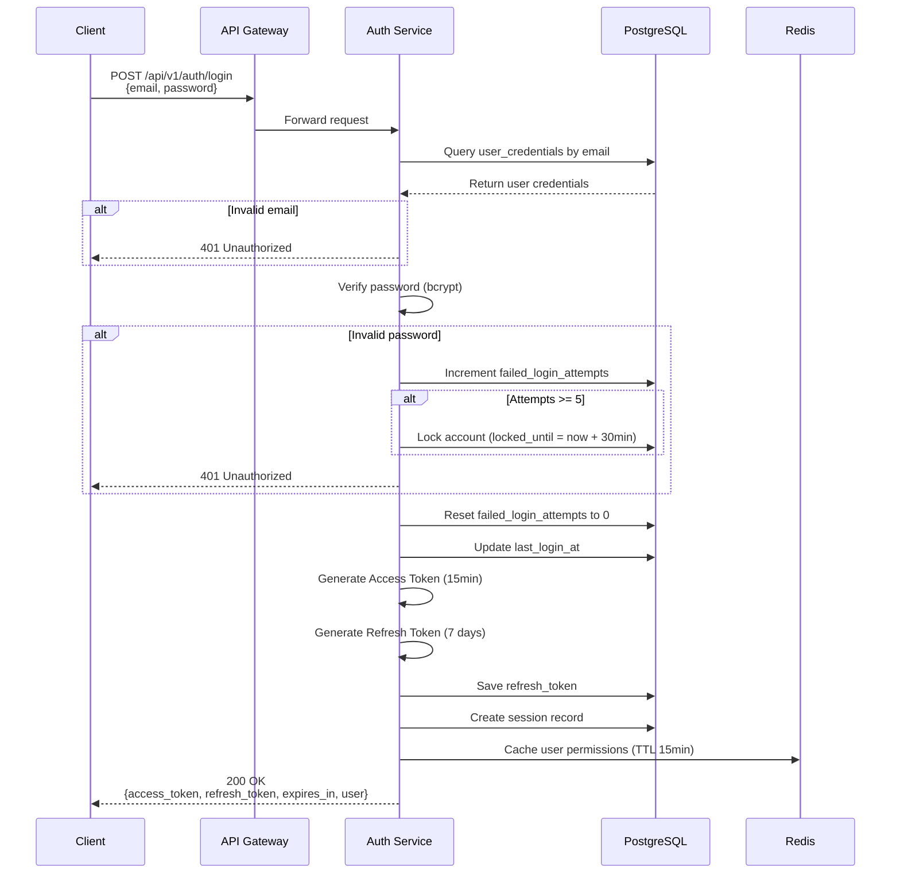
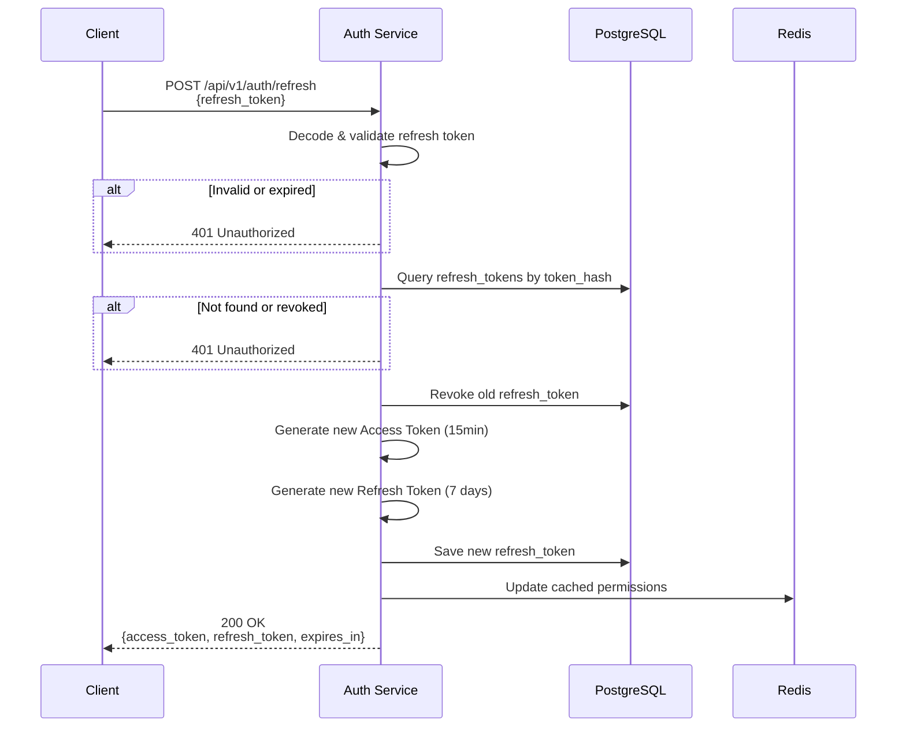
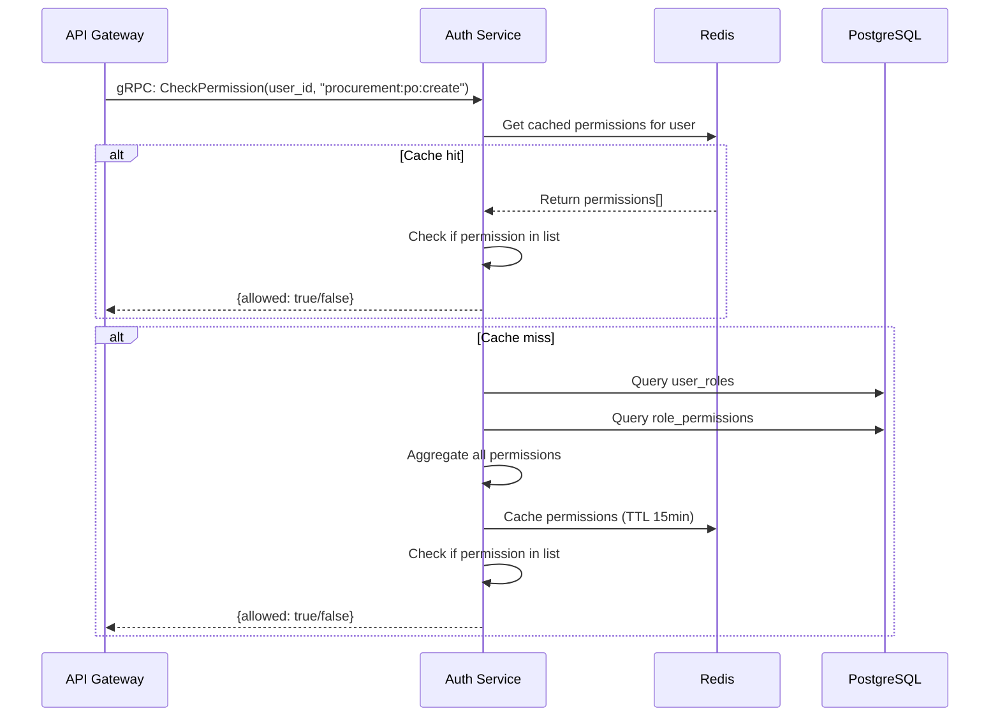
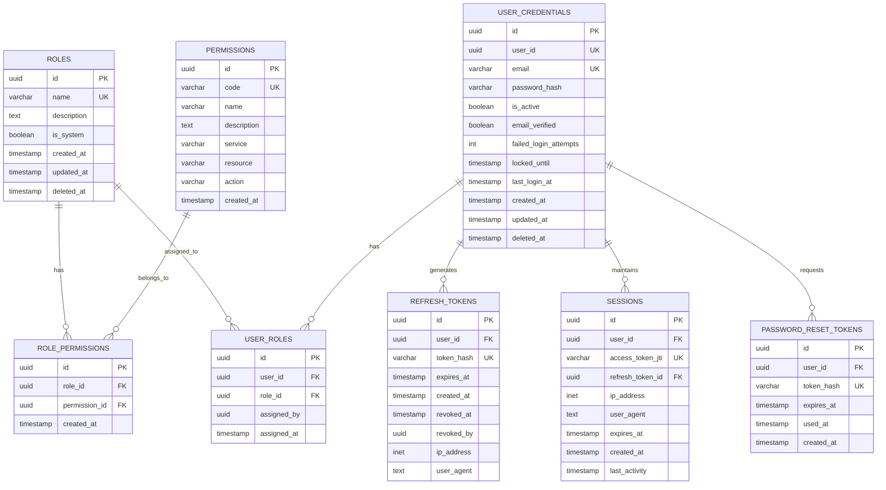

# 03 - AUTH SERVICE

## TỔNG QUAN

Auth Service là dịch vụ trung tâm quản lý **Authentication (Xác thực)** và **Authorization (Phân quyền)** cho toàn bộ hệ thống ERP. Service này đảm bảo chỉ những người dùng hợp lệ mới có thể truy cập và thực hiện các thao tác phù hợp với quyền hạn của họ.

### Responsibilities

✅ User authentication (login/logout)  
✅ JWT token generation, validation & refresh  
✅ Password management (change, reset, forgot)  
✅ Role-Based Access Control (RBAC)  
✅ Permission management (fine-grained)  
✅ Session tracking  
✅ Multi-factor authentication (future)  
✅ Account security (lockout after failed attempts)

### Tech Stack

- **Language**: Go 1.22+
- **Framework**: Gin (HTTP) + gRPC
- **Database**: PostgreSQL
- **Cache**: Redis (token blacklist, session cache)
- **Password Hashing**: Bcrypt (cost factor 12)
- **JWT Library**: golang-jwt/jwt/v5

### Port

- HTTP: `8081`
- gRPC: `9081`

---

## KIẾN TRÚC

### Authentication Flow (Login)



### Token Refresh Flow



### Authorization Flow (Permission Check)



---

## DATABASE SCHEMA

### Entity Relationship Diagram



### Table Definitions

#### 1. roles

```sql
CREATE TABLE roles (
    id UUID PRIMARY KEY DEFAULT gen_random_uuid(),
    name VARCHAR(100) NOT NULL UNIQUE,
    description TEXT,
    is_system BOOLEAN DEFAULT false, -- System roles không thể xóa
    created_at TIMESTAMP NOT NULL DEFAULT CURRENT_TIMESTAMP,
    updated_at TIMESTAMP NOT NULL DEFAULT CURRENT_TIMESTAMP,
    deleted_at TIMESTAMP
);

CREATE INDEX idx_roles_name ON roles(name);

-- Default system roles
INSERT INTO roles (name, description, is_system) VALUES
('Super Admin', 'Full system access', true),
('Admin', 'Administrative access', true),
('Manager', 'Department manager', true),
('User', 'Standard user', true),
('Viewer', 'Read-only access', true);
```

#### 2. permissions

```sql
CREATE TABLE permissions (
    id UUID PRIMARY KEY DEFAULT gen_random_uuid(),
    code VARCHAR(100) NOT NULL UNIQUE, -- Format: service:resource:action
    name VARCHAR(200) NOT NULL,
    description TEXT,
    service VARCHAR(50) NOT NULL, -- auth, user, procurement, wms, etc.
    resource VARCHAR(50) NOT NULL, -- user, role, po, stock, etc.
    action VARCHAR(50) NOT NULL, -- read, create, update, delete, approve
    created_at TIMESTAMP NOT NULL DEFAULT CURRENT_TIMESTAMP
);

CREATE INDEX idx_permissions_service ON permissions(service);
CREATE INDEX idx_permissions_code ON permissions(code);

-- Example permissions
INSERT INTO permissions (code, name, service, resource, action, description) VALUES
('*:*:*', 'Full Access', '*', '*', '*', 'Super admin - all permissions'),
('user:user:read', 'View Users', 'user', 'user', 'read', 'View user list and details'),
('user:user:create', 'Create User', 'user', 'user', 'create', 'Create new users'),
('user:user:update', 'Update User', 'user', 'user', 'update', 'Modify user information'),
('user:user:delete', 'Delete User', 'user', 'user', 'delete', 'Delete users'),
('procurement:po:read', 'View PO', 'procurement', 'po', 'read', 'View purchase orders'),
('procurement:po:create', 'Create PO', 'procurement', 'po', 'create', 'Create purchase orders'),
('procurement:po:approve', 'Approve PO', 'procurement', 'po', 'approve', 'Approve purchase orders'),
('wms:stock:read', 'View Stock', 'wms', 'stock', 'read', 'View inventory'),
('manufacturing:bom:read', 'View BOM', 'manufacturing', 'bom', 'read', 'View bill of materials'),
('manufacturing:bom:approve', 'Approve BOM', 'manufacturing', 'bom', 'approve', 'Approve BOM (sensitive!)');
```

#### 3. role_permissions

```sql
CREATE TABLE role_permissions (
    id UUID PRIMARY KEY DEFAULT gen_random_uuid(),
    role_id UUID NOT NULL REFERENCES roles(id) ON DELETE CASCADE,
    permission_id UUID NOT NULL REFERENCES permissions(id) ON DELETE CASCADE,
    created_at TIMESTAMP NOT NULL DEFAULT CURRENT_TIMESTAMP,
    UNIQUE(role_id, permission_id)
);

CREATE INDEX idx_role_permissions_role ON role_permissions(role_id);
CREATE INDEX idx_role_permissions_permission ON role_permissions(permission_id);
```

#### 4. user_credentials

```sql
CREATE TABLE user_credentials (
    id UUID PRIMARY KEY DEFAULT gen_random_uuid(),
    user_id UUID NOT NULL UNIQUE, -- References User in user-service
    email VARCHAR(255) NOT NULL UNIQUE,
    password_hash VARCHAR(255) NOT NULL, -- bcrypt hash
    is_active BOOLEAN DEFAULT true,
    email_verified BOOLEAN DEFAULT false,
    failed_login_attempts INT DEFAULT 0,
    locked_until TIMESTAMP, -- NULL if not locked
    last_login_at TIMESTAMP,
    created_at TIMESTAMP NOT NULL DEFAULT CURRENT_TIMESTAMP,
    updated_at TIMESTAMP NOT NULL DEFAULT CURRENT_TIMESTAMP,
    deleted_at TIMESTAMP
);

CREATE INDEX idx_user_credentials_email ON user_credentials(email);
CREATE INDEX idx_user_credentials_user_id ON user_credentials(user_id);
CREATE INDEX idx_user_credentials_active ON user_credentials(is_active) WHERE deleted_at IS NULL;
```

#### 5. user_roles

```sql
CREATE TABLE user_roles (
    id UUID PRIMARY KEY DEFAULT gen_random_uuid(),
    user_id UUID NOT NULL,
    role_id UUID NOT NULL REFERENCES roles(id) ON DELETE CASCADE,
    assigned_by UUID, -- user_id of who assigned this role
    assigned_at TIMESTAMP NOT NULL DEFAULT CURRENT_TIMESTAMP,
    UNIQUE(user_id, role_id)
);

CREATE INDEX idx_user_roles_user ON user_roles(user_id);
CREATE INDEX idx_user_roles_role ON user_roles(role_id);
```

#### 6. refresh_tokens

```sql
CREATE TABLE refresh_tokens (
    id UUID PRIMARY KEY DEFAULT gen_random_uuid(),
    user_id UUID NOT NULL,
    token_hash VARCHAR(255) NOT NULL UNIQUE, -- SHA256 hash of token
    expires_at TIMESTAMP NOT NULL,
    created_at TIMESTAMP NOT NULL DEFAULT CURRENT_TIMESTAMP,
    revoked_at TIMESTAMP,
    revoked_by UUID,
    ip_address INET,
    user_agent TEXT,
    CONSTRAINT chk_expires_future CHECK (expires_at > created_at)
);

CREATE INDEX idx_refresh_tokens_user ON refresh_tokens(user_id);
CREATE INDEX idx_refresh_tokens_hash ON refresh_tokens(token_hash);
CREATE INDEX idx_refresh_tokens_expires ON refresh_tokens(expires_at);

-- Auto cleanup expired tokens
CREATE INDEX idx_refresh_tokens_cleanup ON refresh_tokens(expires_at) 
WHERE revoked_at IS NULL;
```

#### 7. sessions

```sql
CREATE TABLE sessions (
    id UUID PRIMARY KEY DEFAULT gen_random_uuid(),
    user_id UUID NOT NULL,
    access_token_jti VARCHAR(100) NOT NULL UNIQUE, -- JWT ID from access token
    refresh_token_id UUID REFERENCES refresh_tokens(id),
    ip_address INET,
    user_agent TEXT,
    expires_at TIMESTAMP NOT NULL,
    created_at TIMESTAMP NOT NULL DEFAULT CURRENT_TIMESTAMP,
    last_activity TIMESTAMP NOT NULL DEFAULT CURRENT_TIMESTAMP
);

CREATE INDEX idx_sessions_user ON sessions(user_id);
CREATE INDEX idx_sessions_jti ON sessions(access_token_jti);
CREATE INDEX idx_sessions_expires ON sessions(expires_at);
```

#### 8. password_reset_tokens

```sql
CREATE TABLE password_reset_tokens (
    id UUID PRIMARY KEY DEFAULT gen_random_uuid(),
    user_id UUID NOT NULL,
    token_hash VARCHAR(255) NOT NULL UNIQUE,
    expires_at TIMESTAMP NOT NULL, -- Usually 1 hour
    used_at TIMESTAMP,
    created_at TIMESTAMP NOT NULL DEFAULT CURRENT_TIMESTAMP
);

CREATE INDEX idx_password_reset_user ON password_reset_tokens(user_id);
CREATE INDEX idx_password_reset_token ON password_reset_tokens(token_hash);
```

---

## JWT TOKEN STRUCTURE

### Access Token

**Lifetime**: 15 minutes  
**Purpose**: Access protected resources

```json
{
  "header": {
    "alg": "HS256",
    "typ": "JWT"
  },
  "payload": {
    "jti": "unique-token-id",
    "sub": "user-uuid",
    "email": "user@company.com",
    "role_ids": ["role-uuid-1", "role-uuid-2"],
    "iat": 1706000000,
    "exp": 1706000900,
    "type": "access"
  },
  "signature": "..."
}
```

### Refresh Token

**Lifetime**: 7 days (168 hours)  
**Purpose**: Obtain new access token

```json
{
  "header": {
    "alg": "HS256",
    "typ": "JWT"
  },
  "payload": {
    "jti": "unique-refresh-token-id",
    "sub": "user-uuid",
    "iat": 1706000000,
    "exp": 1706604800,
    "type": "refresh"
  },
  "signature": "..."
}
```

### Token Storage

- Access token: Client-side (memory, not localStorage due to XSS risk)
- Refresh token: HttpOnly cookie hoặc secure storage
- Token hash: Database (SHA256 hash for lookup)

---

## API ENDPOINTS

### Authentication

#### POST /api/v1/auth/login

Login với email và password.

**Request:**
```json
{
  "email": "user@company.com",
  "password": "SecurePassword123!"
}
```

**Response (200 OK):**
```json
{
  "access_token": "eyJhbGciOiJIUzI1NiIsInR5cCI6IkpXVCJ9...",
  "refresh_token": "eyJhbGciOiJIUzI1NiIsInR5cCI6IkpXVCJ9...",
  "token_type": "Bearer",
  "expires_in": 900,
  "user": {
    "id": "user-uuid",
    "email": "user@company.com",
    "first_name": "John",
    "last_name": "Doe",
    "roles": ["Admin", "Manager"]
  }
}
```

**Errors:**
- `401 Unauthorized`: Invalid credentials
- `403 Forbidden`: Account locked
- `422 Unprocessable Entity`: Validation errors

---

#### POST /api/v1/auth/logout

Logout và revoke tokens.

**Headers:**
```
Authorization: Bearer <access_token>
```

**Request:**
```json
{
  "refresh_token": "eyJ..." // optional
}
```

**Response (200 OK):**
```json
{
  "message": "Logged out successfully"
}
```

---

#### POST /api/v1/auth/refresh

Refresh access token sử dụng refresh token.

**Request:**
```json
{
  "refresh_token": "eyJhbGciOiJIUzI1NiIsInR5cCI6IkpXVCJ9..."
}
```

**Response (200 OK):**
```json
{
  "access_token": "eyJhbGciOiJIUzI1NiIsInR5cCI6IkpXVCJ9...",
  "refresh_token": "eyJhbGciOiJIUzI1NiIsInR5cCI6IkpXVCJ9...",
  "token_type": "Bearer",
  "expires_in": 900
}
```

---

#### GET /api/v1/auth/me

Lấy thông tin user hiện tại từ token.

**Headers:**
```
Authorization: Bearer <access_token>
```

**Response (200 OK):**
```json
{
  "id": "user-uuid",
  "email": "user@company.com",
  "first_name": "John",
  "last_name": "Doe",
  "roles": [
    {
      "id": "role-uuid",
      "name": "Admin"
    }
  ],
  "permissions": [
    "user:user:read",
    "user:user:create",
    "procurement:po:approve"
  ]
}
```

---

#### POST /api/v1/auth/change-password

Đổi password (yêu cầu password cũ).

**Headers:**
```
Authorization: Bearer <access_token>
```

**Request:**
```json
{
  "current_password": "OldPassword123!",
  "new_password": "NewSecurePassword456!",
  "new_password_confirm": "NewSecurePassword456!"
}
```

**Response (200 OK):**
```json
{
  "message": "Password changed successfully"
}
```

**Password Requirements:**
- Minimum 8 characters
- At least 1 uppercase letter
- At least 1 lowercase letter
- At least 1 number
- At least 1 special character

---

#### POST /api/v1/auth/forgot-password

Request password reset email.

**Request:**
```json
{
  "email": "user@company.com"
}
```

**Response (200 OK):**
```json
{
  "message": "If the email exists, a password reset link has been sent"
}
```

**Note**: Luôn trả về 200 để tránh email enumeration attack.

---

#### POST /api/v1/auth/reset-password

Reset password với token từ email.

**Request:**
```json
{
  "token": "reset-token-from-email",
  "new_password": "NewSecurePassword456!",
  "new_password_confirm": "NewSecurePassword456!"
}
```

**Response (200 OK):**
```json
{
  "message": "Password reset successfully"
}
```

---

### Role Management (Admin Only)

#### GET /api/v1/auth/roles

Danh sách roles.

**Query Parameters:**
- `page`: int (default: 1)
- `limit`: int (default: 20)
- `search`: string

**Response (200 OK):**
```json
{
  "data": [
    {
      "id": "role-uuid",
      "name": "Admin",
      "description": "Administrative access",
      "is_system": true,
      "permissions_count": 25,
      "users_count": 5,
      "created_at": "2024-01-01T00:00:00Z"
    }
  ],
  "pagination": {
    "page": 1,
    "limit": 20,
    "total": 10,
    "total_pages": 1
  }
}
```

---

#### POST /api/v1/auth/roles

Tạo role mới.

**Permission Required**: `auth:role:create`

**Request:**
```json
{
  "name": "Warehouse Manager",
  "description": "Manage warehouse operations"
}
```

**Response (201 Created):**
```json
{
  "id": "new-role-uuid",
  "name": "Warehouse Manager",
  "description": "Manage warehouse operations",
  "is_system": false,
  "created_at": "2024-01-23T14:00:00Z"
}
```

---

#### GET /api/v1/auth/roles/:id

Chi tiết role.

**Response (200 OK):**
```json
{
  "id": "role-uuid",
  "name": "Admin",
  "description": "Administrative access",
  "is_system": true,
  "permissions": [
    {
      "id": "perm-uuid",
      "code": "user:user:read",
      "name": "View Users"
    }
  ],
  "created_at": "2024-01-01T00:00:00Z",
  "updated_at": "2024-01-01T00:00:00Z"
}
```

---

#### PUT /api/v1/auth/roles/:id

Cập nhật role.

**Permission Required**: `auth:role:update`

**Request:**
```json
{
  "name": "Warehouse Manager",
  "description": "Manage all warehouse operations and staff"
}
```

**Response (200 OK):**
```json
{
  "id": "role-uuid",
  "name": "Warehouse Manager",
  "description": "Manage all warehouse operations and staff",
  "updated_at": "2024-01-23T15:00:00Z"
}
```

---

#### DELETE /api/v1/auth/roles/:id

Xóa role (soft delete).

**Permission Required**: `auth:role:delete`

**Constraints:**
- Không thể xóa system roles (is_system = true)
- Không thể xóa nếu còn users được assign

**Response (204 No Content)**

---

### Permission Management

#### GET /api/v1/auth/permissions

Danh sách tất cả permissions.

**Query Parameters:**
- `service`: string (filter by service)
- `search`: string

**Response (200 OK):**
```json
{
  "data": [
    {
      "id": "perm-uuid",
      "code": "user:user:read",
      "name": "View Users",
      "description": "View user list and details",
      "service": "user",
      "resource": "user",
      "action": "read"
    }
  ],
  "total": 150
}
```

---

#### POST /api/v1/auth/permissions

Tạo permission mới.

**Permission Required**: `auth:permission:manage`

**Request:**
```json
{
  "code": "warehouse:zone:manage",
  "name": "Manage Warehouse Zones",
  "description": "Create, update, delete warehouse zones",
  "service": "wms",
  "resource": "zone",
  "action": "manage"
}
```

---

### Role-Permission Mapping

#### POST /api/v1/auth/roles/:role_id/permissions

Gán permissions cho role.

**Permission Required**: `auth:permission:manage`

**Request:**
```json
{
  "permission_ids": [
    "perm-uuid-1",
    "perm-uuid-2",
    "perm-uuid-3"
  ]
}
```

**Response (200 OK):**
```json
{
  "message": "Permissions assigned successfully",
  "assigned_count": 3
}
```

---

#### DELETE /api/v1/auth/roles/:role_id/permissions/:permission_id

Xóa permission khỏi role.

**Permission Required**: `auth:permission:manage`

**Response (204 No Content)**

---

#### GET /api/v1/auth/roles/:role_id/permissions

Danh sách permissions của role.

**Response (200 OK):**
```json
{
  "data": [
    {
      "id": "perm-uuid",
      "code": "user:user:read",
      "name": "View Users"
    }
  ],
  "total": 15
}
```

---

### User-Role Management

#### POST /api/v1/auth/users/:user_id/roles

Gán role cho user.

**Permission Required**: `auth:user:assign_role`

**Request:**
```json
{
  "role_ids": ["role-uuid-1", "role-uuid-2"]
}
```

**Response (200 OK):**
```json
{
  "message": "Roles assigned successfully",
  "assigned_count": 2
}
```

---

#### DELETE /api/v1/auth/users/:user_id/roles/:role_id

Xóa role khỏi user.

**Permission Required**: `auth:user:assign_role`

**Response (204 No Content)**

---

#### GET /api/v1/auth/users/:user_id/roles

Danh sách roles của user.

**Response (200 OK):**
```json
{
  "data": [
    {
      "id": "role-uuid",
      "name": "Admin",
      "assigned_at": "2024-01-01T00:00:00Z",
      "assigned_by": "admin-user-uuid"
    }
  ]
}
```

---

#### GET /api/v1/auth/users/:user_id/permissions

Tất cả permissions của user (aggregate từ roles).

**Response (200 OK):**
```json
{
  "data": [
    {
      "code": "user:user:read",
      "name": "View Users",
      "source_roles": ["Admin", "Manager"]
    }
  ],
  "total": 45
}
```

---

## gRPC METHODS (Internal Communication)

### ValidateToken

Validate JWT access token.

**Request:**
```protobuf
message ValidateTokenRequest {
  string token = 1;
}
```

**Response:**
```protobuf
message ValidateTokenResponse {
  bool valid = 1;
  string user_id = 2;
  repeated string role_ids = 3;
  string email = 4;
  string error = 5;
}
```

---

### CheckPermission

Check nếu user có permission cụ thể.

**Request:**
```protobuf
message CheckPermissionRequest {
  string user_id = 1;
  string permission_code = 2; // Format: service:resource:action
}
```

**Response:**
```protobuf
message CheckPermissionResponse {
  bool allowed = 1;
  string reason = 2; // If not allowed
}
```

---

### GetUserPermissions

Lấy tất cả permissions của user.

**Request:**
```protobuf
message GetUserPermissionsRequest {
  string user_id = 1;
}
```

**Response:**
```protobuf
message GetUserPermissionsResponse {
  repeated Permission permissions = 1;
}

message Permission {
  string code = 1;
  string name = 2;
  string service = 3;
  string resource = 4;
  string action = 5;
}
```

---

### GetUserRoles

Lấy roles của user.

**Request:**
```protobuf
message GetUserRolesRequest {
  string user_id = 1;
}
```

**Response:**
```protobuf
message GetUserRolesResponse {
  repeated Role roles = 1;
}

message Role {
  string id = 1;
  string name = 2;
}
```

---

## EVENTS

### Events Published

```yaml
auth.user.logged_in:
  payload:
    user_id: uuid
    email: string
    ip_address: string
    timestamp: datetime

auth.user.logged_out:
  payload:
    user_id: uuid
    timestamp: datetime

auth.user.password_changed:
  payload:
    user_id: uuid
    changed_by: uuid
    timestamp: datetime

auth.user.password_reset:
  payload:
    user_id: uuid
    timestamp: datetime

auth.user.account_locked:
  payload:
    user_id: uuid
    email: string
    locked_until: datetime
    reason: string

auth.role.created:
  payload:
    role_id: uuid
    role_name: string
    created_by: uuid

auth.role.updated:
  payload:
    role_id: uuid
    role_name: string
    updated_by: uuid

auth.role.deleted:
  payload:
    role_id: uuid
    role_name: string
    deleted_by: uuid

auth.permission.assigned:
  payload:
    role_id: uuid
    permission_id: uuid
    permission_code: string
    assigned_by: uuid

auth.permission.revoked:
  payload:
    role_id: uuid
    permission_id: uuid
    permission_code: string
    revoked_by: uuid

auth.user.role_assigned:
  payload:
    user_id: uuid
    role_id: uuid
    role_name: string
    assigned_by: uuid

auth.user.role_revoked:
  payload:
    user_id: uuid
    role_id: uuid
    role_name: string
    revoked_by: uuid
```

### Events Subscribed

```yaml
user.created:
  action: Create user_credentials entry
  handler: CreateUserCredentials

user.deleted:
  action: Soft delete user_credentials, revoke all tokens
  handler: DeleteUserCredentials

user.email_changed:
  action: Update email in user_credentials
  handler: UpdateUserEmail
```

---

## SECURITY CONSIDERATIONS

### Password Security

✅ **Bcrypt hashing** với cost factor 12  
✅ **Minimum requirements**: 8 chars, upper, lower, number, special  
✅ **Password history**: Không cho phép reuse 5 passwords gần nhất (future)  
✅ **Brute force protection**: Lock account sau 5 failed attempts (30 min)

### Token Security

✅ **Short-lived access tokens**: 15 minutes  
✅ **Refresh token rotation**: Mỗi lần refresh tạo token mới  
✅ **Token revocation**: Logout revokes tokens immediately  
✅ **JTI tracking**: Prevent token replay  
✅ **IP & User Agent logging**: Detect suspicious activity

### Session Security

✅ **Concurrent session limit**: 5 sessions per user (configurable)  
✅ **Idle timeout**: 30 minutes inactivity auto-logout  
✅ **Device tracking**: Track all active sessions  
✅ **Remote logout**: User có thể revoke sessions khác

### API Security

✅ **Rate limiting**: 100 requests/minute per user  
✅ **CORS**: Whitelist allowed origins  
✅ **Input validation**: Strict validation on all inputs  
✅ **SQL injection prevention**: Parameterized queries (GORM)  
✅ **XSS prevention**: Output encoding

---

## REDIS CACHING STRATEGY

### Cached Data

```
# User permissions (15 min TTL)
Key: "user:permissions:{user_id}"
Value: ["procurement:po:create", "wms:stock:read", ...]

# User roles (15 min TTL)
Key: "user:roles:{user_id}"
Value: [{"id": "...", "name": "Admin"}, ...]

# Token blacklist (до истечения токена)
Key: "token:blacklist:{jti}"
Value: "1"
TTL: Remaining token lifetime

# Rate limiting
Key: "ratelimit:auth:login:{ip}"
Value: request_count
TTL: 60 seconds

# Failed login attempts
Key: "failed:login:{email}"
Value: attempt_count
TTL: 1800 seconds (30 min)
```

### Cache Invalidation

- **On password change**: Clear user permissions & roles cache
- **On role assignment**: Clear user permissions & roles cache
- **On permission change**: Clear all users with that role
- **On logout**: Add token JTI to blacklist

---

## CONFIGURATION

### Environment Variables

```bash
# Server
AUTH_SERVICE_PORT=8081
AUTH_GRPC_PORT=9081

# Database
AUTH_DB_HOST=postgres
AUTH_DB_PORT=5432
AUTH_DB_NAME=auth_db
AUTH_DB_USER=auth_user
AUTH_DB_PASSWORD=<secret>
AUTH_DB_SSL_MODE=disable

# Redis
REDIS_HOST=redis
REDIS_PORT=6379
REDIS_PASSWORD=<secret>
REDIS_DB=0

# JWT
JWT_SECRET=<strong-secret-key>
JWT_ACCESS_TOKEN_EXPIRY=15m
JWT_REFRESH_TOKEN_EXPIRY=168h

# Security
BCRYPT_COST=12
MAX_LOGIN_ATTEMPTS=5
ACCOUNT_LOCK_DURATION=30m
PASSWORD_RESET_TOKEN_EXPIRY=1h

# Session
MAX_SESSIONS_PER_USER=5
SESSION_IDLE_TIMEOUT=30m

# Rate Limiting
RATE_LIMIT_LOGIN=10/min
RATE_LIMIT_API=100/min
```

---

## TESTING

### Unit Tests

```go
// Test password hashing
func TestHashPassword(t *testing.T)
func TestVerifyPassword(t *testing.T)

// Test token generation
func TestGenerateAccessToken(t *testing.T)
func TestGenerateRefreshToken(t *testing.T)
func TestValidateToken(t *testing.T)

// Test permissions
func TestCheckPermission(t *testing.T)
func TestGetUserPermissions(t *testing.T)

// Test account lockout
func TestAccountLockAfterFailedAttempts(t *testing.T)
```

### Integration Tests

```go
// Test login flow
func TestLoginSuccess(t *testing.T)
func TestLoginInvalidPassword(t *testing.T)
func TestLoginAccountLocked(t *testing.T)

// Test token refresh
func TestTokenRefreshSuccess(t *testing.T)
func TestTokenRefreshExpired(t *testing.T)

// Test RBAC
func TestRolePermissionAssignment(t *testing.T)
func TestUserRoleAssignment(t *testing.T)
```

---

## MONITORING & METRICS

### Key Metrics

```
# Login metrics
auth_login_attempts_total{status="success|failed"}
auth_login_duration_seconds

# Token metrics
auth_tokens_generated_total{type="access|refresh"}
auth_tokens_validated_total{result="valid|invalid|expired"}
auth_token_refresh_total

# Permission checks
auth_permission_checks_total{result="allowed|denied"}
auth_permission_check_duration_seconds

# Account security
auth_accounts_locked_total
auth_password_resets_total

# Active sessions
auth_active_sessions_total
```

### Alerts

```yaml
- alert: HighFailedLoginRate
  expr: rate(auth_login_attempts_total{status="failed"}[5m]) > 10
  severity: warning

- alert: ManyAccountsLocked
  expr: rate(auth_accounts_locked_total[1h]) > 5
  severity: critical

- alert: TokenValidationErrors
  expr: rate(auth_tokens_validated_total{result="invalid"}[5m]) > 20
  severity: warning
```

---

## DEPENDENCIES

### External Services

- **User Service** (gRPC): Verify user exists, get user details
- **Notification Service** (Event): Send password reset email, account locked alert
- **NATS**: Event publishing

### Infrastructure

- **PostgreSQL**: Primary data storage
- **Redis**: Caching & session management
- **MinIO**: Not used by this service

---

## DEPLOYMENT

### Docker Compose

```yaml
auth-service:
  build: ./services/auth-service
  ports:
    - "8081:8081"
    - "9081:9081"
  environment:
    - AUTH_SERVICE_PORT=8081
    - AUTH_DB_HOST=postgres-auth
    - REDIS_HOST=redis
    - JWT_SECRET=${JWT_SECRET}
  depends_on:
    - postgres-auth
    - redis
  networks:
    - erp-network
  restart: unless-stopped

postgres-auth:
  image: postgres:16-alpine
  environment:
    - POSTGRES_DB=auth_db
    - POSTGRES_USER=auth_user
    - POSTGRES_PASSWORD=${AUTH_DB_PASSWORD}
  volumes:
    - auth-db-data:/var/lib/postgresql/data
  networks:
    - erp-network
```

---

## FUTURE ENHANCEMENTS

- [ ] Multi-Factor Authentication (MFA) - TOTP
- [ ] OAuth2/OpenID Connect integration
- [ ] LDAP/Active Directory integration
- [ ] Password history (prevent reuse)
- [ ] Advanced audit logging with retention
- [ ] Anomaly detection (unusual login patterns)
- [ ] Device fingerprinting
- [ ] Biometric authentication support

---

**Document Version**: 1.0  
**Last Updated**: 2026-01-23  
**Author**: ERP Development Team
