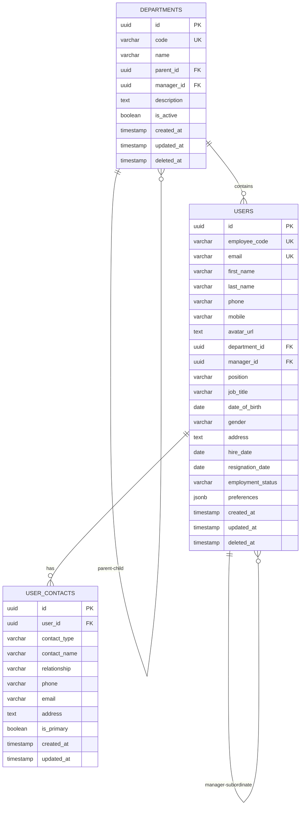

# 04 - USER SERVICE

## TỔNG QUAN

User Service quản lý thông tin người dùng, phòng ban, và cấu trúc tổ chức trong hệ thống ERP.

### Responsibilities

✅ User profile management (employee information)  
✅ Department/Team hierarchy  
✅ Organization structure  
✅ User avatar & profile photos  
✅ User preferences (UI settings, language, timezone)  
✅ Employee onboarding/offboarding

### Tech Stack

- **Language**: Go 1.22+
- **Framework**: Gin (HTTP) + gRPC
- **Database**: PostgreSQL
- **File Storage**: MinIO (avatars)

### Ports

- HTTP: `8082`
- gRPC: `9082`

---

## DATABASE SCHEMA

### ER Diagram



### Table Definitions

#### departments

```sql
CREATE TABLE departments (
    id UUID PRIMARY KEY DEFAULT gen_random_uuid(),
    code VARCHAR(50) NOT NULL UNIQUE,
    name VARCHAR(200) NOT NULL,
    parent_id UUID REFERENCES departments(id),
    manager_id UUID, -- circular reference to users.id
    description TEXT,
    is_active BOOLEAN DEFAULT true,
    created_at TIMESTAMP NOT NULL DEFAULT CURRENT_TIMESTAMP,
    updated_at TIMESTAMP NOT NULL DEFAULT CURRENT_TIMESTAMP,
    deleted_at TIMESTAMP
);

CREATE INDEX idx_departments_parent ON departments(parent_id);
CREATE INDEX idx_departments_manager ON departments(manager_id);
CREATE INDEX idx_departments_code ON departments(code);

-- Example data
INSERT INTO departments (code, name, description) VALUES
('EXEC', 'Executive', 'Executive leadership'),
('PROD', 'Production', 'Manufacturing and production'),
('QC', 'Quality Control', 'Quality assurance and testing'),
('WH', 'Warehouse', 'Inventory and logistics'),
('SALES', 'Sales & Marketing', 'Sales and customer relations'),
('PROC', 'Procurement', 'Purchasing and supplier management'),
('HR', 'Human Resources', 'People management'),
('IT', 'IT', 'Information technology'),
('FIN', 'Finance', 'Accounting and finance');
```

#### users

```sql
CREATE TABLE users (
    id UUID PRIMARY KEY DEFAULT gen_random_uuid(),
    employee_code VARCHAR(50) UNIQUE,
    email VARCHAR(255) NOT NULL UNIQUE,
    first_name VARCHAR(100) NOT NULL,
    last_name VARCHAR(100) NOT NULL,
    phone VARCHAR(20),
    mobile VARCHAR(20),
    avatar_url TEXT, -- MinIO URL
    
    -- Organization
    department_id UUID REFERENCES departments(id),
    manager_id UUID REFERENCES users(id),
    position VARCHAR(100), -- Trưởng phòng, Phó phòng, Nhân viên
    job_title VARCHAR(100), -- QC Inspector, Warehouse Staff, etc.
    
    -- Personal Info
    date_of_birth DATE,
    gender VARCHAR(10), -- MALE, FEMALE, OTHER
    address TEXT,
    city VARCHAR(100),
    country VARCHAR(100) DEFAULT 'Vietnam',
    
    -- Employment
    hire_date DATE,
    resignation_date DATE,
    employment_status VARCHAR(50) DEFAULT 'ACTIVE', 
    -- ACTIVE, PROBATION, RESIGNED, TERMINATED
    
    -- Preferences (JSON)
    preferences JSONB,
    /*
    {
      "language": "vi",
      "theme": "light",
      "timezone": "Asia/Ho_Chi_Minh",
      "notifications": {
        "email": true,
        "push": true
      }
    }
    */
    
    created_at TIMESTAMP NOT NULL DEFAULT CURRENT_TIMESTAMP,
    updated_at TIMESTAMP NOT NULL DEFAULT CURRENT_TIMESTAMP,
    deleted_at TIMESTAMP
);

CREATE INDEX idx_users_email ON users(email);
CREATE INDEX idx_users_department ON users(department_id);
CREATE INDEX idx_users_manager ON users(manager_id);
CREATE INDEX idx_users_employee_code ON users(employee_code);
CREATE INDEX idx_users_status ON users(employment_status);
```

#### user_contacts

```sql
CREATE TABLE user_contacts (
    id UUID PRIMARY KEY DEFAULT gen_random_uuid(),
    user_id UUID NOT NULL REFERENCES users(id) ON DELETE CASCADE,
    contact_type VARCHAR(50) NOT NULL, -- EMERGENCY, FAMILY, PERSONAL, WORK
    contact_name VARCHAR(200),
    relationship VARCHAR(100), -- Spouse, Parent, Friend
    phone VARCHAR(20),
    email VARCHAR(255),
    address TEXT,
    is_primary BOOLEAN DEFAULT false,
    created_at TIMESTAMP NOT NULL DEFAULT CURRENT_TIMESTAMP,
    updated_at TIMESTAMP NOT NULL DEFAULT CURRENT_TIMESTAMP
);

CREATE INDEX idx_user_contacts_user ON user_contacts(user_id);
CREATE INDEX idx_user_contacts_type ON user_contacts(contact_type);
```

---

## API ENDPOINTS

### Users

#### GET /api/v1/users

Danh sách users với filtering và pagination.

**Permission**: `user:user:read`

**Query Parameters**:
- `page`: int (default: 1)
- `limit`: int (default: 20, max: 100)
- `search`: string (search in name, email, employee_code)
- `department_id`: uuid (filter by department)
- `employment_status`: string (ACTIVE, PROBATION, etc.)
- `sort`: string (default: "created_at:desc")

**Response (200 OK)**:
```json
{
  "data": [
    {
      "id": "user-uuid",
      "employee_code": "EMP001",
      "email": "nguyen.van.a@company.com",
      "first_name": "Văn A",
      "last_name": "Nguyễn",
      "full_name": "Nguyễn Văn A",
      "phone": "+84 123 456 789",
      "avatar_url": "https://minio.../avatars/user-uuid.jpg",
      "department": {
        "id": "dept-uuid",
        "code": "PROD",
        "name": "Production"
      },
      "manager": {
        "id": "manager-uuid",
        "name": "Trần Văn B"
      },
      "position": "Nhân viên",
      "job_title": "QC Inspector",
      "employment_status": "ACTIVE",
      "hire_date": "2023-01-15",
      "created_at": "2023-01-10T08:00:00Z"
    }
  ],
  "pagination": {
    "page": 1,
    "limit": 20,
    "total": 95,
    "total_pages": 5
  }
}
```

---

#### POST /api/v1/users

Tạo user mới.

**Permission**: `user:user:create`

**Request**:
```json
{
  "employee_code": "EMP100",
  "email": "new.employee@company.com",
  "first_name": "Văn C",
  "last_name": "Lê",
  "phone": "+84 987 654 321",
  "mobile": "+84 987 654 321",
  "department_id": "dept-uuid",
  "manager_id": "manager-uuid",
  "position": "Nhân viên",
  "job_title": "Warehouse Staff",
  "date_of_birth": "1995-05-20",
  "gender": "MALE",
  "address": "123 Đường ABC, Quận 1",
  "city": "Ho Chi Minh City",
  "hire_date": "2024-02-01",
  "employment_status": "PROBATION"
}
```

**Response (201 Created)**:
```json
{
  "id": "new-user-uuid",
  "employee_code": "EMP100",
  "email": "new.employee@company.com",
  "full_name": "Lê Văn C",
  "created_at": "2024-01-23T15:00:00Z"
}
```

**Note**: Sau khi tạo user, service sẽ publish event `user.created` để Auth Service tạo credentials.

---

#### GET /api/v1/users/:id

Chi tiết user.

**Permission**: `user:user:read`

**Response (200 OK)**:
```json
{
  "id": "user-uuid",
  "employee_code": "EMP001",
  "email": "nguyen.van.a@company.com",
  "first_name": "Văn A",
  "last_name": "Nguyễn",
  "full_name": "Nguyễn Văn A",
  "phone": "+84 123 456 789",
  "mobile": "+84 123 456 789",
  "avatar_url": "https://minio.../avatars/user-uuid.jpg",
  "department": {
    "id": "dept-uuid",
    "code": "PROD",
    "name": "Production",
    "parent": {
      "id": "parent-dept-uuid",
      "name": "Operations"
    }
  },
  "manager": {
    "id": "manager-uuid",
    "name": "Trần Văn B",
    "email": "tran.van.b@company.com"
  },
  "position": "Nhân viên",
  "job_title": "QC Inspector",
  "date_of_birth": "1992-03-15",
  "gender": "MALE",
  "address": "123 Đường ABC, Quận 1",
  "city": "Ho Chi Minh City",
  "country": "Vietnam",
  "hire_date": "2023-01-15",
  "employment_status": "ACTIVE",
  "preferences": {
    "language": "vi",
    "theme": "light",
    "timezone": "Asia/Ho_Chi_Minh"
  },
  "created_at": "2023-01-10T08:00:00Z",
  "updated_at": "2024-01-23T10:00:00Z"
}
```

---

#### PUT /api/v1/users/:id

Cập nhật user.

**Permission**: `user:user:update`

**Request**: (All fields optional)
```json
{
  "first_name": "Văn A Updated",
  "phone": "+84 999 888 777",
  "position": "Trưởng ca",
  "department_id": "new-dept-uuid"
}
```

**Response (200 OK)**:
```json
{
  "id": "user-uuid",
  "full_name": "Nguyễn Văn A Updated",
  "updated_at": "2024-01-23T15:30:00Z"
}
```

---

#### DELETE /api/v1/users/:id

Xóa user (soft delete).

**Permission**: `user:user:delete`

**Constraints**:
- Không thể xóa user đang là manager của người khác
- Không thể xóa chính mình

**Response (204 No Content)**

---

#### PATCH /api/v1/users/:id/status

Thay đổi employment status.

**Permission**: `user:user:update`

**Request**:
```json
{
  "employment_status": "ACTIVE", // ACTIVE, PROBATION, RESIGNED, TERMINATED
  "effective_date": "2024-02-01",
  "notes": "Completed probation period successfully"
}
```

**Response (200 OK)**:
```json
{
  "id": "user-uuid",
  "employment_status": "ACTIVE",
  "updated_at": "2024-01-23T15:00:00Z"
}
```

---

#### POST /api/v1/users/:id/avatar

Upload avatar.

**Permission**: `user:user:update` (own) or `user:user:update` (others)

**Request**: `multipart/form-data`
```
File: avatar.jpg (max 5MB, JPEG/PNG)
```

**Response (200 OK)**:
```json
{
  "avatar_url": "https://minio.../avatars/user-uuid-1234567890.jpg"
}
```

---

### Departments

#### GET /api/v1/departments

Danh sách departments (có thể trả về dạng tree).

**Permission**: `user:department:read`

**Query Parameters**:
- `tree`: boolean (default: false) - return as tree structure
- `include_inactive`: boolean (default: false)

**Response (200 OK)** - Flat list:
```json
{
  "data": [
    {
      "id": "dept-uuid",
      "code": "PROD",
      "name": "Production",
      "parent_id": "ops-dept-uuid",
      "manager": {
        "id": "manager-uuid",
        "name": "Nguyễn Văn Trưởng"
      },
      "employees_count": 25,
      "is_active": true
    }
  ],
  "total": 15
}
```

**Response (200 OK)** - Tree structure (tree=true):
```json
{
  "data": [
    {
      "id": "root-dept-uuid",
      "code": "EXEC",
      "name": "Executive",
      "children": [
        {
          "id": "child-dept-uuid",
          "code": "PROD",
          "name": "Production",
          "employees_count": 25,
          "children": []
        }
      ]
    }
  ]
}
```

---

#### POST /api/v1/departments

Tạo department mới.

**Permission**: `user:department:create`

**Request**:
```json
{
  "code": "RND",
  "name": "Research & Development",
  "parent_id": "exec-dept-uuid",
  "manager_id": "manager-user-uuid",
  "description": "Product R&D team"
}
```

**Response (201 Created)**:
```json
{
  "id": "new-dept-uuid",
  "code": "RND",
  "name": "Research & Development",
  "created_at": "2024-01-23T15:00:00Z"
}
```

---

#### GET /api/v1/departments/:id

Chi tiết department.

**Permission**: `user:department:read`

**Response (200 OK)**:
```json
{
  "id": "dept-uuid",
  "code": "PROD",
  "name": "Production",
  "parent": {
    "id": "parent-dept-uuid",
    "code": "OPS",
    "name": "Operations"
  },
  "manager": {
    "id": "manager-uuid",
    "name": "Nguyễn Văn Trưởng",
    "email": "nguyen.truong@company.com"
  },
  "description": "Manufacturing and production operations",
  "employees_count": 25,
  "is_active": true,
  "created_at": "2023-01-01T00:00:00Z"
}
```

---

#### PUT /api/v1/departments/:id

Cập nhật department.

**Permission**: `user:department:update`

**Request**:
```json
{
  "name": "Production & Manufacturing",
  "manager_id": "new-manager-uuid",
  "description": "Updated description"
}
```

---

#### DELETE /api/v1/departments/:id

Xóa department.

**Permission**: `user:department:delete`

**Constraints**:
- Không thể xóa nếu còn employees
- Không thể xóa nếu có child departments

**Response (204 No Content)**

---

#### GET /api/v1/departments/:id/users

Danh sách users trong department.

**Permission**: `user:user:read`

**Response**: Giống như GET /api/v1/users

---

## gRPC METHODS

### GetUser

```protobuf
message GetUserRequest {
  string user_id = 1;
}

message GetUserResponse {
  User user = 1;
}

message User {
  string id = 1;
  string employee_code = 2;
  string email = 3;
  string first_name = 4;
  string last_name = 5;
  string full_name = 6;
  string avatar_url = 7;
  string department_id = 8;
  string department_name = 9;
  string employment_status = 10;
}
```

---

### GetUserByEmail

```protobuf
message GetUserByEmailRequest {
  string email = 1;
}

message GetUserByEmailResponse {
  User user = 1;
}
```

---

### GetUsersByIds

```protobuf
message GetUsersByIdsRequest {
  repeated string user_ids = 1;
}

message GetUsersByIdsResponse {
  repeated User users = 1;
}
```

---

### ValidateUserExists

```protobuf
message ValidateUserExistsRequest {
  string user_id = 1;
}

message ValidateUserExistsResponse {
  bool exists = 1;
  bool is_active = 2;
}
```

---

### GetDepartment

```protobuf
message GetDepartmentRequest {
  string department_id = 1;
}

message GetDepartmentResponse {
  Department department = 1;
}

message Department {
  string id = 1;
  string code = 2;
  string name = 3;
  string parent_id = 4;
  string manager_id = 5;
}
```

---

## EVENTS

### Events Published

```yaml
user.created:
  payload:
    user_id: uuid
    email: string
    first_name: string
    last_name: string
    employee_code: string
    department_id: uuid
    created_by: uuid

user.updated:
  payload:
    user_id: uuid
    updated_fields: array
    updated_by: uuid

user.deleted:
  payload:
    user_id: uuid
    email: string
    deleted_by: uuid

user.status_changed:
  payload:
    user_id: uuid
    old_status: string
    new_status: string
    effective_date: date
    changed_by: uuid

user.email_changed:
  payload:
    user_id: uuid
    old_email: string
    new_email: string

department.created:
  payload:
    department_id: uuid
    code: string
    name: string
    parent_id: uuid
    created_by: uuid

department.updated:
  payload:
    department_id: uuid
    updated_fields: array

department.deleted:
  payload:
    department_id: uuid
    code: string
    name: string
```

### Events Subscribed

```yaml
auth.user.logged_in:
  action: Update last_login_at
  handler: UpdateLastLogin
```

---

## BUSINESS LOGIC

### Employee Code Generation

Auto-generate employee code nếu không được cung cấp:

```
Format: EMP{YYYY}{NNNN}
Example: EMP2024001, EMP2024002

YYYY: Năm tuyển dụng
NNNN: Số thứ tự (4 digits, zero-padded)
```

### Manager Validation

- Manager phải thuộc cùng department hoặc parent department
- Manager phải có employment_status = ACTIVE
- Không được circular reference (A manages B, B manages A)

### Department Hierarchy

- Maximum depth: 5 levels
- Root departments có parent_id = NULL
- Khi move department, tất cả children cũng move theo

---

## CONFIGURATION

```bash
# Server
USER_SERVICE_PORT=8082
USER_GRPC_PORT=9082

# Database
USER_DB_HOST=postgres
USER_DB_PORT=5433
USER_DB_NAME=user_db
USER_DB_USER=user_service
USER_DB_PASSWORD=<secret>

# MinIO (for avatars)
MINIO_ENDPOINT=minio:9000
MINIO_ACCESS_KEY=<key>
MINIO_SECRET_KEY=<secret>
MINIO_BUCKET=avatars
MINIO_USE_SSL=false

# File Upload
MAX_AVATAR_SIZE=5MB
ALLOWED_AVATAR_TYPES=image/jpeg,image/png

# Default Values
DEFAULT_COUNTRY=Vietnam
DEFAULT_TIMEZONE=Asia/Ho_Chi_Minh
DEFAULT_LANGUAGE=vi
```

---

## MONITORING METRICS

```
user_service_users_total{status="active|probation|resigned"}
user_service_departments_total
user_service_user_operations_total{operation="create|update|delete"}
user_service_avatar_uploads_total{result="success|failed"}
```

---

## DEPENDENCIES

- **Auth Service** (gRPC): Validate permissions
- **File Service** (HTTP): Upload avatars to MinIO
- **NATS**: Event publishing

---

**Document Version**: 1.0  
**Last Updated**: 2026-01-23  
**Author**: ERP Development Team
