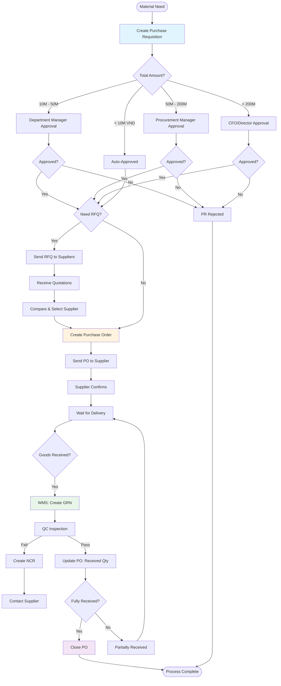
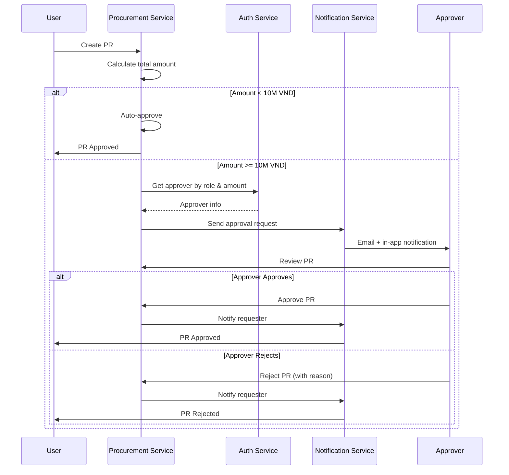
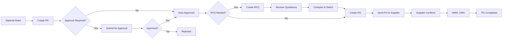

# 07 - PROCUREMENT SERVICE

## TỔNG QUAN

Procurement Service quản lý quy trình mua hàng từ Purchase Requisition (PR) → Request for Quotation (RFQ) → Purchase Order (PO) → theo dõi nhận hàng.

### Responsibilities

✅ Purchase Requisition (PR) workflow với approval  
✅ Request for Quotation (RFQ) - optional  
✅ Purchase Order (PO) creation & management  
✅ PO tracking & status updates  
✅ Integration với WMS (GRN receipt)  
✅ Vendor comparison & selection  
✅ Budget control

### Tech Stack

- **Language**: Go 1.22+
- **Framework**: Gin (HTTP) + gRPC
- **Database**: PostgreSQL

### Ports

- HTTP: `8085`
- gRPC: `9085`

---

## PROCUREMENT WORKFLOW

### Complete Purchase Process



### Approval Workflow Detail



---

## PROCUREMENT WORKFLOW



---

## KEY FEATURES

### 1. Multi-Level Approval

PR approval based on total amount:
- < 10M VND: Auto-approved
- 10M - 50M: Department Manager
- 50M - 200M: Procurement Manager
- > 200M: CFO/Director

### 2. Material Sourcing

- Auto-suggest approved suppliers từ ASL
- Show last purchase price
- Lead time visibility

### 3. Budget Control

- Check budget availability before PR approval
- Budget allocation tracking
- Commitment vs actual spend

### 4. PO Tracking

- Expected delivery date
- Partial receipts tracking
- Over/under delivery alerts

---

## DATABASE SCHEMA (Summary)

Chi tiết trong `02-SERVICE-SPECIFICATIONS.md`:

- `purchase_requisitions` + `pr_line_items`
- `purchase_orders` + `po_line_items`
- `rfqs` + `rfq_suppliers` + `supplier_quotations`

---

## API ENDPOINTS (Key)

### Purchase Requisitions

```
GET    /api/v1/procurement/requisitions
POST   /api/v1/procurement/requisitions
GET    /api/v1/procurement/requisitions/:id
PUT    /api/v1/procurement/requisitions/:id
PATCH  /api/v1/procurement/requisitions/:id/submit
PATCH  /api/v1/procurement/requisitions/:id/approve
PATCH  /api/v1/procurement/requisitions/:id/reject
```

#### POST /api/v1/procurement/requisitions

**Permission**: `procurement:pr:create`

**Request**:
```json
{
  "pr_date": "2024-01-23",
  "required_date": "2024-02-15",
  "priority": "NORMAL",
  "justification": "Stock below reorder point",
  "items": [
    {
      "material_id": "material-uuid",
      "quantity": 50,
      "uom_id": "kg-uuid",
      "required_date": "2024-02-15",
      "estimated_unit_price": 150000,
      "specifications": "Food grade, min 99% purity"
    }
  ]
}
```

**Response 201**:
```json
{
  "id": "pr-uuid",
  "pr_number": "PR-2024-001",
  "status": "DRAFT",
  "total_amount": 7500000,
  "created_at": "2024-01-23T15:00:00Z"
}
```

---

#### PATCH /api/v1/procurement/requisitions/:id/approve

**Permission**: `procurement:pr:approve`

**Request**:
```json
{
  "notes": "Approved. Please proceed with PO creation."
}
```

---

### Purchase Orders

```
GET    /api/v1/procurement/purchase-orders
POST   /api/v1/procurement/purchase-orders
POST   /api/v1/procurement/purchase-orders/from-pr/:pr_id
GET    /api/v1/procurement/purchase-orders/:id
PUT    /api/v1/procurement/purchase-orders/:id
PATCH  /api/v1/procurement/purchase-orders/:id/submit
PATCH  /api/v1/procurement/purchase-orders/:id/cancel
GET    /api/v1/procurement/purchase-orders/:id/pdf
```

#### POST /api/v1/procurement/purchase-orders/from-pr/:pr_id

Create PO từ approved PR.

**Permission**: `procurement:po:create`

**Request**:
```json
{
  "supplier_id": "supplier-uuid",
  "delivery_address_id": "address-uuid",
  "payment_terms": "Net 30",
  "delivery_terms": "EXW",
  "expected_delivery_date": "2024-02-20",
  "notes": "Please confirm delivery date",
  "pr_line_item_ids": ["pr-line-1", "pr-line-2"]
}
```

**Response 201**:
```json
{
  "id": "po-uuid",
  "po_number": "PO-2024-001",
  "supplier_name": "ABC Chemicals",
  "total_amount": 7650000,
  "status": "DRAFT"
}
```

---

#### GET /api/v1/procurement/purchase-orders/:id/pdf

Generate PO PDF for sending to supplier.

**Response**: PDF file download

---

## gRPC METHODS

### GetPO

```protobuf
message GetPORequest {
  string po_id = 1;
}

message GetPOResponse {
  PurchaseOrder po = 1;
}
```

### UpdatePOReceivedQuantity

Called by WMS when GRN completed.

```protobuf
message UpdatePOReceivedQuantityRequest {
  string po_line_item_id = 1;
  double received_quantity = 2;
}

message UpdatePOReceivedQuantityResponse {
  bool success = 1;
  string po_status = 2; // PARTIALLY_RECEIVED, FULLY_RECEIVED
}
```

---

## EVENTS

### Events Published

```yaml
procurement.pr.created:
  payload:
    pr_id: uuid
    pr_number: string
    requested_by: uuid
    total_amount: decimal

procurement.pr.approved:
  payload:
    pr_id: uuid
    pr_number: string
    approved_by: uuid

procurement.po.created:
  payload:
    po_id: uuid
    po_number: string
    supplier_id: uuid
    total_amount: decimal

procurement.po.submitted:
  payload:
    po_id: uuid
    po_number: string
    supplier_id: uuid
    expected_delivery_date: date
```

### Events Subscribed

```yaml
wms.grn.completed:
  action: Update PO received quantities
  handler: UpdatePOFromGRN

supplier.blocked:
  action: Alert for active POs with that supplier
  handler: AlertBlockedSupplierPOs
```

---

## BUSINESS LOGIC

### PR Number Generation

```
Format: PR-{YYYY}-{NNNN}
Example: PR-2024-0001
```

### PO Number Generation

```
Format: PO-{YYYY}-{NNNN}
Example: PO-2024-0001
```

### Approval Rules

```yaml
pr_approval_rules:
  - amount_max: 10000000  # 10M VND
    approver: AUTO
  - amount_max: 50000000  # 50M
    approver: DEPARTMENT_MANAGER
  - amount_max: 200000000 # 200M
    approver: PROCUREMENT_MANAGER
  - amount_max: null      # Unlimited
    approver: CFO
```

### PO Status Lifecycle

```
DRAFT → SUBMITTED → CONFIRMED → PARTIALLY_RECEIVED → FULLY_RECEIVED → CLOSED
                                                   ↓
                                              CANCELLED
```

---

## MONITORING METRICS

```
procurement_pr_total{status="draft|submitted|approved|rejected"}
procurement_po_total{status}
procurement_pr_approval_duration_seconds
procurement_po_cycle_time_seconds
```

---

## DEPENDENCIES

- **Supplier Service** (gRPC): Get supplier details
- **Master Data Service** (gRPC): Get material info
- **User Service** (gRPC): Get approvers
- **WMS Service** (Subscribe): GRN events
- **File Service** (HTTP): Generate PO PDF
- **NATS**: Events

---

**Document Version**: 1.0  
**Last Updated**: 2026-01-23  
**Author**: ERP Development Team
