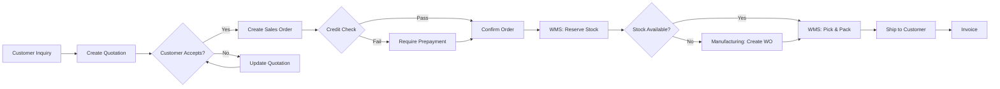

# 10 - SALES SERVICE

## TỔNG QUAN

Sales Service quản lý quy trình bán hàng từ customer management, quotations, sales orders đến integration với WMS cho fulfillment.

### Responsibilities

✅ Customer management (retail, wholesale, distributors)  
✅ Price lists & customer-specific pricing  
✅ Quotations (báo giá)  
✅ Sales Orders với approval workflow  
✅ Order fulfillment tracking  
✅ Integration với WMS (stock reservation, picking)  
✅ Customer credit limit control

### Tech Stack

- **Language**: Go 1.22+
- **Framework**: Gin (HTTP) + gRPC
- **Database**: PostgreSQL

### Ports

- HTTP: `8088`
- gRPC: `9088`

---

## SALES WORKFLOW



---

## DATABASE SCHEMA (Key Tables)

Chi tiết trong `02-SERVICE-SPECIFICATIONS.md`:

- `customers`
- `customer_addresses`
- `price_lists` + `price_list_items`
- `quotations` + `quotation_line_items`
- `sales_orders` + `so_line_items`

---

## API ENDPOINTS (Key)

### Customers

```
GET    /api/v1/sales/customers
POST   /api/v1/sales/customers
GET    /api/v1/sales/customers/:id
PUT    /api/v1/sales/customers/:id
DELETE /api/v1/sales/customers/:id
```

#### POST /api/v1/sales/customers

**Permission**: `sales:customer:create`

**Request**:
```json
{
  "customer_code": "CUST-001",
  "name": "Beauty Shop ABC",
  "tax_code": "0123456789",
  "customer_type": "RETAIL",
  "customer_group": "VIP",
  "email": "contact@beautyshop.com",
  "phone": "+84 28 1234 5678",
  "website": "https://beautyshop.com",
  "payment_terms": "Net 30",
  "credit_limit": 50000000,
  "currency": "VND",
  "billing_address": {
    "address": "123 Nguyen Hue, District 1",
    "city": "Ho Chi Minh City",
    "country": "Vietnam"
  }
}
```

---

### Quotations

```
GET    /api/v1/sales/quotations
POST   /api/v1/sales/quotations
GET    /api/v1/sales/quotations/:id
PUT    /api/v1/sales/quotations/:id
PATCH  /api/v1/sales/quotations/:id/send
POST   /api/v1/sales/quotations/:id/convert-to-order
```

#### POST /api/v1/sales/quotations

**Permission**: `sales:quotation:create`

**Request**:
```json
{
  "quotation_date": "2024-01-23",
  "valid_until": "2024-02-23",
  "customer_id": "customer-uuid",
  "items": [
    {
      "product_id": "product-uuid",
      "quantity": 100,
      "uom_id": "bottle-uuid",
      "unit_price": 450000,
      "discount_percent": 10,
      "notes": "Bulk discount applied"
    }
  ],
  "discount_amount": 4500000,
  "tax_percent": 10,
  "notes": "Special promotion for VIP customer",
  "terms_and_conditions": "Payment: Net 30 days\nDelivery: 7-10 working days"
}
```

**Response 201**:
```json
{
  "id": "quot-uuid",
  "quotation_number": "QT-2024-001",
  "customer_name": "Beauty Shop ABC",
  "subtotal": 45000000,
  "discount_amount": 4500000,
  "tax_amount": 4050000,
  "total_amount": 44550000,
  "status": "DRAFT"
}
```

---

### Sales Orders

```
GET    /api/v1/sales/orders
POST   /api/v1/sales/orders
POST   /api/v1/sales/orders/from-quotation/:quotation_id
GET    /api/v1/sales/orders/:id
PUT    /api/v1/sales/orders/:id
PATCH  /api/v1/sales/orders/:id/confirm
PATCH  /api/v1/sales/orders/:id/ship
PATCH  /api/v1/sales/orders/:id/cancel
```

#### POST /api/v1/sales/orders

**Permission**: `sales:order:create`

**Request**:
```json
{
  "so_date": "2024-01-23",
  "customer_id": "customer-uuid",
  "quotation_id": "quot-uuid",
  "delivery_date": "2024-02-05",
  "delivery_address": "456 Le Loi, District 3, HCMC",
  "items": [
    {
      "product_id": "product-uuid",
      "quantity": 100,
      "uom_id": "bottle-uuid",
      "unit_price": 450000,
      "discount_percent": 10,
      "tax_percent": 10
    }
  ],
  "payment_method": "BANK_TRANSFER",
  "notes": "Customer requested express delivery"
}
```

**Response 201**:
```json
{
  "id": "so-uuid",
  "so_number": "SO-2024-001",
  "customer_name": "Beauty Shop ABC",
  "total_amount": 44550000,
  "status": "DRAFT"
}
```

---

#### PATCH /api/v1/sales/orders/:id/confirm

**Permission**: `sales:order:confirm`

**Request**:
```json
{
  "confirmed_delivery_date": "2024-02-05"
}
```

**Actions**:
1. Check credit limit
2. Check stock availability (WMS gRPC call)
3. If stock available → Reserve stock
4. If stock not available → Create alert for production
5. Update status = CONFIRMED
6. Publish `sales.order.confirmed` event

**Response 200**:
```json
{
  "id": "so-uuid",
  "status": "CONFIRMED",
  "stock_reserved": true,
  "reservation_ids": ["res-uuid-1", "res-uuid-2"]
}
```

---

## gRPC METHODS

### GetCustomer

```protobuf
message GetCustomerRequest {
  string customer_id = 1;
}

message GetCustomerResponse {
  Customer customer = 1;
}
```

### CheckCreditLimit

```protobuf
message CheckCreditLimitRequest {
  string customer_id = 1;
  double order_amount = 2;
}

message CheckCreditLimitResponse {
  bool within_limit = 1;
  double credit_limit = 2;
  double outstanding_amount = 3;
  double available_credit = 4;
}
```

---

## EVENTS

### Events Published

```yaml
sales.customer.created:
sales.quotation.sent:
sales.order.created:
sales.order.confirmed:
  payload:
    so_id: uuid
    so_number: string
    customer_id: uuid
    items: array
    total_amount: decimal
    
sales.order.shipped:
sales.order.cancelled:
```

### Events Subscribed

```yaml
wms.goods_issued:
  action: Update shipped_quantity in SO line items
  handler: UpdateShippedQuantity
```

---

## BUSINESS LOGIC

### Sales Order Number Generation

```
Format: SO-{YYYY}-{NNNN}
Example: SO-2024-0001
```

### Credit Limit Check

```
Available Credit = Credit Limit - Outstanding Amount - Current Order Amount

If Available Credit < 0:
  - Require prepayment OR
  - Require manager approval
```

### Order Status Lifecycle

```
DRAFT → CONFIRMED → PROCESSING → PARTIALLY_SHIPPED → SHIPPED → DELIVERED
                                                               ↓
                                                          CANCELLED
```

### Pricing Logic

```
1. Check if customer has customer-specific price
2. If not, use default price list
3. Apply customer group discount
4. Apply quantity discount (if applicable)
5. Calculate tax
```

---

## CONFIGURATION

```bash
SALES_SERVICE_PORT=8088
SALES_GRPC_PORT=9088
SALES_DB_HOST=postgres
SALES_DB_PORT=5439
SALES_DB_NAME=sales_db

# Business Rules
ENABLE_CREDIT_CHECK=true
ALLOW_NEGATIVE_STOCK=false
AUTO_RESERVE_ON_CONFIRM=true
```

---

## MONITORING METRICS

```
sales_orders_total{status}
sales_revenue_total{customer_group}
sales_order_value_average
sales_quotation_conversion_rate
```

---

## DEPENDENCIES

- **Master Data** (gRPC): Product info, pricing
- **WMS** (gRPC): Check stock, reserve stock
- **Customer Service** (Subscribe): Customer events
- **NATS**: Events

---

**Document Version**: 1.0  
**Last Updated**: 2026-01-23  
**Author**: ERP Development Team
