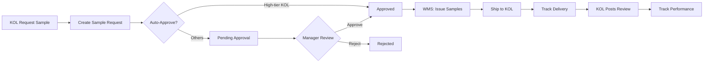

# 11 - MARKETING SERVICE

## TỔNG QUAN

Marketing Service quản lý campaigns, KOL/Influencer partnerships, sample distribution tracking - đặc thù quan trọng cho ngành mỹ phẩm.

### Responsibilities

✅ Campaign management (launch campaigns, promotions)  
✅ KOL/Influencer database  
✅ Sample request & distribution workflow  
✅ Sample tracking (who received what, when)  
✅ KOL performance tracking  
✅ Marketing budget tracking  
✅ Campaign ROI analysis

### Tech Stack

- **Language**: Go 1.22+
- **Framework**: Gin (HTTP) + gRPC
- **Database**: PostgreSQL

### Ports

- HTTP: `8089`
- gRPC: `9089`

---

## WHY MARKETING IS CRITICAL FOR COSMETICS

### 1. KOL/Influencer Marketing

Mỹ phẩm phụ thuộc nhiều vào KOL marketing:
- Beauty bloggers
- Instagram influencers
- YouTube reviewers
- TikTok creators

→ Cần track samples sent, reviews received, engagement metrics

### 2. Sample Distribution

Gửi sample miễn phí để:
- Product testing
- Reviews
- Word-of-mouth marketing
- Customer acquisition

→ Phải track số lượng, chi phí, effectiveness

### 3. Product Launches

New product launch campaigns:
- Teaser campaigns
- Launch events
- Promotional pricing
- Bundle offers

---

## DATABASE SCHEMA (Key Tables)

### Core Tables

- `campaigns` - Marketing campaigns
- `kols` (Key Opinion Leaders/Influencers)
- `kol_contacts` - Social media handles, email
- `sample_requests` - Sample request workflow
- `sample_shipments` - Tracking samples sent
- `kol_posts` - Track KOL reviews/posts
- `campaign_budgets` - Budget allocation

### Example: KOLs Table

```sql
CREATE TABLE kols (
    id UUID PRIMARY KEY,
    kol_code VARCHAR(50) UNIQUE,
    name VARCHAR(200) NOT NULL,
    category VARCHAR(100), -- BEAUTY_BLOGGER, INFLUENCER, CELEBRITY
    tier VARCHAR(50), -- MEGA, MACRO, MICRO, NANO
    
    -- Social Media
    instagram_handle VARCHAR(100),
    instagram_followers INT,
    youtube_channel VARCHAR(100),
    youtube_subscribers INT,
    tiktok_handle VARCHAR(100),
    tiktok_followers INT,
    facebook_page VARCHAR(100),
    
    email VARCHAR(255),
    phone VARCHAR(50),
    
    -- Engagement
    avg_engagement_rate DECIMAL(5,2), -- %
    niche VARCHAR(100), -- Skincare, Makeup, Haircare
    
    -- Business
    collaboration_rate DECIMAL(18,2), -- Fee per post
    currency VARCHAR(10) DEFAULT 'VND',
    preferred_products JSONB, -- Array of product types they like
    
    -- Performance
    total_posts INT DEFAULT 0,
    total_samples_received INT DEFAULT 0,
    last_collaboration_date DATE,
    
    notes TEXT,
    status VARCHAR(50) DEFAULT 'ACTIVE',
    created_at TIMESTAMP DEFAULT CURRENT_TIMESTAMP
);
```

---

## API ENDPOINTS (Key)

### Campaigns

```
GET    /api/v1/marketing/campaigns
POST   /api/v1/marketing/campaigns
GET    /api/v1/marketing/campaigns/:id
PUT    /api/v1/marketing/campaigns/:id
PATCH  /api/v1/marketing/campaigns/:id/launch
GET    /api/v1/marketing/campaigns/:id/performance
```

#### POST /api/v1/marketing/campaigns

**Permission**: `marketing:campaign:create`

**Request**:
```json
{
  "campaign_code": "CAMP-SERUM-LAUNCH-2024",
  "name": "Vitamin C Serum Launch Campaign",
  "description": "Launch campaign for new Vitamin C serum product",
  "campaign_type": "PRODUCT_LAUNCH",
  "start_date": "2024-03-01",
  "end_date": "2024-03-31",
  "target_audience": "Women 25-40, interested in skincare",
  "channels": ["INSTAGRAM", "FACEBOOK", "YOUTUBE", "TIKTOK"],
  "budget": 50000000,
  "goals": {
    "awareness": "100k impressions",
    "engagement": "5k likes + comments",
    "sales": "500 units sold"
  },
  "products": ["product-uuid-1", "product-uuid-2"]
}
```

---

### KOLs

```
GET    /api/v1/marketing/kols
POST   /api/v1/marketing/kols
GET    /api/v1/marketing/kols/:id
PUT    /api/v1/marketing/kols/:id
GET    /api/v1/marketing/kols/:id/posts
GET    /api/v1/marketing/kols/:id/samples
```

#### POST /api/v1/marketing/kols

**Permission**: `marketing:kol:create`

**Request**:
```json
{
  "name": "Beauty By Linh",
  "category": "BEAUTY_BLOGGER",
  "tier": "MICRO",
  "instagram_handle": "@beautybylinh",
  "instagram_followers": 50000,
  "youtube_channel": "Beauty By Linh",
  "youtube_subscribers": 25000,
  "email": "contact@beautybylinh.com",
  "phone": "+84 901 234 567",
  "avg_engagement_rate": 5.5,
  "niche": "Skincare",
  "collaboration_rate": 5000000,
  "preferred_products": ["Serum", "Cream"],
  "notes": "Specializes in Korean skincare reviews"
}
```

---

#### GET /api/v1/marketing/kols/:id/posts

Track KOL posts mentioning our products.

**Response 200**:
```json
{
  "data": [
    {
      "id": "post-uuid",
      "kol_name": "Beauty By Linh",
      "platform": "INSTAGRAM",
      "post_url": "https://instagram.com/p/xyz123",
      "post_date": "2024-01-25",
      "product_mentioned": "Vitamin C Serum",
      "likes": 2500,
      "comments": 180,
      "views": 15000,
      "engagement_rate": 17.87,
      "sentiment": "POSITIVE",
      "summary": "Loved the texture, absorbed quickly, saw results in 2 weeks"
    }
  ]
}
```

---

### Sample Requests

```
GET    /api/v1/marketing/samples/requests
POST   /api/v1/marketing/samples/requests
GET    /api/v1/marketing/samples/requests/:id
PATCH  /api/v1/marketing/samples/requests/:id/approve
PATCH  /api/v1/marketing/samples/requests/:id/ship
```

#### POST /api/v1/marketing/samples/requests

**Permission**: `marketing:sample:create`

**Request**:
```json
{
  "request_date": "2024-01-23",
  "kol_id": "kol-uuid",
  "campaign_id": "campaign-uuid",
  "request_reason": "Product review for new serum launch",
  "products_requested": [
    {
      "product_id": "product-uuid",
      "quantity": 2,
      "notes": "Full size for review + backup"
    }
  ],
  "delivery_address": "123 Nguyen Trai, District 1, HCMC",
  "expected_post_date": "2024-02-15",
  "expected_reach": 50000
}
```

**Response 201**:
```json
{
  "id": "sample-req-uuid",
  "request_number": "SR-2024-001",
  "kol_name": "Beauty By Linh",
  "status": "PENDING_APPROVAL",
  "total_value": 900000
}
```

---

#### PATCH /api/v1/marketing/samples/requests/:id/approve

**Permission**: `marketing:sample:approve`

**Request**:
```json
{
  "approved": true,
  "notes": "Approved for serum launch campaign"
}
```

**Actions**:
1. Update status = APPROVED
2. Deduct from marketing inventory (WMS)
3. Create shipment record
4. Publish event

---

#### PATCH /api/v1/marketing/samples/requests/:id/ship

**Permission**: `marketing:sample:ship`

**Request**:
```json
{
  "shipment_date": "2024-01-24",
  "tracking_number": "VN123456789",
  "courier": "Giao Hang Nhanh",
  "estimated_delivery": "2024-01-26"
}
```

---

## SAMPLE WORKFLOW



---

## gRPC METHODS

### GetKOL

```protobuf
message GetKOLRequest {
  string kol_id = 1;
}

message GetKOLResponse {
  KOL kol = 1;
}
```

### GetCampaign

```protobuf
message GetCampaignRequest {
  string campaign_id = 1;
}

message GetCampaignResponse {
  Campaign campaign = 1;
}
```

---

## EVENTS

### Events Published

```yaml
marketing.campaign.created:
marketing.campaign.launched:
marketing.sample_request.created:
marketing.sample_request.approved:
marketing.sample.shipped:
marketing.kol_post.recorded:
```

### Events Subscribed

```yaml
wms.stock.issued:
  action: Track sample inventory deduction
```

---

## BUSINESS LOGIC

### KOL Tier Classification

```
MEGA: > 1M followers
MACRO: 100K - 1M followers
MICRO: 10K - 100K followers
NANO: < 10K followers
```

### Sample Approval Rules

```yaml
auto_approve:
  - tier: MEGA
  - tier: MACRO
    AND previous_collaborations: > 3
  
require_approval:
  - tier: MICRO
  - tier: NANO
  - new KOL
  - sample_value: > 5M VND
```

### ROI Calculation

```
Campaign ROI = (Revenue Generated - Campaign Cost) / Campaign Cost * 100%

Example:
Campaign Cost: 50M VND
Revenue Generated: 200M VND
ROI = (200M - 50M) / 50M = 300%
```

---

## CONFIGURATION

```bash
MARKETING_SERVICE_PORT=8089
MARKETING_GRPC_PORT=9089
MARKETING_DB_HOST=postgres
MARKETING_DB_PORT=5440
MARKETING_DB_NAME=marketing_db

# Business Rules
AUTO_APPROVE_MEGA_KOLS=true
AUTO_APPROVE_MACRO_KOLS=false
SAMPLE_VALUE_APPROVAL_THRESHOLD=5000000
TRACK_KOL_POSTS=true
```

---

## MONITORING METRICS

```
marketing_campaigns_total{type, status}
marketing_samples_sent_total
marketing_kol_posts_total{platform}
marketing_campaign_roi
marketing_budget_spent{campaign_id}
```

---

## DEPENDENCIES

- **Master Data** (gRPC): Product info
- **WMS** (gRPC): Sample inventory, issue samples
- **File Service** (HTTP): Upload KOL content screenshots
- **NATS**: Events

---

**Document Version**: 1.0  
**Last Updated**: 2026-01-23  
**Author**: ERP Development Team
