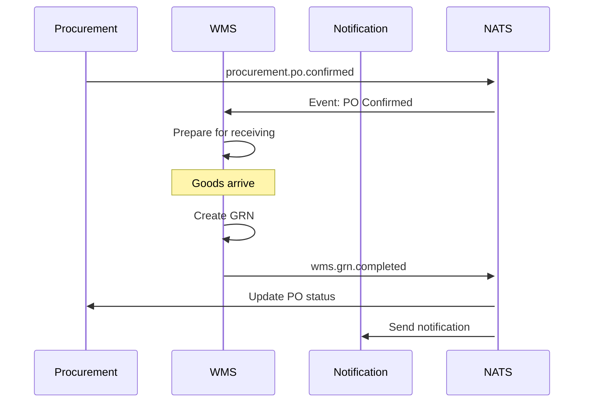
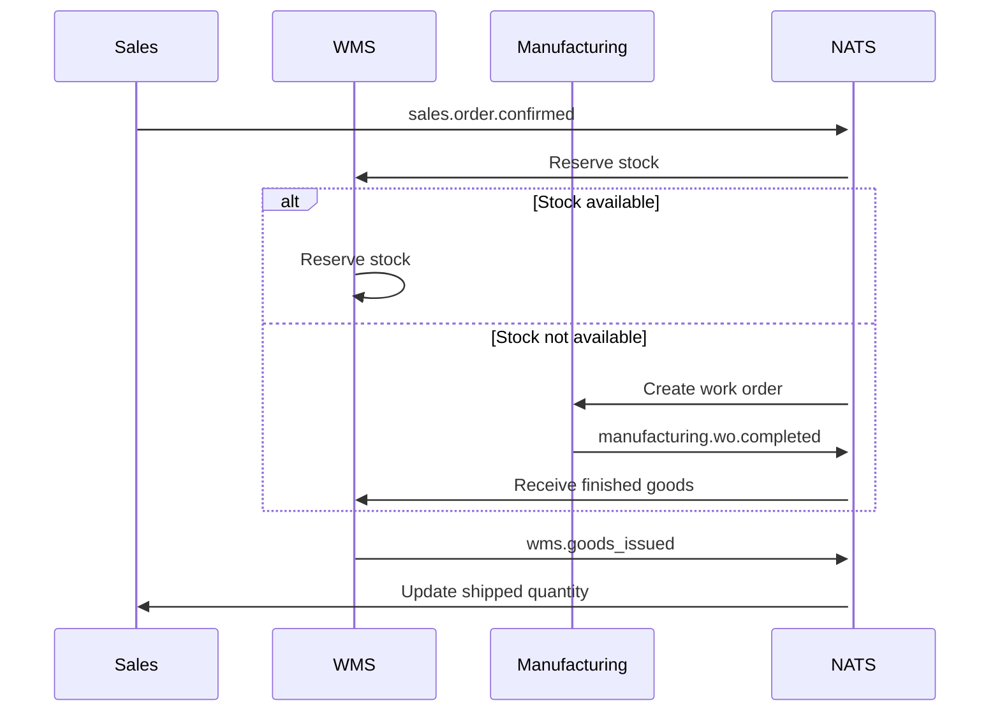

# 14 - EVENT CATALOG

## TỔNG QUAN

Event Catalog liệt kê tất cả events trong hệ thống ERP, event schema, publisher/subscriber mapping, và event flows.

---

## EVENT NAMING CONVENTION

Format: `{service}.{entity}.{action}`

Examples:
- `auth.user.logged_in`
- `procurement.po.created`
- `wms.stock.issued`
- `manufacturing.wo.completed`

---

## ALL EVENTS BY SERVICE

### AUTH SERVICE

```yaml
auth.user.logged_in:
  publisher: Auth Service
  subscribers: [User Service, Audit Service]
  payload:
    user_id: UUID
    email: string
    ip_address: string
    timestamp: datetime

auth.user.logged_out:
  publisher: Auth Service
  payload:
    user_id: UUID
    timestamp: datetime

auth.user.password_changed:
  publisher: Auth Service
  subscribers: [Notification Service]
  payload:
    user_id: UUID
    changed_by: UUID
    timestamp: datetime

auth.user.account_locked:
  publisher: Auth Service
  subscribers: [Notification Service]
  payload:
    user_id: UUID
    email: string
    locked_until: datetime
    reason: string

auth.role.created:
auth.role.updated:
auth.role.deleted:
auth.permission.assigned:
auth.permission.revoked:
auth.user.role_assigned:
auth.user.role_revoked:
```

### USER SERVICE

```yaml
user.created:
  publisher: User Service
  subscribers: [Auth Service]
  payload:
    user_id: UUID
    email: string
    first_name: string
    last_name: string
    department_id: UUID
    created_by: UUID

user.updated:
user.deleted:
user.status_changed:
user.email_changed:
department.created:
department.updated:
department.deleted:
```

### MASTER DATA SERVICE

```yaml
master_data.material.created:
master_data.material.updated:
master_data.material.deactivated:
master_data.product.created:
master_data.product.updated:
master_data.product.deactivated:
master_data.category.created:
master_data.material.license_expiring:
```

### SUPPLIER SERVICE

```yaml
supplier.created:
  publisher: Supplier Service
  subscribers: [Master Data Service, Notification Service]
  
supplier.approved:
  payload:
    supplier_id: UUID
    supplier_code: string
    approved_by: UUID

supplier.blocked:
  payload:
    supplier_id: UUID
    reason: string

supplier.certification.added:
supplier.certification.expiring:
  subscribers: [Notification Service]
  payload:
    supplier_id: UUID
    supplier_name: string
    certification_type: string
    expiry_date: date
    days_until_expiry: int

supplier.certification.expired:
supplier.evaluation.completed:
```

### PROCUREMENT SERVICE

```yaml
procurement.pr.created:
procurement.pr.submitted:
  subscribers: [Notification Service]
  payload:
    pr_id: UUID
    pr_number: string
    requested_by: UUID
    total_amount: decimal

procurement.pr.approved:
  subscribers: [Notification Service]

procurement.pr.rejected:
procurement.po.created:
procurement.po.submitted:
  subscribers: [Supplier Service, Notification Service]

procurement.po.confirmed:
  subscribers: [WMS Service]
  
procurement.po.cancelled:
procurement.rfq.sent:
procurement.quotation.received:
```

### WMS SERVICE

```yaml
wms.grn.created:
wms.grn.completed:
  publisher: WMS Service
  subscribers: [Procurement Service]
  payload:
    grn_id: UUID
    po_id: UUID
    items: array

wms.stock.received:
wms.stock.issued:
  subscribers: [Manufacturing Service, Sales Service]
  payload:
    material_id: UUID
    quantity: decimal
    lots_used: array
    reference_type: string
    reference_id: UUID

wms.stock.transferred:
wms.stock.adjusted:
wms.stock.low_stock_alert:
  subscribers: [Notification Service, Manufacturing Service]
  payload:
    material_id: UUID
    current_quantity: decimal
    reorder_point: decimal

wms.lot.expiring_soon:
  subscribers: [Notification Service]
  payload:
    lot_id: UUID
    material_id: UUID
    expiry_date: date
    days_until_expiry: int

wms.lot.expired:
wms.stock.reserved:
wms.stock.reservation_released:
```

### MANUFACTURING SERVICE

```yaml
manufacturing.bom.created:
manufacturing.bom.approved:
manufacturing.wo.created:
manufacturing.wo.released:
manufacturing.wo.started:
  subscribers: [WMS Service]
  payload:
    wo_id: UUID
    materials_needed: array

manufacturing.wo.completed:
  subscribers: [Sales Service, WMS Service]
  payload:
    wo_id: UUID
    product_id: UUID
    batch_number: string
    good_quantity: decimal

manufacturing.qc.failed:
  subscribers: [Notification Service]

manufacturing.ncr.created:
manufacturing.ncr.closed:
```

### SALES SERVICE

```yaml
sales.customer.created:
sales.quotation.sent:
sales.order.created:
sales.order.confirmed:
  subscribers: [WMS Service, Manufacturing Service]
  payload:
    so_id: UUID
    customer_id: UUID
    items: array
    delivery_date: date

sales.order.shipped:
sales.order.cancelled:
```

### MARKETING SERVICE

```yaml
marketing.campaign.created:
marketing.campaign.launched:
marketing.sample_request.created:
marketing.sample_request.approved:
marketing.sample.shipped:
marketing.kol_post.recorded:
```

---

## EVENT FLOW DIAGRAMS

### Purchase Order → GRN → Stock Receipt



### Sales Order → Manufacturing → Fulfillment



---

## EVENT SCHEMA EXAMPLES

### procurement.po.created

```json
{
  "event_id": "evt-uuid",
  "event_type": "procurement.po.created",
  "timestamp": "2024-01-23T15:00:00Z",
  "source_service": "procurement-service",
  "payload": {
    "po_id": "po-uuid",
    "po_number": "PO-2024-001",
    "supplier_id": "supplier-uuid",
    "supplier_name": "ABC Chemicals",
    "total_amount": 7650000,
    "currency": "VND",
    "expected_delivery_date": "2024-02-20",
    "items": [
      {
        "material_id": "material-uuid",
        "material_code": "RM-001",
        "quantity": 50,
        "unit_price": 150000
      }
    ],
    "created_by": "user-uuid"
  },
  "metadata": {
    "correlation_id": "req-uuid",
    "user_agent": "Mozilla/5.0..."
  }
}
```

---

## PUBLISHER/SUBSCRIBER MAP

| Event | Publisher | Subscribers |
|-------|-----------|-------------|
| `auth.user.created` | Auth | User, Notification |
| `procurement.po.confirmed` | Procurement | WMS |
| `wms.grn.completed` | WMS | Procurement |
| `wms.stock.low_stock_alert` | WMS | Notification, Manufacturing |
| `manufacturing.wo.completed` | Manufacturing | WMS, Sales |
| `sales.order.confirmed` | Sales | WMS, Manufacturing |
| `supplier.certification.expiring` | Supplier | Notification |

---

## EVENT REPLAY & DEBUGGING

Events stored in NATS JetStream for replay:
- Retention: 30 days
- Max size: 100GB

Replay events for debugging:
```bash
nats stream view EVENTS --subject="procurement.po.*"
```

---

**Document Version**: 1.0  
**Last Updated**: 2026-01-23  
**Author**: ERP Development Team
