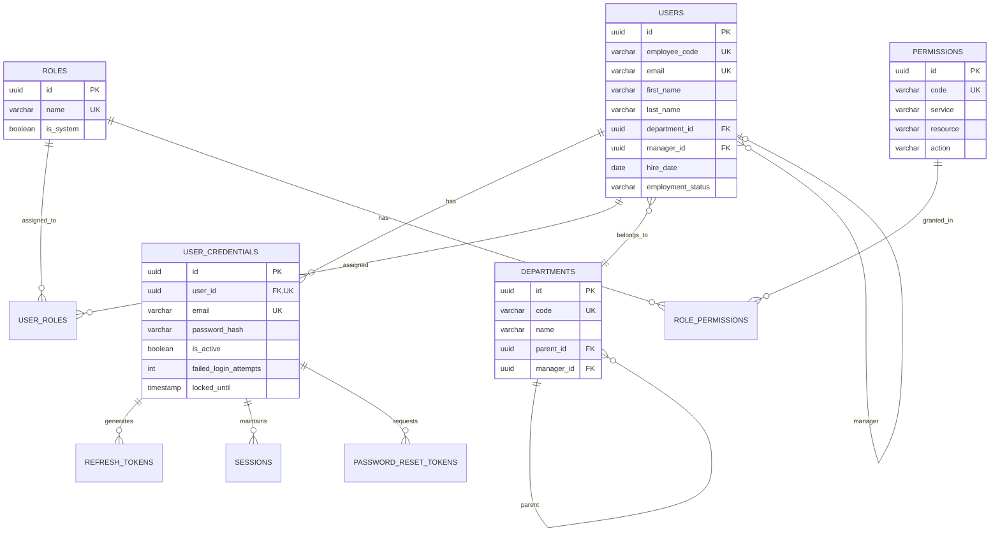
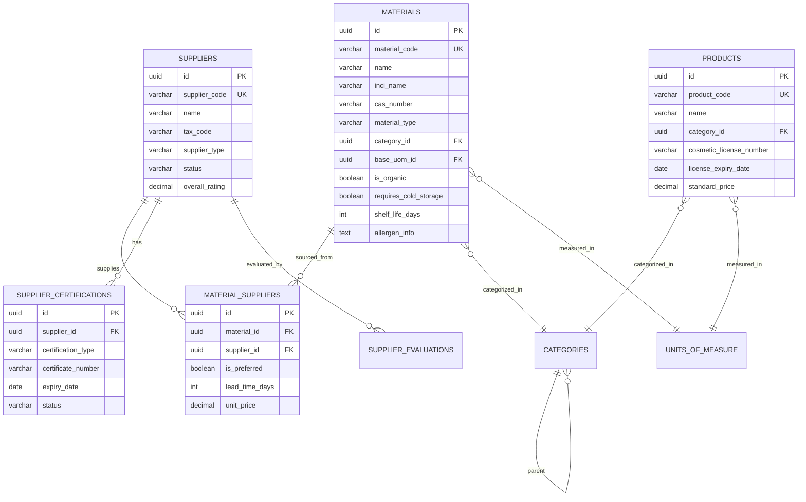
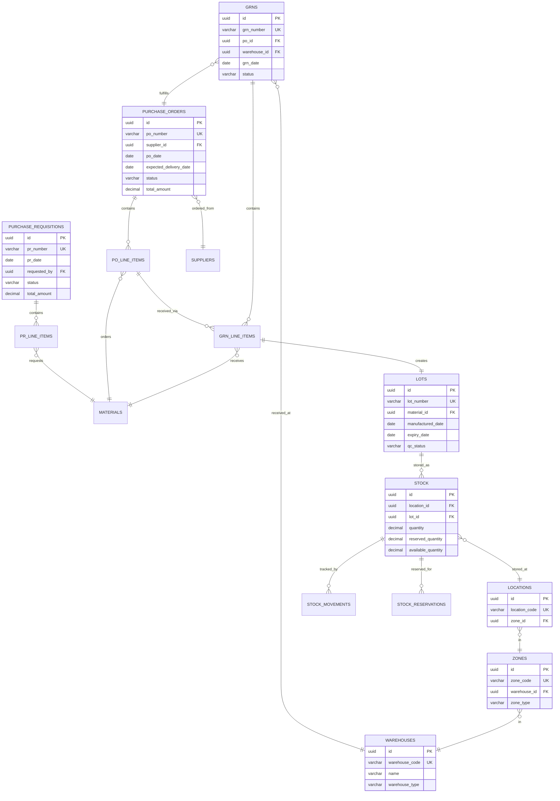
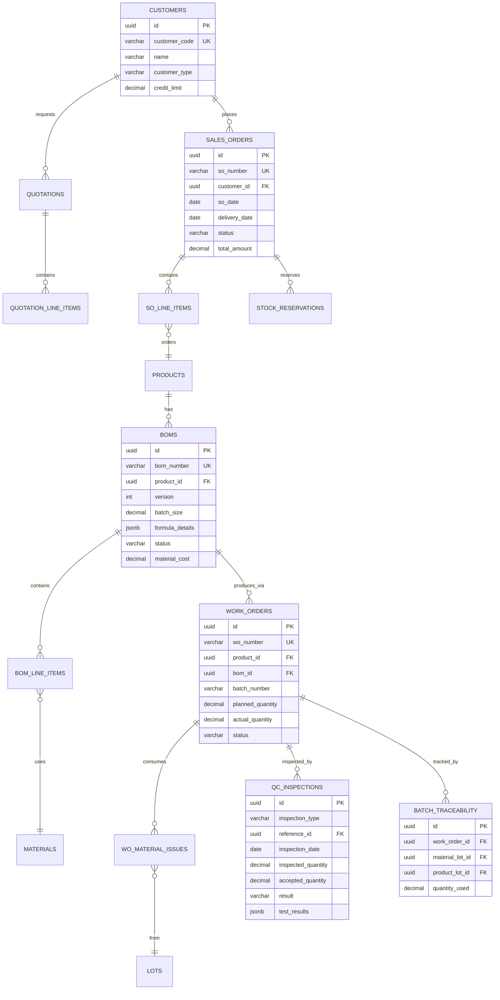

# 15 - DATABASE SCHEMAS

## TỔNG QUAN

Tài liệu tổng hợp database schemas cho tất cả 15 services, indexes, constraints, và best practices.

---

## DATABASE STRATEGY

### Database Per Service

Mỗi service có PostgreSQL database riêng:

| Service | Database Name | Port |
|---------|---------------|------|
| Auth | `auth_db` | 5432 |
| User | `user_db` | 5433 |
| Master Data | `master_data_db` | 5434 |
| Supplier | `supplier_db` | 5435 |
| Procurement | `procurement_db` | 5436 |
| WMS | `wms_db` | 5437 |
| Manufacturing | `manufacturing_db` | 5438 |
| Sales | `sales_db` | 5439 |
| Marketing | `marketing_db` | 5440 |
| Finance | `finance_db` | 5441 |
| Reporting | `reporting_db` | 5442 |
| Notification | `notification_db` | 5443 |
| AI | `ai_db` | 5444 |

---

## COMMON PATTERNS

### UUID Primary Keys

```sql
CREATE EXTENSION IF NOT EXISTS "uuid-ossp";

CREATE TABLE example (
    id UUID PRIMARY KEY DEFAULT gen_random_uuid(),
    ...
);
```

### Timestamps

```sql
created_at TIMESTAMP NOT NULL DEFAULT CURRENT_TIMESTAMP,
updated_at TIMESTAMP NOT NULL DEFAULT CURRENT_TIMESTAMP,
deleted_at TIMESTAMP  -- Soft delete
```

### Auto-update Trigger

```sql
CREATE OR REPLACE FUNCTION update_updated_at_column()
RETURNS TRIGGER AS $$
BEGIN
    NEW.updated_at = CURRENT_TIMESTAMP;
    RETURN NEW;
END;
$$ LANGUAGE plpgsql;

CREATE TRIGGER update_example_updated_at
BEFORE UPDATE ON example
FOR EACH ROW
EXECUTE FUNCTION update_updated_at_column();
```

---

## INDEX STRATEGIES

### Essential Indexes

```sql
-- Foreign keys
CREATE INDEX idx_table_foreign_key ON table_name(foreign_key_id);

-- Query filters
CREATE INDEX idx_table_status ON table_name(status) WHERE deleted_at IS NULL;

-- Composite indexes (order matters!)
CREATE INDEX idx_table_composite ON table_name(user_id, created_at DESC);

-- Unique constraints
CREATE UNIQUE INDEX idx_table_unique ON table_name(code) WHERE deleted_at IS NULL;
```

### Partial Indexes

```sql
-- Only index active records
CREATE INDEX idx_active_suppliers ON suppliers(name) 
WHERE status = 'APPROVED' AND deleted_at IS NULL;
```

---

## DATA INTEGRITY

### Check Constraints

```sql
-- Ensure positive quantities
CHECK (quantity >= 0)

-- Ensure end date after start date
CHECK (end_date >= start_date)

-- Enum-like values
CHECK (status IN ('DRAFT', 'APPROVED', 'REJECTED'))
```

### Foreign Key Constraints

```sql
-- CASCADE delete
FOREIGN KEY (parent_id) REFERENCES parent_table(id) ON DELETE CASCADE

-- RESTRICT delete (default)
FOREIGN KEY (user_id) REFERENCES users(id) ON DELETE RESTRICT

-- SET NULL on delete
FOREIGN KEY (manager_id) REFERENCES users(id) ON DELETE SET NULL
```

---

## COSMETICS-SPECIFIC SCHEMAS

### Material with INCI/CAS

```sql
CREATE TABLE materials (
    inci_name VARCHAR(300),  -- International nomenclature
    cas_number VARCHAR(50),  -- Chemical registry number
    is_organic BOOLEAN DEFAULT false,
    requires_cold_storage BOOLEAN DEFAULT false,
    shelf_life_days INT,
    allergen_info TEXT,
    safety_data_sheet_url TEXT
);
```

### Lot/Batch Tracking

```sql
CREATE TABLE lots (
    lot_number VARCHAR(100) NOT NULL UNIQUE,
    material_id UUID,
    supplier_lot_number VARCHAR(100), -- Traceability to supplier
    manufactured_date DATE,
    expiry_date DATE,
    qc_status VARCHAR(50),
    CONSTRAINT chk_expiry CHECK (expiry_date > manufactured_date)
);
```

### BOM with Encryption

```sql
CREATE TABLE boms (
    formula_details JSONB,  -- ENCRYPTED! AES-256-GCM
    confidentiality_level VARCHAR(50) DEFAULT 'RESTRICTED'
);

-- Encryption handled at application layer
-- Only users with 'manufacturing:bom:view_formula' permission can decrypt
```

---

---

## COMPREHENSIVE ER DIAGRAMS BY SERVICE GROUP

### Auth & User Services



### Master Data & Supplier Services



### Procurement & WMS Services



### Manufacturing & Sales Services



---

## PERFORMANCE OPTIMIZATION

### Materialized Views

For reporting queries:

```sql
CREATE MATERIALIZED VIEW mv_stock_summary AS
SELECT 
    m.material_code,
    m.name,
    w.warehouse_name,
    SUM(s.quantity) as total_quantity,
    SUM(s.reserved_quantity) as total_reserved
FROM stock s
JOIN materials m ON s.material_id = m.id
JOIN locations l ON s.location_id = l.id
JOIN warehouses w ON l.warehouse_id = w.id
GROUP BY m.material_code, m.name, w.warehouse_name;

-- Refresh schedule
REFRESH MATERIALIZED VIEW CONCURRENTLY mv_stock_summary;
```

### Partitioning

For large transaction tables:

```sql
-- Partition by month
CREATE TABLE stock_movements (
    id UUID,
    movement_date DATE NOT NULL,
    ...
) PARTITION BY RANGE (movement_date);

CREATE TABLE stock_movements_2024_01 PARTITION OF stock_movements
FOR VALUES FROM ('2024-01-01') TO ('2024-02-01');
```

---

## BACKUP & RECOVERY

### Daily Backup Script

```bash
#!/bin/bash
DATE=$(date +%Y%m%d_%H%M%S)
BACKUP_DIR="/backups/postgres"

for DB in auth_db user_db master_data_db procurement_db wms_db manufacturing_db sales_db
do
    pg_dump -h postgres -U postgres $DB | gzip > $BACKUP_DIR/${DB}_${DATE}.sql.gz
done

# Retention: Keep 30 days
find $BACKUP_DIR -name "*.sql.gz" -mtime +30 -delete
```

---

## MIGRATION STRATEGY

### Tools

- **golang-migrate**: Database migration tool
- **Flyway** (alternative): Database migration tool

### Migration Files

```
migrations/
  000001_create_users_table.up.sql
  000001_create_users_table.down.sql
  000002_add_users_email_index.up.sql
  000002_add_users_email_index.down.sql
```

### Example Migration

```sql
-- 000001_create_users_table.up.sql
CREATE TABLE users (
    id UUID PRIMARY KEY DEFAULT gen_random_uuid(),
    email VARCHAR(255) NOT NULL UNIQUE,
    created_at TIMESTAMP NOT NULL DEFAULT CURRENT_TIMESTAMP
);

-- 000001_create_users_table.down.sql
DROP TABLE users;
```

---

**Document Version**: 1.0  
**Last Updated**: 2026-01-23  
**Author**: ERP Development Team
